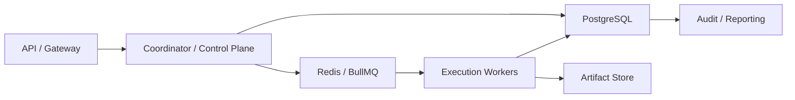

# Production Storage And Queue Contract

## 1. Scope

This contract defines the formal roadmap from the current transactional storage baseline evolving to industrial-grade PostgreSQL + Redis/BullMQ queue.

It answers the question: When the platform enters production, which data must be placed in authoritative relational store, which responsibilities enter queue/broker, and which designs must from now on be constrained by PG semantics.

Related documents:

- `storage_schema_contract.md`
- `runtime_repository_and_migration_contract.md`
- `execution_plane_contract.md`
- `event_bus_contract.md`

## 2. Goals

- Clarify responsibilities for transactional truth, queue dispatch, and caching.
- Avoid implementation over-binding to SQLite specifics.
- Freeze PG-semantics-first repository / migration rules in advance.
- Provide clear boundaries for Redis/BullMQ as execution queue.

## 3. Production Data Layering

| Layer | Primary Backend | Responsible For |
| --- | --- | --- |
| `transaction store` | PostgreSQL | task, workflow, execution, approval, lease, audit, quota authoritative truth |
| `queue / dispatch` | Redis + BullMQ | execution ticket, delayed queue, retry queue, dead-letter routing |
| `artifact store` | object storage / file store | large files, reports, attachments, export packages |
| `analytics / replay` | PG secondary or subsequent analysis store | usage, cost, evaluation, ops aggregation |

## 4. Key Invariants

- Authoritative task / execution state must not exist only in queue.
- After queue message loss, must be reconstructable from transactional store.
- Dispatch queue is responsible for "delivery and retry," not "final truth state."
- PG schema design takes priority over SQLite convenience features.

## 5. Production Recommended Topology

## 6. PostgreSQL Semantics Requirements

- All repository designs must be compatible with row-level locks, transactions, unique constraints, foreign keys, and JSONB.
- Must not write SQLite-specific implementation methods as contract truth.
- Migrations must from the start support validation on PG.
- Any "only valid under SQLite" shortcut must be registered as technical debt.

## 7. Queue Semantics Requirements

- Dispatch at-least-once delivery.
- Queue consumption success does not equal business success; must wait for authoritative writeback.
- Delay, retry, dead-letter are managed by queue, but decision source still comes from control plane.
- Duplicate delivery must rely on idempotency key + fencing token protection.

## 8. Dual-Run and Migration Suggestions

Industrial-grade progression order:

1. Repository first implements interface by PG semantics.
2. Migration performs compatibility verification on both SQLite and PG sides.
3. Queue first verified in single-instance mode, then on Redis/BullMQ.
4. Complete PG + queue drill before Phase 4; do not delay switch.

## 9. Consistency Model

| Object | Consistency |
| --- | --- |
| task / execution / lease | Strongly consistent |
| approval decision | Strongly consistent |
| queue delivery | At-least-once |
| UI progress | Eventually consistent |
| analytics aggregation | Delayed consistent |

## 10. Failure and Rollback

- When Redis/BullMQ is unavailable, system should enter admission control or degradation and must not silently drop tasks.
- When PG is not writable, must not continue accepting tasks requiring authoritative state.
- When `AA_STORAGE_DRIVER=postgres`, startup preflight / doctor must first complete fail-close validation of DSN, SSL, pool sizing, dual-run switch, and shadow SQLite path; failed validation prevents enabling postgres driver.
- When queue and DB write are inconsistent, should prioritize trusting DB truth and trigger repair job.

## 11. Phase Boundaries

Current:

- Documents and repository first design by PG/queue semantics
- Implementation allowed to start from single-machine baseline

Must complete before entering production:

- PG migration compatibility test
- Queue replay / duplicate delivery drill
- DB/queue disconnect failure drill

## 12. Closure Conclusion

Industrial-grade production cannot treat PostgreSQL and queue as just "future replacement parts."

From documents and contracts, must design by "transactional truth in PG, scheduling delivery in queue, duplicate delivery guaranteed by idempotency and fencing" structure.
