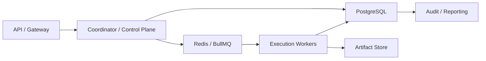

# Production Storage And Queue Contract

---

## OAPEFLIR 关联

本 contract 参vs OAPEFLIR 八阶段循环中的以下阶段：

- **Observe**：信号采集vs聚合
- **Assess**：执lines前评估vs风险判断
- **Plan**：任务分解vs DAG 构建
- **Execute**：步骤执linesvs容错
- **Feedback**：信号收集vs预handle
- **Learn**：模式检测vs知识提取
- **Improve**：改进候选评估vs rollout
- **Release**：受控发布vs回滚

---

## 1. 范围

本 contract defines从当前事务storage基线演进到工业级 PostgreSQL + Redis/BullMQ 队列的正式路线。

它回答的Issueis：平台进入生产后，哪些data必须放进 authoritative relational store，哪些职责进入 queue/broker，哪些设计从现在起就必须按 PG 语义约束。

相关文档：

- `storage_schema_contract.md`
- `runtime_repository_and_migration_contract.md`
- `execution_plane_contract.md`
- `event_bus_contract.md`

权威边界：

- table名、最小列和 inventory 以 `storage_schema_contract.md` 为准
- 生产拓扑、队列职责和 PG/Redis 边界以本文为准

## 2. 目标

- 把事务真相、队列派发和cache职责分清。
- 避免实现过度绑定 SQLite 特性。
- 提前冻结 PG 语义优先的 repository / migration 规则。
- 为 Redis/BullMQ 作为 execution queue 提供清晰边界。

## 3. 生产data分层

| 层 | 主要后端 | 负责内容 |
|---|-------|--------|
| `transaction store` | PostgreSQL | task、workflow、execution、approval、lease、audit、quota authoritative truth |
| `queue / dispatch` | Redis + BullMQ | execution ticket、delayed queue、retry queue、dead-letter routing |
| `artifact store` | object storage / file store | 大文件、报table、附件、export包 |
| `knowledge / rollout store` | PostgreSQL + pgvector | knowledge namespace 元data、semantic vector index、rollout record、strategy lineage |
| `analytics / replay` | PG 副table或后续分析storage | usage、cost、evaluation、ops aggregation |

## 4. 关键不variable

- authoritative task / execution state 不得只存在于 queue。
- queue 消息丢失后，必须能从 transaction store 重建。
- dispatch queue 负责“投递vs重试”，不负责“最终真相Status”。
- PG schema 设计优先于 SQLite 便捷特性。
- rollout / strategy / knowledge namespace 元data不得只保留在cache或 artifact 中。
- knowledge semantic embedding 若enabled外部向量检索，authoritative vector index 必须可由 PG/pgvector 重建，不得只存在于进程内cache。

## 5. 生产推荐拓扑

## 6. PostgreSQL 语义要求

- 所有 repository 设计必须兼容lines级锁、事务、唯一约束、外键和 JSONB。
- 不得把 SQLite 特有实现方式写成 contract 真相。
- migration 必须从一开始就supported在 PG 上验证。
- 任何“只在 SQLite 下能成立”的 shortcut 都必须登记为技术债。
- knowledge semantic infra 的 target 后端is `pgvector`；schema 应contains `knowledge_semantic_vectors` 或等价table，用 `knowledge_ref` 作为稳定键，并保留 `chunk_id`、`document_id`、`namespace`、`embedding_id`、`embedding_model`、`embedding vector(32)`、`updated_at`。
- pgvector extension 缺失时 migration 可以 fail-soft 并保留 notice，但显式选择 `AA_KNOWLEDGE_VECTOR_BACKEND=pgvector` 的 runtime 必须 fail-close。
- semantic query 应via `embedding <=> query_vector` 或等价 cosine distance 语义排序，不能把 keyword score as向量相似度。
- 仓库内必须提供可执lines的 pgvector readiness / roundtrip 检查入口；当前以 `knowledge-semantic-readiness` CLI 对 `AA_STORAGE_DRIVER=postgres` + `AA_KNOWLEDGE_VECTOR_BACKEND=pgvector` 执lines extension/table/ivfflat/roundtrip 校验，并在failed时 fail-close。

## 7. Queue 语义要求

- dispatch 至少一iterations投递。
- queue 消费success不等于业务success，必须等待 authoritative writeback。
- delay、retry、dead-letter 由 queue manage，但 decision source 仍来自 control plane。
- repeats投递必须relies on idempotency key + fencing token 防护。

## 8. 双跑vs迁移Recommendation

工业级推进顺序：

1. repository 先按 PG 语义实现接口。
2. migration 在 SQLite 和 PG 两侧都进lines兼容校验。
3. queue 先在单实例模式验证，再上 Redis/BullMQ。
4. 生产前完成 PG + queue 演练，不把切换拖到 Phase 4 以后。

Knowledge semantic infra 迁移路线：

1. `Current`：本地 hash embedding + archive scan / in-memory vector store 可used for开发和no PG 环境。
2. `Transition`：`SemanticVectorStore` 抽象同时supported `local_hash` vs `pgvector`；API 查询路径uses async retrieval，可等待向量索referenceswrites。
3. `Target`：生产enabled PostgreSQL + pgvector，`knowledge_semantic_vectors` 由 ingestion pipeline writes，semantic query 走 pgvector distance 排序；snapshot restore 后也必须能回填 semantic vector index。仓库内 readiness CLI vs roundtrip 校验completed，但真实 PG 环境仍必须完成 live validation 证据。

## 9. 一致性模型

| 对象 | 一致性 |
| --- | --- |
| task / execution / lease | 强一致 |
| approval decision | 强一致 |
| queue delivery | 至少一iterations |
| UI progress | 最终一致 |
| analytics aggregation | delay一致 |

## 10. failedvs回退

- Redis/BullMQ 不可用时，系统应进入 admission control 或降级，不得默默丢任务。
- PG 不可写时，不得继续accepts需要 authoritative state 的任务。
- 当 `AA_STORAGE_DRIVER=postgres` 时，startup preflight / doctor 必须先对 DSN、SSL、pool sizing、dual-run 开关vs shadow SQLite 路径完成 fail-close 校验，未via不得enabled postgres driver。
- queue vs DB writesinconsistent时，应优先相信 DB 真相并触发 repair job。

## 11. Phase 边界

当前：

- 文档和 repository 先按 PG/queue 语义设计
- 允许实现仍从单机基线起步

进入生产前必须完成：

- PG migration compatibility test
- queue replay / duplicate delivery drill
- DB/queue 断连故障演练
- rollout / strategy lineage consistency drill

## 12. 收口Conclusion

工业级生产不能把 PostgreSQL 和 queue 只当“未来替换件”。

从文档和 contract 起，就必须按“事务真相在 PG、调度投递在 queue、repeats投递由幂等vs fencing 兜底”的结构设计。
