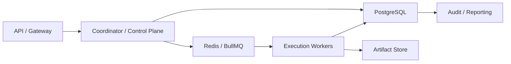

# Production Storage And Queue Contract

---

## OAPEFLIR Association

This contract participates in the following stages of the OAPEFLIR eight-stage cycle:

- **Observe**: Signal collection and aggregation
- **Assess**: Pre-execution assessment and risk judgment
- **Plan**: Task decomposition and DAG construction
- **Execute**: Step execution and fault tolerance
- **Feedback**: Signal collection and preprocessing
- **Learn**: Pattern detection and knowledge extraction
- **Improve**: Improvement candidate evaluation and rollout
- **Release**: Controlled release and rollback

---

## 1. Scope

This contract defines the formal path from the current transactional storage baseline evolving to industrial-grade PostgreSQL + Redis/BullMQ queue.

It answers the question: After the platform enters production, which data must go into the authoritative relational store, which responsibilities go to queue/broker, and which designs must from now on be constrained by PG semantics.

Related documents:

- `storage_schema_contract.md`
- `runtime_repository_and_migration_contract.md`
- `execution_plane_contract.md`
- `event_bus_contract.md`

Authoritative boundaries:

- Table names, minimum columns, and inventory are based on `storage_schema_contract.md`
- Production topology, queue responsibilities, and PG/Redis boundaries are based on this document

## 2. Objectives

- Clearly separate transactional truth, queue dispatch, and cache responsibilities.
- Avoid implementation over-binding to SQLite-specific features.
- Early-freeze PG-semantics-prioritized repository / migration rules.
- Provide clear boundaries for Redis/BullMQ as execution queue.

## 3. Production Data Layers

| Layer | Primary Backend | Responsibilities |
| --- | --- | --- |
| `transaction store` | PostgreSQL | task, workflow, execution, approval, lease, audit, quota authoritative truth |
| `queue / dispatch` | Redis + BullMQ | execution ticket, delayed queue, retry queue, dead-letter routing |
| `artifact store` | object storage / file store | Large files, reports, attachments, export packages |
| `knowledge / rollout store` | PostgreSQL + pgvector | knowledge namespace metadata, semantic vector index, rollout record, strategy lineage |
| `analytics / replay` | PG secondary tables or follow-up analytics storage | usage, cost, evaluation, ops aggregation |

## 4. Key Invariants

- Authoritative task / execution state must not exist only in the queue.
- After queue message loss, must be reconstructable from the transactional store.
- Dispatch queue is responsible for "delivery and retry", not for "final truth state".
- PG schema design takes precedence over SQLite convenience features.
- Rollout / strategy / knowledge namespace metadata must not be kept only in cache or artifacts.
- If knowledge semantic embedding uses external vector retrieval, the authoritative vector index must be reconstructable by PG/pgvector and must not exist only in process-level cache.

## 5. Recommended Production Topology

## 6. PostgreSQL Semantic Requirements

- All repository designs must be compatible with row-level locks, transactions, unique constraints, foreign keys, and JSONB.
- Must not write SQLite-specific implementation methods as contract truth.
- Migrations must from the start support validation on PG.
- Any "only works under SQLite" shortcuts must be registered as technical debt.
- Knowledge semantic infra target backend is `pgvector`; schema should include `knowledge_semantic_vectors` or equivalent table, using `knowledge_ref` as a stable key, preserving `chunk_id`, `document_id`, `namespace`, `embedding_id`, `embedding_model`, `embedding vector(32)`, `updated_at`.
- When pgvector extension is missing, migration can fail-soft and preserve a notice, but runtime explicitly selecting `AA_KNOWLEDGE_VECTOR_BACKEND=pgvector` must fail-close.
- Semantic queries should use `embedding <=> query_vector` or equivalent cosine distance semantic ordering and must not disguise keyword scores as vector similarity.
- The repository must provide executable pgvector readiness / roundtrip check entry; currently the `knowledge-semantic-readiness` CLI performs extension/table/ivfflat/roundtrip validation on `AA_STORAGE_DRIVER=postgres` + `AA_KNOWLEDGE_VECTOR_BACKEND=pgvector`, and fails-close on failure.
- Repository must provide executable pgvector readiness / roundtrip check entry; currently `knowledge-semantic-readiness` CLI performs extension/table/ivfflat/roundtrip validation on `AA_STORAGE_DRIVER=postgres` + `AA_KNOWLEDGE_VECTOR_BACKEND=pgvector` and fails-close on failure.
- Semantic queries should go through `embedding <=> query_vector` or equivalent cosine distance semantic ordering, and must not disguise keyword scores as vector similarity.
- The repository must provide executable pgvector readiness / roundtrip check entry; currently `knowledge-semantic-readiness` CLI performs extension/table/ivfflat/roundtrip validation on `AA_STORAGE_DRIVER=postgres` + `AA_KNOWLEDGE_VECTOR_BACKEND=pgvector` and fails-close on failure.

## 7. Queue Semantic Requirements

- Dispatch at-least-once delivery.
- Queue consumption success does not equal business success; must wait for authoritative writeback.
- Delay, retry, dead-letter are managed by queue, but decision source still comes from control plane.
- Repeated delivery must rely on idempotency key + fencing token protection.

## 8. Dual-Run and Migration Recommendations

Industrial-grade progression order:

1. Repository first implements interfaces per PG semantics.
2. Migration performs compatibility validation on both SQLite and PG sides.
3. Queue first validates in single-instance mode, then moves to Redis/BullMQ.
4. Complete PG + queue drills before production, and do not delay the switch past Phase 4.

Knowledge semantic infra migration path:

1. `Current`: Local hash embedding + archive scan / in-memory vector store can be used for development and non-PG environments.
2. `Transition`: `SemanticVectorStore` abstraction supports both `local_hash` and `pgvector`; API query path uses async retrieval and can wait for vector index writes.
3. `Target`: Production enables PostgreSQL + pgvector, `knowledge_semantic_vectors` written by ingestion pipeline, semantic queries go through pgvector distance ordering; after snapshot restore, semantic vector index must also be backfilled. Repository readiness CLI and roundtrip validation are complete, but real PG environments must still complete live validation evidence.

## 9. Consistency Model

| Object | Consistency |
| --- | --- |
| task / execution / lease | Strongly consistent |
| approval decision | Strongly consistent |
| queue delivery | At-least-once |
| UI progress | Eventually consistent |
| analytics aggregation | Lazily consistent |

## 10. Failure and Rollback

- When Redis/BullMQ is unavailable, system should enter admission control or degradation and must not silently drop tasks.
- When PG is not writable, must not continue accepting tasks requiring authoritative state.
- When `AA_STORAGE_DRIVER=postgres`, startup preflight / doctor must first perform fail-close validation on DSN, SSL, pool sizing, dual-run switch, and shadow SQLite path; if validation fails, postgres driver must not be enabled.
- When queue and DB writes are inconsistent, should prioritize trusting DB truth and triggering repair job.

## 11. Phase Boundaries

Currently:

- Documentation and repository first designed per PG/queue semantics
- Implementation may still start from single-machine baseline

Must be completed before production:

- PG migration compatibility test
- Queue replay / duplicate delivery drill
- DB/queue disconnection fault drill
- Rollout / strategy lineage consistency drill

## 12. Consolidation Conclusion

Industrial-grade production cannot treat PostgreSQL and queue merely as "future replacements".

From documentation and contract onward, must design with the structure of "transactional truth in PG, schedule delivery in queue, repeated delivery guaranteed by idempotency and fencing".