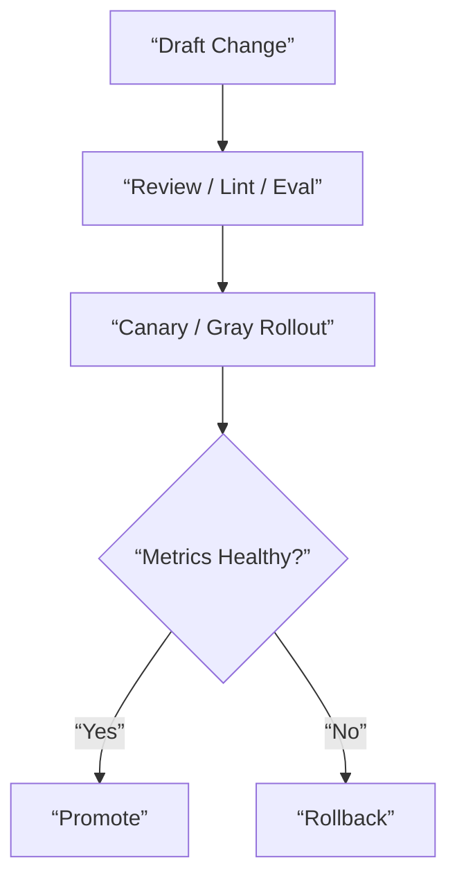

# Prompt Model Policy Governance Contract

## 1. Scope

This contract defines version, review, gray-release, rollback, and evaluation boundaries for three high-risk governance objects: prompt, model, and policy.

Related documents:

- `release_rollout_and_rollback_contract.md`
- `policy_engine_contract.md`
- `vcr_and_fixture_testing_contract.md`

## 2. Goals

- Govern prompts like code.
- Model changes must be evaluable androllable.
- Policy changes must be auditable and gray-releasable.

## 3. Model Governance

At minimum should define:

- `model whitelist`
- `capability labels`
- `frozen version`
- `fallback chain`
- `rollback target`
- `evaluation gate`
- `auth profile routing`
- `cooldown / disabled state`
- `session affinity`

Supplementary rules:

- Provider fallback should not only be expressed as “model chain” but also consider auth profile rotation within provider.
- For multiple credentials or accounts of the same provider, should support explicit sorting, cooling, disabling, and recovery.
- Auto-selected auth profile can maintain session stickiness to reduce cache churn and behavior drift.
- User-explicitly pinned profile / model should be distinguished from system auto fallback and must not be silently overridden.

## 4. Prompt Governance

At minimum should define:

- prompt version
- owner
- review requirement
- rollout scope
- rollback version
- lint / test evidence

## 5. Policy Governance

At minimum should define:

- policy bundle version
- change ticket
- effective scope
- deny/allow delta summary
- audit evidence

## 6. Governance Process

## 7. Continuous Evaluation

Industrial-grade requirements at minimum:

- Daily regression suite
- Pre-release regression suite
- Business unit bucketed evaluation
- High-risk adversarial samples

## 8. Circuit Breaker and Rollback

- When model fails or quality is abnormal, should support switching to fallback model.
- When prompt release causes failure rate or risk rate to rise, should support quick rollback.
- When policy release causes false rejections or false allowances, should support bundle rollback.

## 9. Conclusion

Industrial-grade LLM governance is not “try switching models” but:

- Versions are traceable
- Releases are gray-releasable
- Quality is evaluable
- Issues are rollrollable
