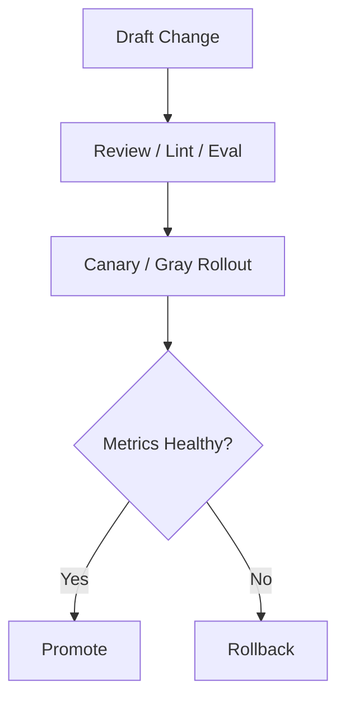

# Prompt Model Policy Governance Contract

## 1. Scope

This contract defines versioning, review, canary, rollback, and evaluation boundaries for prompt, model, and policy这三类高风险治理对象.

Related documents:

- `release_rollout_and_rollback_contract.md`
- `policy_engine_contract.md`
- `vcr_and_fixture_testing_contract.md`

## 2. Objectives

- Govern prompts like code.
- Model changes must be evaluable and rollbackable.
- Policy changes must be auditable and canary-releasable.

## 3. Model Governance

Must define at minimum:

- `model whitelist`
- `capability labels`
- `frozen version`
- `fallback chain`
- `rollback target`
- `evaluation gate`
- `auth profile routing`
- `cooldown / disabled state`
- `session affinity`

Supplementary rules:

- Provider fallback should not only be expressed as a "model chain", but should also consider auth profile rotation within a provider.
- For multiple credentials or accounts of the same provider, should support explicit ordering, cooling, disabling, and recovery.
- Auto-selected auth profiles can maintain session affinity to reduce cache churn and behavioral drift.
- User-explicitly pinned profile / model should be handled separately from system auto-fallback and must not be silently overwritten.

## 4. Prompt Governance

Must define at minimum:

- prompt version
- owner
- review requirement
- rollout scope
- rollback version
- lint / test evidence
- KV cache fixed prefix strategy
- domain block compatibility

Supplementary rules:

- System prompt should allow splitting into three layers: `fixed_prefix`, `domain_block`, `variable_suffix`, to reduce prefill cost for multi-agent handoff.
- Changes to `fixed_prefix` should be treated as high-impact prompt changes; same-layer hash changes must trigger cache invalidation and regression validation.
- `domain_block` can be governed by domain / profile dimension and must not implicitly drift without updating version/owner.
- `variable_suffix` can be dynamically generated by task but must not break safety constraints and output format boundaries defined at the policy layer.

## 5. Policy Governance

Must define at minimum:

- policy bundle version
- change ticket
- effective scope
- deny/allow delta summary
- audit evidence

## 6. Governance Process

Within OAPEFLIR Phase 1-4 scope, Prompt / Policy related releases must support at minimum:

- `off`
- `suggest`
- `shadow`

`canary`, `staged`, `auto_rollback` can be expanded in later phases but should not be disguised as currently delivered capabilities.

## 7. Continuous Evaluation

Industrial-grade requirements must have at minimum:

- Daily regression suite
- Pre-release regression suite
- Business division bucket evaluation
- High-risk adversarial samples

## 8. Circuit Breaking and Rollback

- When model fails or quality anomalies occur, should support switching to fallback model.
- When prompt release causes increased failure rate or risk rate, should support quick rollback.
- When policy release causes false rejections or false allows, should support bundle rollback.
- Whether rollout is allowed to enter `shadow` must pass a deterministic guardrail; when guardrail does not pass, system can only retain suggestion state and must not be directly allowed by the model.

## 9. Consolidation Conclusion

Industrial-grade LLM governance is not "try switching models":

- Versions are traceable
- Releases are canary-releasable
- Quality is evaluable
- Issues are rollbackable