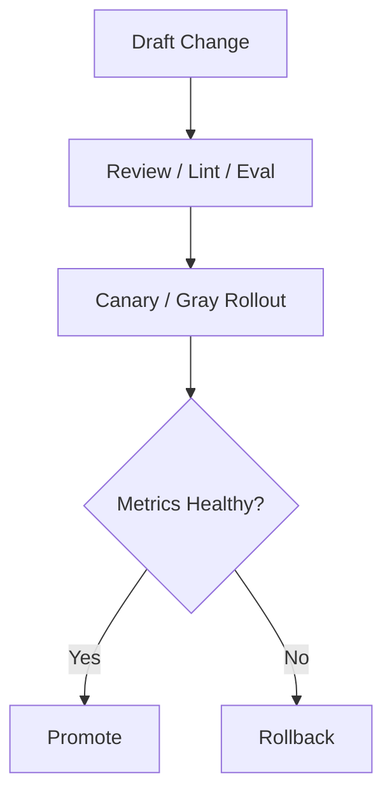

# Prompt Model Policy Governance Contract

## 1. Scope

This contract defines versioning, review, rollout, rollback, and evaluation boundaries for three high-risk governance objects: prompts, models, and policies.

Related documents:

- `release_rollout_and_rollback_contract.md`
- `policy_engine_contract.md`
- `vcr_and_fixture_testing_contract.md`

## 2. Goals

- Govern prompts like code.
- Model changes must be evaluable and rollbackable.
- Policy changes must be auditable and canaried.

## 3. Model Governance

Must define at minimum:

- `model whitelist`
- `capability labels`
- `frozen version`
- `fallback chain`
- `rollback target`
- `evaluation gate`
- `auth profile routing`
- `cooldown / disabled state`
- `session affinity`

Supplementary rules:

- Provider fallback should not only be expressed as a "model chain", but should also consider auth profile rotation within a provider.
- For multiple credentials or accounts of the same provider, explicit ordering, cooldown, disable, and recovery must be supported.
- Auto-selected auth profiles can maintain session stickiness to reduce cache churn and behavioral drift.
- User-explicitly pinned profiles/models must be distinguished from system auto-fallback and must not be silently overridden.

## 4. Prompt Governance

Must define at minimum:

- prompt version
- owner
- review requirement
- rollout scope
- rollback version
- lint / test evidence
- KV cache fixed prefix strategy
- domain block compatibility

Supplementary rules:

- System prompts may be split into three layers: `fixed_prefix`, `domain_block`, `variable_suffix`, to reduce prefill cost during multi-agent handoffs.
- Changes to `fixed_prefix` should be treated as high-impact prompt changes; hash changes within the same layer must trigger cache invalidation and regression verification.
- `domain_block` can be governed by domain/profile dimensions and must not implicitly drift without updating version/owner.
- `variable_suffix` can be dynamically generated per task, but must not break security constraints and output format boundaries defined by the policy layer.

## 5. Policy Governance

Must define at minimum:

- policy bundle version
- change ticket
- effective scope
- deny/allow delta summary
- audit evidence

## 6. Governance Process

Within OAPEFLIR Phase 1-4 scope, prompt/policy-related releases must support at minimum:

- `off`
- `suggest`
- `shadow`

`canary`, `staged`, `auto_rollback` may be extended in later phases but must not be misrepresented as currently delivered capabilities.

## 7. Continuous Evaluation

Industrial-grade requirements include at minimum:

- Daily regression suite
- Pre-release regression suite
- Division bucketed evaluation
- High-risk adversarial samples

## 8. Circuit Breaking and Rollback

- When a model fails or quality anomalies occur, switching to a fallback model must be supported.
- When prompt release causes increased failure rate or risk rate, fast rollback must be supported.
- When policy release causes false rejections or false allowances, bundle rollback must be supported.
- Whether rollout is allowed to enter `shadow` must pass a deterministic guardrail; when guardrail does not pass, the system may only retain suggestion state, and must not be directly approved by the model.

## 9. Closure Conclusion

Industrial-grade LLM governance is not "try switching models", but rather:

- Version traceable
- Release canaried
- Quality evaluable
- Issues rollbackable
