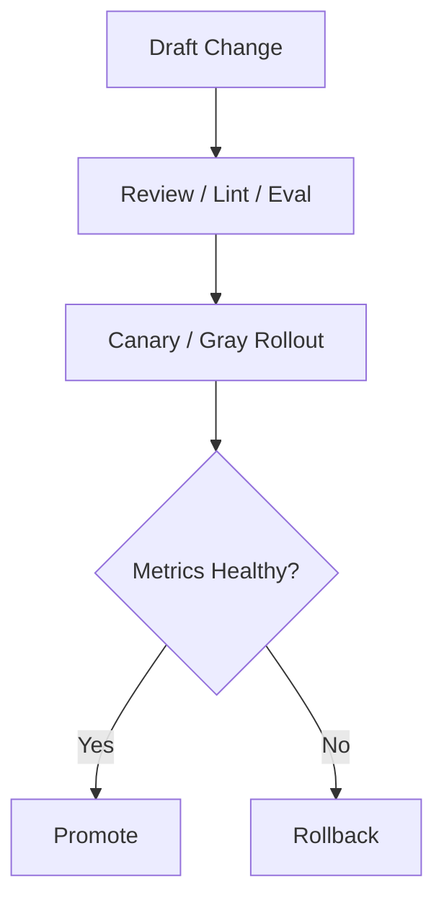

# Prompt Model Policy Governance Contract

## 1. 范围

本 contract defines prompt、model、policy 三class高风险治理对象的版本、审查、灰度、回滚和评测边界。

相关文档：

- `release_rollout_and_rollback_contract.md`
- `policy_engine_contract.md`
- `vcr_and_fixture_testing_contract.md`

## 2. 目标

- prompt 像code一样治理。
- model 变更必须可评估、可回滚。
- policy 变更必须可审计、可灰度。

## 3. Model Governance

至少应defines：

- `model whitelist`
- `capability labels`
- `frozen version`
- `fallback chain`
- `rollback target`
- `evaluation gate`
- `auth profile routing`
- `cooldown / disabled state`
- `session affinity`

补充规则：

- provider fallback 不应只按“模型链条”table达，也应考虑 provider 内的 auth profile rotation。
- 对同一 provider 的多个凭据或账号，应supported显式排序、冷却、disabled和恢复。
- 自动选中的 auth profile 可按 session 保持粘性，以减少cache抖动和lines为漂移。
- user显式 pin 的 profile / model 应vs系统自动 fallback 区分handle，不得no提示篡改。

## 4. Prompt Governance

至少应defines：

- prompt version
- owner
- review requirement
- rollout scope
- rollback version
- lint / test evidence
- KV cache fixed prefix strategy
- domain block compatibility

补充规则：

- system prompt 应允许拆分为 `fixed_prefix`、`domain_block`、`variable_suffix` 三层，以降低多 agent handoff 的 prefill 成本。
- `fixed_prefix` 的变更应视为高Impact prompt 变更；同层 hash 变化必须触发cache失效vs回归验证。
- `domain_block` 可按 domain / profile 维度治理，不得在未更新 version/owner 的情况下隐式漂移。
- `variable_suffix` 可按任务dynamically生成，但不得突破 policy 层defines的security约束vs输出格式边界。

## 5. Policy Governance

至少应defines：

- policy bundle version
- change ticket
- effective scope
- deny/allow delta summary
- audit evidence

## 6. 治理流程

在 OAPEFLIR Phase 1-4 范围内，Prompt / Policy 相关 release 至少supported：

- `off`
- `suggest`
- `shadow`

`canary`、`staged`、`auto_rollback` 可作为后续阶段扩展，但不应as当前已交付能力。

## 7. 持续评测

工业级要求至少有：

- 日常回归集
- 发布前回归集
- 事业部分桶评测
- 高风险对抗样本

## 8. 熔断vs回滚

- 模型失效或质量异常时，应supported切换到 fallback model。
- prompt 发布导致failed率或风险率上升时，应supported快速回滚。
- policy 发布造成误拒或误放时，应supported bundle rollback。
- rollout isno允许进入 `shadow` 必须via过 deterministic guardrail；guardrail 不via时，系统只能保留Recommendation态，不得由模型directly放lines。

## 9. 收口Conclusion

工业级 LLM 治理不is“换个模型试试”，而is：

- 版本可追踪
- 发布可灰度
- 质量可评测
- Issue可回滚
