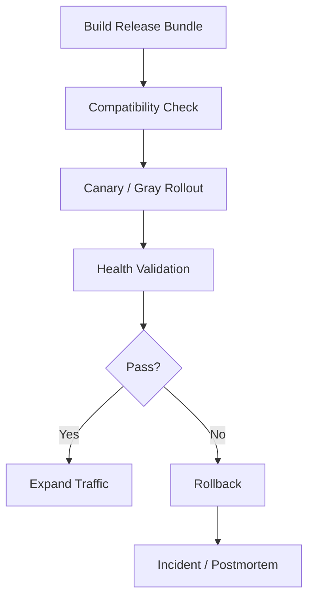

# Release Rollout And Rollback Contract

## 1. Scope

This contract defines industrial-grade release, gray-scale, rollback, and schema compatibility strategies.

Related documents:

- `runtime_repository_and_migration_contract.md`
- `prompt_model_policy_governance_contract.md`
- `enterprise_operations_plane_contract.md`

## 2. Goals

- Unify release path for code, configuration, prompt, role, skill.
- Make any production release have controllable gray-scale and executable rollback.
- Make schema changes comply with forward/backward compatibility.

## 3. Release Objects

- `application_binary`
- `config_bundle`
- `prompt_bundle`
- `policy_bundle`
- `role_bundle`
- `skill_bundle`
- `schema_migration`

## 4. Release Modes

| Mode | Purpose |
| --- | --- |
| `blue_green` | Main chain major version, need quick whole-group switch |
| `canary` | Small traffic verification |
| `tenant_gray` | Designated tenant or business unit batch gray-scale |
| `feature_flag` | Feature enable/disable and quick loss stopping |

## 5. Required Capabilities

- Release batch ID
- Release object version number
- Gray-scale target scope
- One-click rollback entry
- Rollback prerequisite check
- Post-release health validation
- `config_bundle_ref / registry_credential_ref / deployment_credential_ref` injection plan

## 6. Schema Compatibility Matrix

Industrial-grade schema changes must first comply with:

1. Add before use
2. First compatible then switch
3. First forward then cleanup

Not allowed:

- Directly delete columns being depended on by old version
- Simultaneously go online "new code depends on new column" without compatibility window
- Bind irreversible data conversion and application logic switch into one step

## 7. Release Process

## 8. Rollback Rules

- Code rollback must be faster than data repair.
- prompt / policy / feature flag should support independent rollback.
- Schema rollback if irreversible must be declared in advance and prepare compensating migration.
- Rollback action must produce logs, audit, and incident records.
- If involving local workspace file modification, allowed to use shadow snapshot / shadow git repo outside workspace as step-level undo / redo basis; but must not leak git state into user workspace.
- Shadow snapshot at minimum should support: one operation one stable snapshot, common generated directory exclusion, super large directory protection, and on failure not pollute user repository.

## 9. Production Entry Threshold

- Has health validation step
- Has tenant gray strategy
- Has rollback owner
- Has schema compatibility checklist
- Has machine-readable secret/config injection plan, and workflow only consumes ref, does not consume plaintext secret

## 9.1 Current Execution Surface Requirements

- `release-pipeline` must simultaneously support `build / export / execute` three modes.
- `execute` must execute real `docker build` and `gh workflow run publish` through command runner seam and allow `simulate` runner for sandboxable verification.
- Publish path when consuming registry credential must first describe, then issue/revoke short-term lease per execute path; on failure must fail-close and recycle lease.
- When `AA_RELEASE_TRIGGER_DEPLOY=true`, release execute must be able to chain-trigger `deployment-execution execute`, but still maintain release and deployment respective independent ledger / artifact.
- Release execution result must not only land artifact, must additionally persist machine-readable execution ledger and record workflow dispatch run id / URL for subsequent audit, reconciliation, and replay.

## 10. Closure Conclusion

Industrial-grade release is not "can deploy" but "can gray-scale, can validate, can rollback, can review".
