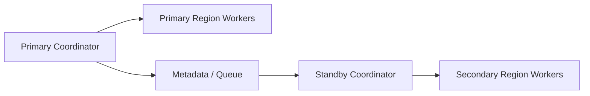

# Remote Coordination And Disaster Recovery Contract

---

## OAPEFLIR Mapping

This contract participates in the following stages of the OAPEFLIR eight-stage loop:

- **Observe**: signal collection and aggregation
- **Assess**: pre-execution evaluation and risk judgement
- **Plan**: task decomposition and DAG construction
- **Execute**: step execution and fault tolerance
- **Feedback**: signal collection and preprocessing
- **Learn**: pattern detection and knowledge extraction
- **Improve**: improvement candidate evaluation and rollout
- **Release**: controlled release and rollback

---

## 1. Scope

This contract defines file consistency, remote execution observability, and cross-region disaster recovery boundaries in Bridge / Worker remote coordination scenarios.

Related documents:

- `execution_plane_contract.md`
- `ha_coordinator_and_leader_election_contract.md`
- `tenant_isolation_and_shared_worker_safety_contract.md`
- `production_storage_and_queue_contract.md`

## 2. Goals

- Make remote workers not just "able to connect", but possess consistency and recoverability.
- Provide formal recovery paths for cross-region coordination, worker loss of contact, and synchronization breakage.
- Establish a source of truth for future coordinator clusters and region-level failover.

## 3. Remote File Consistency

At least define:

- Conflict detection
- Incremental verification
- Hash reconciliation
- Synchronization recovery after session disconnect
- Rate limiting for large file synchronization
- Execution blocking rules after synchronization failure

## 4. Remote Execution Observability

Each remote worker must at least report:

- saturation
- active lease count
- mean startup latency
- sandbox success rate
- repo cache hit rate

Should also at least support:

- bridge credential refresh success rate
- stream resume success rate
- last acknowledged stream offset
- session consistency check result after reconnect

Remote session status should at least distinguish:

- `connecting`
- `connected`
- `reconnecting`
- `degraded`
- `failed`
- `viewer_only`

## 5. Disaster Recovery Capabilities

A mature industrial platform should progressively support:

- Region-level failover
- Worker cross-region reallocation
- Metadata store primary-standby switchover
- Queue / lease repair

## 6. Key Invariants

- After a remote worker loses contact, the old lease must not continue to write back to authoritative state.
- File synchronization state must be verifiable, and must not only rely on "it looked successful last time".
- After a region-level switchover, the control plane must be able to determine which executions need to be rebuilt and which only need reconnection.
- When synchronization hash is inconsistent, repo version is inconsistent, or lease ownership is inconsistent, it must default to not continuing execution.
- After bridge credentials are refreshed, the new epoch / session generation must override the write permission of the old transport.
- Remote stream recovery should resume from the acknowledged offset, rather than defaulting to a full replay.
- A `viewer_only` session may consume logs and state, but must not send interruption, approval, dispatch, or write back to authoritative state.
- Transient reconnect and permanent disconnect must be explicitly distinguished at the event and UI layer, to avoid misjudging short jitter as final failure.

## 7. Topology Sketch

## 8. Closure Conclusion

Once remote coordination reaches industrial grade, the focus is no longer "can we dispatch", but:

- Are files and state consistent
- After a worker loses contact, can it be safely reclaimed
- After a regional failure, can it be controlled and switched
- When inconsistent, can it be blocked in time, rebuilt, and given a clear recovery path

Additional notes:

- Currently only general patterns such as token refresh, 401 recovery, and offset resumption from remote bridging are referenced.
- Proprietary session / bridge protocols from external systems are not written directly into the source of truth for this system.
