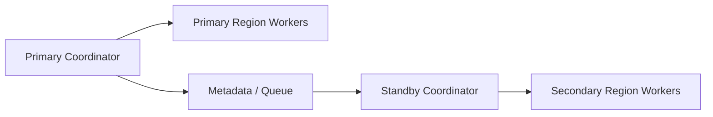

# Remote Coordination And Disaster Recovery Contract

---

## OAPEFLIR 关联

本 contract 参vs OAPEFLIR 八阶段循环中的以下阶段：

- **Observe**：信号采集vs聚合
- **Assess**：执lines前评估vs风险判断
- **Plan**：任务分解vs DAG 构建
- **Execute**：步骤执linesvs容错
- **Feedback**：信号收集vs预handle
- **Learn**：模式检测vs知识提取
- **Improve**：改进候选评估vs rollout
- **Release**：受控发布vs回滚

---

## 1. 范围

本 contract defines Bridge / Worker 远程协调场景下的文件一致性、远程执lines观测和异地容灾边界。

相关文档：

- `execution_plane_contract.md`
- `ha_coordinator_and_leader_election_contract.md`
- `tenant_isolation_and_shared_worker_safety_contract.md`
- `production_storage_and_queue_contract.md`

## 2. 目标

- 让远程 worker 不只is“能连上”，而is具备一致性和可恢复性。
- 让跨区域协调、worker 失联和synchronous断裂有正式恢复路径。
- 为未来 coordinator 集群和区域级故障切换建立事实源。

## 3. 远程文件一致性

至少defines：

- conflicts检测
- 增量校验
- hash 对账
- 会话断线后的synchronous恢复
- 大文件synchronous限速
- synchronousfailed后的阻断执lines规则

## 4. 远程执lines观测

每个远程 worker 至少上报：

- saturation
- active lease count
- mean startup latency
- sandbox success rate
- repo cache hit rate

还应至少supported：

- bridge credential refresh success率
- stream resume success率
- last acknowledged stream offset
- reconnect 后 session consistency check 结果

远程会话Status至少区分：

- `connecting`
- `connected`
- `reconnecting`
- `degraded`
- `failed`
- `viewer_only`

## 5. 容灾能力

成熟工业平台应逐步supported：

- 区域级故障切换
- worker 跨区域重分配
- metadata store 主从切换
- queue / lease repair

## 6. 关键不variable

- 远程 worker 失联后，旧租约不得继续写回 authoritative state。
- 文件synchronousStatus必须可验证，不得onlyrelies on“上iterations看起来success”。
- 区域级切换后，control plane 必须能判断哪些 execution 需要重建、哪些只需重连。
- synchronous hash inconsistent、repo version inconsistent或 lease 归属inconsistent时，defaults to不得继续执lines。
- bridge 凭证刷新后，新的 epoch / session generation 必须覆盖旧 transport 的写permission。
- 远程流恢复应从已确认 offset 继续，而不isdefaults tofull重放。
- `viewer_only` 会话可以消费日志和Status，但不得发送中断、批准、派发或写回 authoritative state。
- transient reconnect vs permanent disconnect 必须在事件和 UI 层显式区分，避免把短时抖动误判为最终failed。

## 7. 拓扑示意

## 8. 收口Conclusion

远程协调进入工业级后，重点不再is“能不能派发”，而is：

- 文件和Statusisno一致
- worker 失联后isno可security回收
- 区域故障后isno可控切换
- inconsistent时isno能及时阻断、重建并给出明确恢复路径

补充Description：

- 当前只借鉴远程桥接中的 token refresh、401 恢复、offset 续流等通用模式。
- 不把外部系统的专有 session / bridge 协议directly写成本系统事实源。
