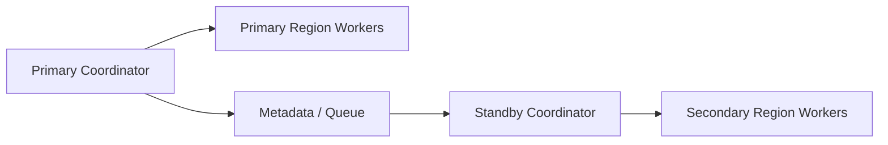

# Remote Coordination And Disaster Recovery Contract

## 1. Scope

This contract defines file consistency, remote execution observation, and cross-region disaster recovery boundaries for Bridge / Worker remote coordination scenarios.

Related documents:

- `execution_plane_contract.md`
- `ha_coordinator_and_leader_election_contract.md`
- `tenant_isolation_and_shared_worker_safety_contract.md`
- `production_storage_and_queue_contract.md`

## 2. Goals

- Make remote workers not just "able to connect" but have consistency and recoverability.
- Establish formal recovery paths for cross-region coordination, worker disconnection, and sync breakage.
- Establish source of truth for future coordinator clusters and region-level failover.

## 3. Remote File Consistency

At minimum define:

- Conflict detection
- Incremental verification
- Hash reconciliation
- Sync recovery after session disconnection
- Large file sync rate limiting
- Blocking execution rules after sync failure

## 4. Remote Execution Observation

Each remote worker at minimum reports:

- saturation
- active lease count
- mean startup latency
- sandbox success rate
- repo cache hit rate

Should also at minimum support:

- bridge credential refresh success rate
- stream resume success rate
- last acknowledged stream offset
- session consistency check result after reconnect

Remote session states at minimum distinguish:

- `connecting`
- `connected`
- `reconnecting`
- `degraded`
- `failed`
- `viewer_only`

## 5. Disaster Recovery Capabilities

Mature industrial platforms should gradually support:

- Region-level failover
- Worker cross-region reassignment
- Metadata store primary/secondary switch
- queue / lease repair

## 6. Key Invariants

- After remote worker disconnection, old leases must not continue writing back to authoritative state.
- File sync status must be verifiable and must not rely only on "looked successful last time".
- After region-level switch, control plane must be able to determine which executions need rebuild and which only need reconnect.
- When sync hash inconsistent, repo version inconsistent, or lease ownership inconsistent, must not continue execution by default.
- After bridge credential refresh, new epoch / session generation must overwrite old transport's write permissions.
- Remote stream recovery should continue from acknowledged offset, not full replay by default.
- `viewer_only` sessions can consume logs and status but must not send interrupts, approvals, dispatches, or write back to authoritative state.
- Transient reconnect and permanent disconnect must be explicitly distinguished at event and UI layers to avoid misjudging short-term jitter as final failure.

## 7. Topology Diagram

## 8. Conclusion

After remote coordination enters industrial grade, the focus is no longer "can it dispatch" but:

- Are files and state consistent
- Can workers be safely reclaimed after disconnection
- Can region failures be controlled and switched
- Can inconsistencies be timely blocked, rebuilt, and given clear recovery paths

Supplementary notes:

- Currently only borrowing common patterns from remote bridging: token refresh, 401 recovery, offset continuation.
- Not directly writing external system's proprietary session / bridge protocols as this system's source of truth.
