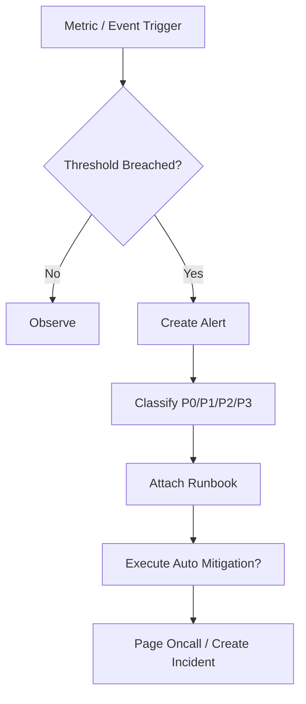

# SLO Alerting And Runbook Contract

## 1. Scope

This contract defines industrial-grade SLI/SLO/SLA, alert classification, and runbook directory.

It answers the questions: what counts as "production available", when should alerts be triggered, and what should on-call personnel look at, do, and how to contain damage when issues occur.

Related documents:

- `observability_contract.md`
- `debug_inspect_health_backpressure_contract.md`
- `enterprise_operations_plane_contract.md`

## 2. SLI Hierarchy

| Layer | SLI Examples |
| --- | --- |
| OAPEFLIR Layer | loop convergence rate, feedback positive rate, rollout success rate |
| System Layer | API availability, event loop latency, DB writability |
| Platform Layer | task success rate, startup latency, recovery success rate |
| Interaction Layer | approval availability, streaming first-packet latency |
| Cost Layer | budget estimation error, token metering delay |

## 3. Minimum SLO Set

- `task_success_rate`
- `task_start_latency`
- `approval_delivery_availability`
- `recovery_success_rate`
- `tier1_event_delivery_latency`
- `cost_accounting_accuracy`
- `oapeflir_loop_convergence_rate`
- `feedback_positive_rate`
- `rollout_success_rate`

Rules:

- Before production declaration, each SLO must have calculation formula, data source, and alert threshold.
- Goals without observability formula must not be written as external SLA.

## 4. Alert Classification

| Level | Description | Typical Examples |
| --- | --- | --- |
| `P0` | Platform core unavailable | New task cannot execute, authoritative DB not writable |
| `P1` | Critical tenant or critical path failure | Critical tenant cannot dispatch tasks, approval chain largely failed |
| `P2` | Single division or local capability significantly degraded | A certain division failure rate spikes |
| `P3` | Local anomaly or capacity warning | Queue delay increasing, cost drift high |

## 5. Alert Must Include

- Trigger metric and threshold
- Impact scope
- First discovery time
- Recommended runbook
- Whether auto containment action has been executed

## 6. Runbook Directory

At minimum should have the following runbooks:

- `worker_mass_disconnect`
- `provider_429_or_5xx_spike`
- `queue_backlog_breach`
- `approval_channel_unavailable`
- `cost_spike_containment`
- `database_lock_contention`
- `stale_lease_repair`
- `secret_rotation_failure`
- `oapeflir_loop_stalled`
- `rollout_blocked_or_rollback`

## 7. Alert Flow Diagram

## 8. Auto Containment Boundaries

Allowed to auto-execute:

- admission control tightening
- provider failover
- queue rate limiting
- A specific tenant / division rate limiting

Forbidden to auto-execute:

- Unauthorized large-scale destructive rollback
- Cross-tenant data-level operations
- Directly ignoring approval chain

## 9. Phase Boundaries

Phase 1a / 1b must freeze at minimum:

- SLI name and formula
- P0-P3 classification
- Basic runbook checklist

Must complete before production:

- Threshold finalization
- On-call contact and escalation path
- Drill records

## 10. Closure Conclusion

Industrial-grade operations is not "lots of logs", but:

- Has clear SLO
- Has actionable alerts
- Has runbooks
- Has auto containment boundaries
