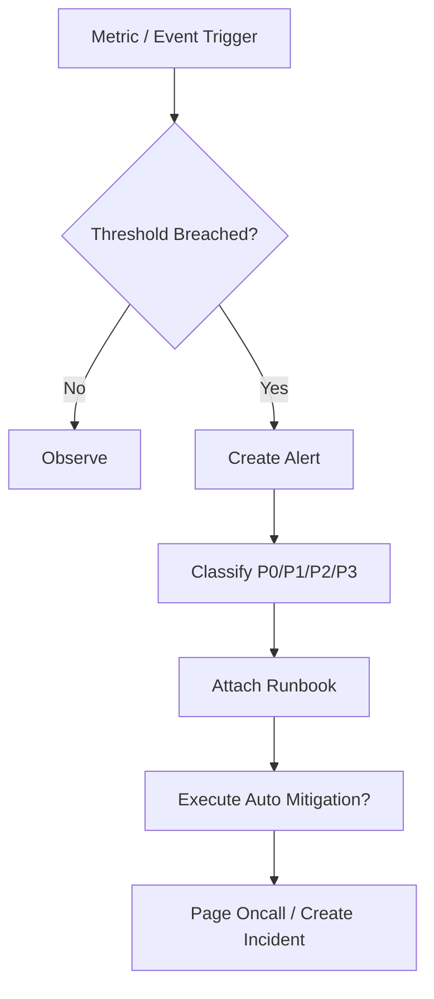

# SLO Alerting And Runbook Contract

## 1. Scope

This contract defines industrial-grade SLI/SLO/SLA, alert classification, and runbook directory.

It answers the question: What counts as "production available," when does it need alerting, and what should on-duty personnel look at, do, and how to stop losses when incidents occur.

Related documents:

- `observability_contract.md`
- `debug_inspect_health_backpressure_contract.md`
- `enterprise_operations_plane_contract.md`

## 2. SLI Layering

| Layer | SLI Examples |
| --- | --- |
| System layer | API availability, event loop delay, DB writability |
| Platform layer | Task success rate, startup latency, recovery success rate |
| Interaction layer | Approval availability, streaming first-packet latency |
| Cost layer | Budget estimation error, token metering delay |

## 3. Minimum SLO Set

- `task_success_rate`
- `task_start_latency`
- `approval_delivery_availability`
- `recovery_success_rate`
- `tier1_event_delivery_latency`
- `cost_accounting_accuracy`

Rules:

- Before production declaration, each SLO must have calculation scope/definition, data source, and alert threshold.
- Targets without observable scope must not be written as external SLA.

## 4. Alert Classification

| Level | Description | Typical Examples |
| --- | --- | --- |
| `P0` | Platform core unavailable | New tasks cannot execute, authoritative DB not writable |
| `P1` | Key tenant or key chain invalidated | Key tenant cannot dispatch tasks, approval chain largely invalidated |
| `P2` | Single business unit or local capability significantly degraded | Some division failure rate surges |
| `P3` | Local anomaly or capacity warning | Queue delay rising, cost drift relatively high |

## 5. Alerts Must Include

- Triggering metric and threshold
- Impact scope
- First discovery time
- Suggested runbook
- Whether auto mitigation action has been executed

## 6. Runbook Directory

At minimum should have the following runbooks:

- `worker_mass_disconnect`
- `provider_429_or_5xx_spike`
- `queue_backlog_breach`
- `approval_channel_unavailable`
- `cost_spike_containment`
- `database_lock_contention`
- `stale_lease_repair`
- `secret_rotation_failure`

## 7. Alert Flow Diagram

## 8. Auto Mitigation Boundaries

Allowed to auto-execute:

- admission control tightening
- provider switching
- queue rate limiting
- Some tenant / division rate limiting

Forbidden to auto-execute:

- Unauthorized large-scale destructive rollback
- Cross-tenant data-level operations
- Directly ignoring approval chain

## 9. Phase Boundaries

Phase 1a / 1b at minimum must