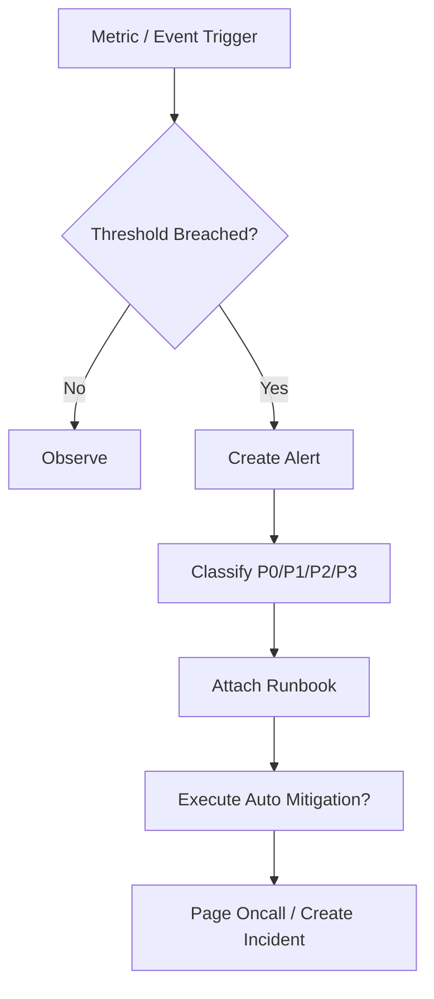

# SLO Alerting And Runbook Contract

## 1. Scope

This contract defines SLI/SLO/SLA for industrial-grade operations, alert classification, and runbook inventory.

It answers the questions: what counts as "production ready," when alerts should fire, and what on-call personnel should look at, do, and how to contain damage when incidents occur.

Related documents:

- `observability_contract.md`
- `debug_inspect_health_backpressure_contract.md`
- `enterprise_operations_plane_contract.md`

## 2. SLI Layering

| Layer | SLI Examples |
|---|---|
| OAPEFLIR layer | loop convergence rate, feedback positive rate, rollout success rate |
| System layer | API availability, event loop latency, DB writability |
| Platform layer | task success rate, start latency, recovery success rate |
| Interaction layer | approval availability, streaming time-to-first-byte |
| Cost layer | budget estimation error, token metering latency |

## 3. Minimum SLO Set

- `task_success_rate`
- `task_start_latency`
- `approval_delivery_availability`
- `recovery_success_rate`
- `tier1_event_delivery_latency`
- `cost_accounting_accuracy`
- `oapeflir_loop_convergence_rate`
- `feedback_positive_rate`
- `rollout_success_rate`

Rules:

- Before any production declaration, each SLO must have calculation methodology, data source, and alert thresholds.
- Objectives without observable metrics must not be written as external SLAs.

## 4. Alert Classification

| Level | Description | Typical Examples |
|---|---|---|
| `P0` | Platform core unavailable | New tasks cannot execute, authoritative DB not writable |
| `P1` | Critical tenant or critical path failure | Critical tenant cannot dispatch tasks, approval chain widely failed |
| `P2` | Single division or partial capability significantly degraded |某个 division failure rate spiked |
| `P3` | Local anomaly or capacity warning | Queue latency increased, cost drift偏高 |

## 5. Alerts Must Include

- Trigger metric and threshold
- Impact scope
- First discovery time
- Recommended runbook
- Whether auto-containment action has been executed

## 6. Runbook Inventory

At minimum, the following runbooks must exist:

- `worker_mass_disconnect`
- `provider_429_or_5xx_spike`
- `queue_backlog_breach`
- `approval_channel_unavailable`
- `cost_spike_containment`
- `database_lock_contention`
- `stale_lease_repair`
- `secret_rotation_failure`
- `oapeflir_loop_stalled`
- `rollout_blocked_or_rollback`

## 7. Alert Flow Diagram

## 8. Auto-Containment Boundaries

Auto-execution permitted:

- Admission control tightening
- Provider traffic switching
- Queue rate limiting
- Per-tenant / division rate limiting

Auto-execution prohibited:

- Unauthorized large-scale destructive rollback
- Cross-tenant data-level operations
- Directly ignoring approval chain

## 9. Phase Boundaries

Phase 1a / 1b must freeze at minimum:

- SLI names and methodology
- P0-P3 classification
- Basic runbook inventory

Must complete before production:

- Threshold finalization
- On-call contact and escalation paths
- Drill records

## 10. Closure Conclusion

Industrial-grade operations is not "lots of logs," but:

- Have clear SLOs
- Have actionable alerts
- Have runbooks
- Have auto-containment boundaries