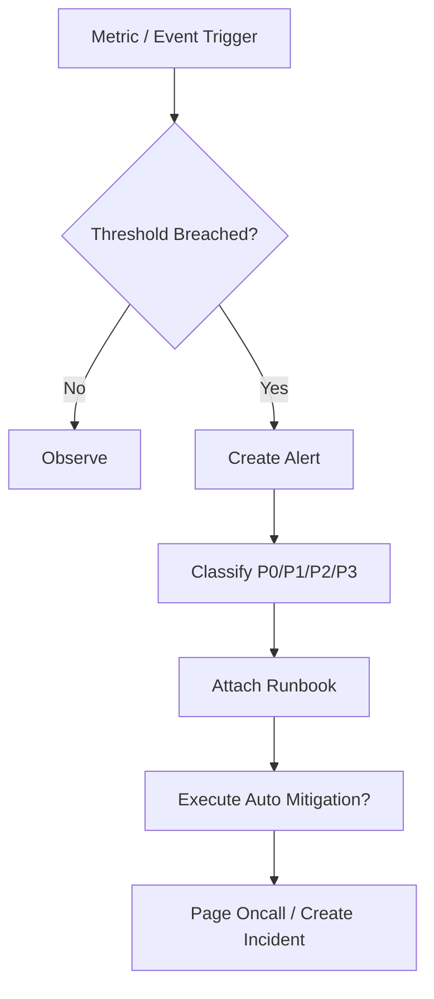

# SLO Alerting And Runbook Contract

## 1. Scope

This contract defines industrial-grade SLI/SLO/SLA, alert levels, and runbook directory.

It answers the question: what counts as "production available", when does alerting need to happen, and when something happens on call, what should the person on duty look at, do, and how to limit damage.

Related documents:

- `observability_contract.md`
- `debug_inspect_health_backpressure_contract.md`
- `enterprise_operations_plane_contract.md`

## 2. SLI Layering

| Layer | SLI Examples |
| --- | --- |
| OAPEFLIR Layer | loop convergence rate, feedback positive rate, rollout success rate |
| System Layer | API availability, event loop latency, DB writability |
| Platform Layer | task success rate, startup latency, recovery success rate |
| Interaction Layer | approval availability, streaming first-byte latency |
| Cost Layer | budget estimation error, token metering delay |

## 3. Minimum SLO Set

- `task_success_rate`
- `task_start_latency`
- `approval_delivery_availability`
- `recovery_success_rate`
- `tier1_event_delivery_latency`
- `cost_accounting_accuracy`
- `oapeflir_loop_convergence_rate`
- `feedback_positive_rate`
- `rollout_success_rate`

Rules:

- Before production declaration, each SLO must have calculation formula, data source, and alert threshold.
- Targets without observability formula must not be written as external SLA.

## 4. Alert Classification

| Level | Description | Typical Examples |
| --- | --- | --- |
| `P0` | Platform core unavailable | New tasks cannot execute, authoritative DB not writable |
| `P1` | Critical tenant or critical path failure | Critical tenant cannot dispatch tasks, approval chain broadly failed |
| `P2` | Single division or local capability significant degradation | Certain division failure rate surged |
| `P3` | Local anomaly or capacity warning | Queue latency rising, cost drift high |

## 5. Alert Must Include

- Trigger metric and threshold
- Impact scope
- First discovery time
- Recommended runbook
- Whether automatic damage control action has been executed

## 6. Runbook Directory

At minimum should have the following runbooks:

- `worker_mass_disconnect`
- `provider_429_or_5xx_spike`
- `queue_backlog_breach`
- `approval_channel_unavailable`
- `cost_spike_containment`
- `database_lock_contention`
- `stale_lease_repair`
- `secret_rotation_failure`
- `oapeflir_loop_stalled`
- `rollout_blocked_or_rollback`

## 7. Alert Flowchart

## 8. Automatic Damage Control Boundaries

Allowed to automatically execute:

- admission control tightening
- provider traffic switching
- queue rate limiting
- specific tenant / division rate limiting

Prohibited from automatically executing:

- Unauthorized large-scale destructive rollback
- Cross-tenant data-level operations
- Directly ignoring approval chain

## 9. Phase Boundaries

Phase 1a / 1b must freeze at minimum:

- SLI name and formula
- P0-P3 classification
- Basic runbook inventory

Before entering production must complete:

- Threshold finalization
- On-call contact and escalation path
- Drill records

## 10. Conclusion

Industrial-grade operations is not "lots of logs", but:

- Have clear SLO
- Have actionable alerts
- Have runbooks
- Have automatic damage control boundaries
