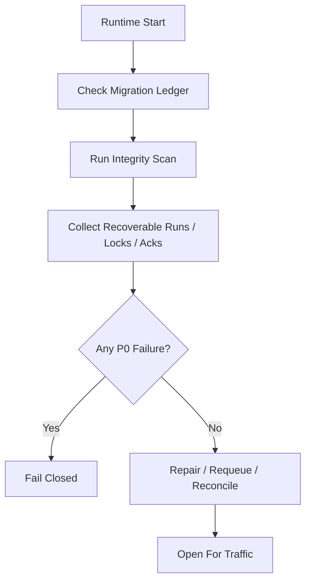

# Startup Consistency And Recovery Drill Contract

## 1. Scope

This contract defines runtime startup consistency check items and crash recovery scenarios that must be regularly drilled.

Related documents:

- `runtime_repository_and_migration_contract.md`
- `runtime_execution_contract.md`
- `file_lock_contract.md`
- `event_reliability_matrix_contract.md`

## 2. Goals

Before truly writing code, freeze two things:

- What consistency problems are checked at startup.
- What scenarios crash recovery testing must cover.

## 3. Startup Consistency Check Matrix

| Check Item | Judgment Rule | Failure Action |
| --- | --- | --- |
| Migration version | Schema version consistent with ledger | fail-closed |
| Active task and workflow alignment | `in_progress / awaiting_decision` tasks must have corresponding workflow_state or explainable absence | Mark for recovery |
| Illegal step index | `current_step_index` must not exceed bounds | fail-closed or manual repair |
| Stale execution | `prechecking / executing` and heartbeat expired (note: `retrying` deprecated, retry implemented via new execution attempt) | Mark recoverable |
| Hanging session | Session in active state but task already in terminal state | Auto-close or alert |
| Expired file lock | `expires_at < now` and holder already inactive | Clean up and log event |
| Tier 1 ack backlog | Key events long unacknowledged | Alert and enter resend |
| Active execution ownership conflict | Same task simultaneously has multiple active executions | fail-closed or manual repair |

## 4. Startup Flow

## 5. Recovery Drill Minimum Scenarios

Must cover the following scenarios:

1. Crash before step completion
2. DB write succeeds but event emit fails
3. Tool executed but assistant message not fully saved
4. Recovery duplicates entering same step
5. File lock not released residual
6. Approval approved but execution not yet recovered
7. Heartbeat stopped but execution status still `executing`
8. SQLite `BUSY` or transaction interruption recovery
9. Cancel submitted but child process still alive

## 6. Each Drill Scenario Assertion

Each drill at minimum asserts:

- Will not treat completed step as unexecuted
- Will not re-execute side-effect steps that cannot be safely replayed
- Task primary state will not be incorrectly advanced to success
- Recovery chain can finally give `resume / retry / dead-letter / manual-handoff`
- Under cancel propagation scenario, will not leave child process or stale lock continuing to advance

## 7. Check Output Objects

Minimum output:

- `StartupConsistencyReport`
- `RecoveryCandidate`
- `RepairAction`
- `RecoveryDrillResult`

`RepairAction` suggested enumeration:

- `requeue_execution`
- `release_stale_lock`
- `rebuild_ack`
- `close_orphan_session`
- `manual_intervention_required`

## 8. Operating Rules

- Startup check is a fail-closed capability and should not continue silently accepting traffic after finding P0 inconsistency.
- Recovery drills should prioritize relying on fixture / replay data rather than just manual verbal verification.
- After adding key state, Tier 1 event, or file lock semantics, must supplement corresponding drill.

## 9. Phase Boundaries

Phase 1a explicitly does:

- Single-machine SQLite consistency check
- Stale execution / stale lock / pending ack scan
- Fixed recovery drill matrix

Currently does not do:

- Multi-machine collaborative recovery drills
- Chaos engineering platform
- Automated cross-region disaster recovery switching
