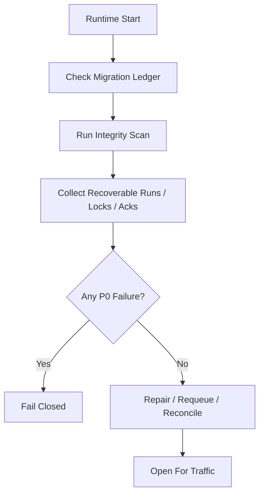

# Startup Consistency And Recovery Drill Contract

## 1. Scope

This contract defines runtime startup consistency checks and crash recovery scenarios that must be rehearsed regularly.

Related documents:

- `runtime_repository_and_migration_contract.md`
- `runtime_execution_contract.md`
- `file_lock_contract.md`
- `event_reliability_matrix_contract.md`

## 2. Objectives

Before the system writes any code, two things must be frozen:

- What consistency issues are checked at startup.
- Which scenarios the crash recovery drill must cover.

## 3. Startup Consistency Check Matrix

| Check Item | Decision Rule | Failure Action |
| --- | --- | --- |
| Migration version | Schema version matches ledger | fail-closed |
| Active task aligns with workflow | `in_progress / awaiting_decision` tasks must have corresponding workflow_state or explainable absence | mark recoverable |
| Invalid step index | `current_step_index` must not be out of bounds | fail-closed or manual repair |
| Stale execution | `prechecking / executing` with expired heartbeat (note: `retrying` is deprecated; retry is via new execution attempt) | mark recoverable |
| Orphaned session | session is active but task is in terminal state | auto-close or alert |
| Expired file lock | `expires_at < now` and holder is inactive | cleanup and record event |
| Tier 1 ack backlog | Critical events with long-standing unacked | alert and enter resend |
| Active execution ownership conflict | Multiple active executions for same task | fail-closed or manual repair |
| OAPEFLIR stage consistency | workflow `current_stage / loop_iteration` consistent with execution / timeline / evidence | fail-closed or mark recoverable |
| Rollout record consistency | rollout level / status / approval / strategy lineage closes | fail-closed or manual repair |

## 4. Startup Flow

## 5. Minimum Recovery Drill Scenarios

Must cover the following scenarios:

1. Crash before step completion
2. DB write succeeded but event emit failed
3. Tool executed but assistant message not fully saved
4. Re-entering same step during recovery
5. File lock not released, residual
6. Approval granted but execution not yet recovered
7. Heartbeat stopped but execution still `executing`
8. SQLite `BUSY` or transaction interruption recovery
9. Cancel submitted but child process still alive
10. Feedback written but learn not completed
11. Improve candidate accepted but release interrupted
12. Rollout / timeline written but inspect projection not updated

## 6. Assertions for Each Drill Scenario

Each drill must assert at minimum:

- Completed steps will not be mistaken as unexecuted
- Side effect steps that cannot be safely replayed will not be re-executed
- Task master status will not be incorrectly advanced to success
- Recovery chain ultimately yields `resume / retry / dead-letter / manual-handoff`
- In cancel propagation scenarios, no residual child process or stale lock continues to advance

## 7. Check Output Objects

Minimum output:

- `StartupConsistencyReport`
- `RecoveryCandidate`
- `RepairAction`
- `RecoveryDrillResult`

`RepairAction` suggested enumeration:

- `requeue_execution`
- `release_stale_lock`
- `rebuild_ack`
- `close_orphan_session`
- `manual_intervention_required`

## 8. Operating Rules

- Startup checks are a fail-closed capability; should not continue accepting traffic after discovering P0 inconsistency.
- Recovery drills should prioritize fixture / replay data over manual verbal verification.
- After adding critical state, Tier 1 event, or file lock semantics, corresponding drills must be added.

## 9. Phase Boundaries

Phase 1a explicitly includes:

- Single-machine SQLite consistency checks
- Stale execution / stale lock / pending ack scanning
- Fixed recovery drill matrix
- OAPEFLIR stage / rollout consistency scanning

Currently not included:

- Multi-machine collaborative recovery drills
- Chaos engineering platform
- Automated cross-region disaster recovery switching

## 10. Closure Conclusion

Whether recovery capability truly exists is not determined by how much "supports recovery" is written in documentation, but by whether startup checks and drills have frozen each of the most failure-prone breakpoints.

## v4.3 Architecture Remediation

The following entries fix contract deviations recorded in `platform-architecture-implementation-consistency-audit.md`. If historical sections of this document conflict with this section, this section, `docs_zh/architecture/00-platform-architecture.md`, ADR-109 through ADR-113, and `src/platform/contracts/executable-contracts/` take precedence.

Mandatory rules: State transitions must go through `RuntimeStateMachine.transition(command)`; execution plans must use `PlanGraphBundle`; execution results must use `NodeAttemptReceipt`; truth events must only use `platform.*`; OAPEFLIR can only be used as `oapeflir.view.*` / rationale projection; budgets must use `BudgetLedger` / `BudgetReservation` / `BudgetSettlement`.