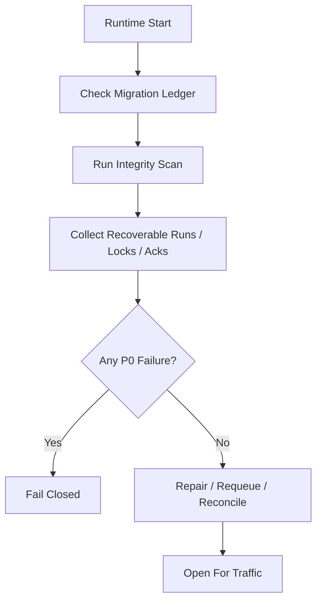

# Startup Consistency And Recovery Drill Contract

## 1. Scope

This contract defines runtime startup consistency inspection items, and crash recovery scenarios that must be regularly drilled.

Related documents:

- `runtime_repository_and_migration_contract.md`
- `runtime_execution_contract.md`
- `file_lock_contract.md`
- `event_reliability_matrix_contract.md`

## 2. Objectives

Before the system truly writes code, two things must be frozen:

- What consistency issues are actually checked at startup.
- What scenarios crash recovery testing must cover.

## 3. Startup Consistency Inspection Matrix

| Check Item | Decision Rule | Failure Action |
|---|---|---|
| Migration version | Schema version consistent with ledger | fail-closed |
| Active runs vs projection alignment | Active `HarnessRun / NodeRun` must have explicable task/workflow projection; absence only permitted as compatible projection exception | mark for recovery |
| Illegal run cursor | `PlanGraphBundle` current ready / active node reference must not point to non-existent or terminal-state nodes continuing to advance | fail-closed or manual repair |
| stale execution | `prechecking / executing` with heartbeat expired (note: `retrying` is deprecated; retry via new execution attempt) | mark recoverable |
| orphaned session | session in active state but task in terminal state | auto-close or alert |
| expired file lock | `expires_at < now` and holder inactive | clean and log event |
| Tier 1 ack backlog | Long-standing unacknowledged critical events | alert and enter resend |
| Active execution ownership conflict | Multiple active executions for same task | fail-closed or manual repair |
| OAPEFLIR stage consistency | Workflow `current_stage / loop_iteration` consistent with execution / timeline / evidence | fail-closed or mark recoverable |
| rollout record consistency | rollout level / status / approval / strategy lineage closeable | fail-closed or manual repair |

## 4. Startup Flow

## 5. Minimum Recovery Drill Scenarios

Must cover the following scenarios:

1. Crash before step completion
2. DB write success but event emit failed
3. Tool executed but assistant message not fully saved
4. Recovery re-enters same step
5. File lock not released, residue remains
6. Approval granted but execution not yet recovered
7. Heartbeat stopped but execution status still `executing`
8. SQLite `BUSY` or transaction interrupted, then recovery
9. Cancel submitted but child process still alive
10. Feedback written but learn not completed
11. Improve candidate accepted but release interrupted
12. Rollout / timeline written but inspect projection not updated

## 6. Assertions Per Drill Scenario

Each drill must assert at minimum:

- Completed steps are not mistaken for unexecuted
- Side effect steps that cannot be safely replayed are not re-executed
- Task primary status is not incorrectly advanced to success
- Recovery chain ultimately provides `resume / retry / dead-letter / manual-handoff`
- In cancel propagation scenarios, no child process or stale lock continues advancing

## 7. Inspection Output Objects

Minimum output:

- `StartupConsistencyReport`
- `RecoveryCandidate`
- `RepairAction`
- `RecoveryDrillResult`

`RepairAction` recommended enum:

- `requeue_execution`
- `release_stale_lock`
- `rebuild_ack`
- `close_orphan_session`
- `manual_intervention_required`

## 8. Operating Rules

- Startup inspection is a fail-closed capability; should not continue silently accepting traffic after discovering P0 inconsistency.
- Recovery drills should prioritize relying on fixture / replay data, not just manual verbal verification.
- After adding critical status, Tier 1 event, or file lock semantics, must add corresponding drill.

## 9. Phase Boundaries

Phase 1a explicitly does:

- Single-machine SQLite consistency inspection
- stale execution / stale lock / pending ack scanning
- Fixed recovery drill matrix
- OAPEFLIR stage / rollout consistency scanning

Currently not doing:

- Multi-machine coordinated recovery drills
- Chaos engineering platform
- Automated cross-region disaster recovery switching

## 10. Closure Conclusion

Whether recovery capability truly exists is not measured by how much "supports recovery" is written in documents, but by whether startup inspection and drills have frozen each breakpoint most likely to fail.

## v4.3 Architecture Remediation

This section fixes contract deviations recorded in `platform-architecture-implementation-consistency-audit.md`. If any historical section of this document conflicts with this section, this section, `docs_zh/architecture/00-platform-architecture.md`, ADR-109 through ADR-113, and `src/platform/contracts/executable-contracts/` take precedence.

Mandatory rules: State transitions must go through `RuntimeStateMachine.transition(command)`; execution plans must use `PlanGraphBundle`; execution results must use `NodeAttemptReceipt`; truth events must only use `platform.*`; OAPEFLIR can only be used as `oapeflir.view.*` / rationale projection; budget must use `BudgetLedger` / `BudgetReservation` / `BudgetSettlement`.