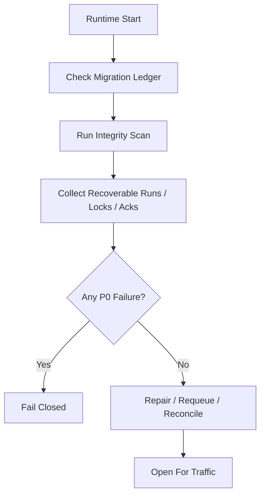

# Startup Consistency And Recovery Drill Contract

## 1. 范围

本 contract defines runtime 启动一致性巡检项，以及必须定期演练的崩溃恢复场景。

相关文档：

- `runtime_repository_and_migration_contract.md`
- `runtime_execution_contract.md`
- `file_lock_contract.md`
- `event_reliability_matrix_contract.md`

## 2. 目标

系统在真正写code前，要先冻结两件事：

- 启动时到底检查哪些一致性Issue。
- 崩溃恢复测试到底必须覆盖哪些场景。

## 3. 启动一致性巡检矩阵

| 检查项 | 判定规则 | failed动作 |
|---|-------|--------|
| 迁移版本 | schema 版本vs ledger 一致 | fail-closed |
| 活跃运linesvs投影对齐 | 活跃 `HarnessRun / NodeRun` 必须有可解释的 task/workflow projection；缺失only允许作为兼容投影视图例外 | 标记恢复 |
| 非法运lines游标 | `PlanGraphBundle` 当前 ready / active node references用不得指向don't exist或终态后继续推进的节点 | fail-closed 或人工修复 |
| stale execution | `prechecking / executing` 且心跳过期（注：`retrying` 已废弃，重试via新 execution attempt 实现） | 标记 recoverable |
| 悬挂 session | session occurrences于活跃态但 task 已终态 | 自动收口或告警 |
| 过期 file lock | `expires_at < now` 且 holder 已失活 | 清理并记事件 |
| Tier 1 ack 积压 | 存在长期未 ack 的关键事件 | 告警并进入补发 |
| 活跃 execution 所有权conflicts | 同一 task 同时存在多个活跃 execution | fail-closed 或人工修复 |
| OAPEFLIR stage 一致性 | workflow `current_stage / loop_iteration` vs execution / timeline / evidence 一致 | fail-closed 或标记 recoverable |
| rollout record一致性 | rollout level / status / approval / strategy lineage 可闭合 | fail-closed 或人工修复 |

## 4. 启动流程

## 5. 恢复演练最小场景

必须覆盖以下场景：

1. step 完成前崩溃
2. DB 写success但事件 emit failed
3. tool 执lines后 assistant message 未完整保存
4. 恢复时repeats进入同一步
5. file lock 未释放残留
6. approval 已批准但 execution 尚未恢复
7. heartbeat 停止但 execution Status仍为 `executing`
8. SQLite `BUSY` 或事务中断后恢复
9. cancel 已提交但子进程仍存活
10. feedback 已writes但 learn 未完成
11. improve candidate accepted 后 release 中断
12. rollout / timeline 已writes但 inspect projection 未更新

## 6. 每个演练场景的断言

每个 drill 至少断言：

- 不会把completed步骤误当成未执lines
- 不会repeats执lines不可security重放的副作用步骤
- 任务主Status不会被错误推进到success
- 恢复链最终能给出 `resume / retry / dead-letter / manual-handoff`
- 取消传播场景下不会残留继续推进的 child process 或 stale lock

## 7. 巡检输出对象

最小输出：

- `StartupConsistencyReport`
- `RecoveryCandidate`
- `RepairAction`
- `RecoveryDrillResult`

`RepairAction` Recommendation枚举：

- `requeue_execution`
- `release_stale_lock`
- `rebuild_ack`
- `close_orphan_session`
- `manual_intervention_required`

## 8. 运lines规则

- 启动巡检belongs to fail-closed 能力，不应在发现 P0 inconsistent后继续默默接流量。
- 恢复演练应优先relies on fixture / replay data，而不is只靠人工口头验证。
- 新增关键Status、Tier 1 事件或 file lock 语义后，必须补对应 drill。

## 9. Phase 边界

Phase 1a 明确做：

- 单机 SQLite 一致性巡检
- stale execution / stale lock / pending ack 扫描
- 固定恢复演练矩阵
- OAPEFLIR stage / rollout consistency 扫描

当前不做：

- 多机协同恢复演练
- chaos engineering 平台
- 自动化跨区域容灾切换

## 10. 收口Conclusion

恢复能力isno真实存在，不看文档里写了多少“supported恢复”，而看启动巡检和 drill isno已via把最容易出事的断点逐项冻结下来。

## v4.3 Architecture Remediation

以下条目修复 `platform-architecture-implementation-consistency-audit.md` 中record的 contract 偏差。若本文历史段落vs本节conflicts，以本节、`docs_zh/architecture/00-platform-architecture.md`、ADR-109 至 ADR-113、以及 `src/platform/contracts/executable-contracts/` 为准。

mandatory规则：Status迁移必须via `RuntimeStateMachine.transition(command)`；执lines计划必须uses `PlanGraphBundle`；执lines结果必须uses `NodeAttemptReceipt`；truth event 只能uses `platform.*`；OAPEFLIR 只能作为 `oapeflir.view.*` / rationale 投影；budget必须uses `BudgetLedger` / `BudgetReservation` / `BudgetSettlement`。
