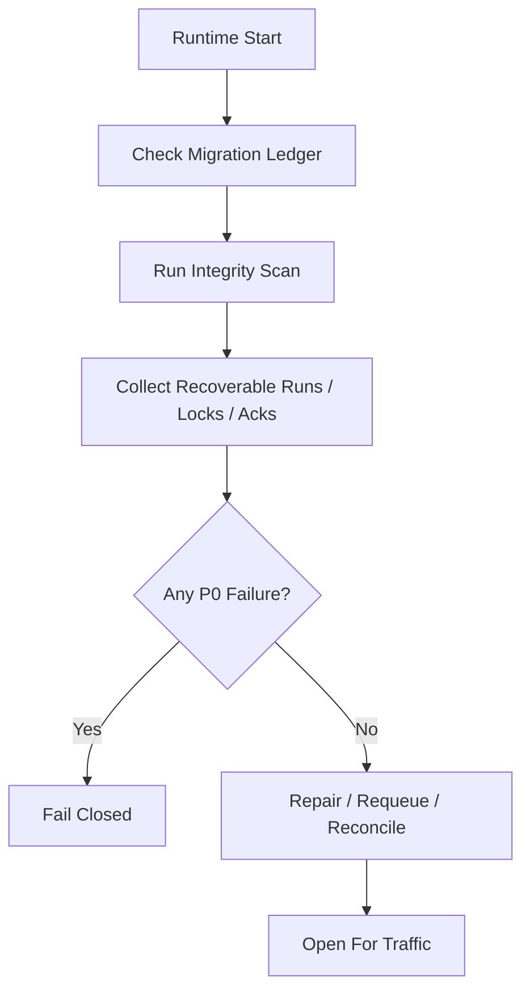

# Startup Consistency And Recovery Drill Contract

## 1. Scope

This contract defines runtime startup consistency inspection items, and crash recovery scenarios that must be regularly drilled.

Related documents:

- `runtime_repository_and_migration_contract.md`
- `runtime_execution_contract.md`
- `file_lock_contract.md`
- `event_reliability_matrix_contract.md`

## 2. Goals

Before the system truly writes code, two things must be frozen:

- What consistency issues are checked at startup.
- What scenarios crash recovery testing must cover at minimum.

## 3. Startup Consistency Inspection Matrix

| Check Item | Judgment Rule | Failure Action |
| --- | --- | --- |
| Migration version | Schema version consistent with ledger | fail-closed |
| Active task and workflow alignment | `in_progress / awaiting_decision` task must have corresponding workflow_state or explainable absence | mark recoverable |
| Illegal step index | `current_step_index` must not be out of bounds | fail-closed or manual repair |
| stale execution | `prechecking / executing` and heartbeat expired (note: `retrying` deprecated, retry implemented via new execution attempt) | mark recoverable |
| hanging session | session in active state but task already terminal | auto-close or alert |
| expired file lock | `expires_at < now` and holder inactive | clean and record event |
| Tier 1 ack backlog | long-standing unacked key events | alert and enter resend |
| active execution ownership conflict | same task has multiple active executions simultaneously | fail-closed or manual repair |
| OAPEFLIR stage consistency | workflow `current_stage / loop_iteration` consistent with execution / timeline / evidence | fail-closed or mark recoverable |
| rollout record consistency | rollout level / status / approval / strategy lineage closable | fail-closed or manual repair |

## 4. Startup Flow

## 5. Minimum Recovery Drill Scenarios

Must cover the following scenarios:

1. Crash before step completion
2. DB write succeeded but event emit failed
3. Tool executed but assistant message not fully saved
4. Duplicate entry into same step on recovery
5. File lock not released, residual
6. Approval approved but execution not yet resumed
7. Heartbeat stopped but execution status still `executing`
8. SQLite `BUSY` or transaction interruption recovery
9. Cancel submitted but child process still alive
10. Feedback written but learn incomplete
11. improve candidate accepted then release interrupted
12. rollout / timeline written but inspect projection not updated

## 6. Assertions for Each Drill Scenario

Each drill must assert at minimum:

- Will not mistake completed step as unexecuted
- Will not re-execute side-effect steps that cannot be safely replayed
- Task main status will not be incorrectly advanced to success
- Recovery chain can ultimately give `resume / retry / dead-letter / manual-handoff`
- In cancel propagation scenario, will not leave continuing child process or stale lock

## 7. Inspection Output Objects

Minimum output:

- `StartupConsistencyReport`
- `RecoveryCandidate`
- `RepairAction`
- `RecoveryDrillResult`

`RepairAction` recommended enum:

- `requeue_execution`
- `release_stale_lock`
- `rebuild_ack`
- `close_orphan_session`
- `manual_intervention_required`

## 8. Operating Rules

- Startup inspection is a fail-closed capability, should not continue accepting traffic after discovering P0 inconsistency.
- Recovery drills should prioritize relying on fixture / replay data, not just relying on manual verbal verification.
- After adding key state, Tier 1 event, or file lock semantics, must add corresponding drill.

## 9. Phase Boundaries

Phase 1a explicitly does:

- Single-machine SQLite consistency inspection
- stale execution / stale lock / pending ack scanning
- Fixed recovery drill matrix
- OAPEFLIR stage / rollout consistency scanning

Currently does not do:

- Multi-machine coordinated recovery drills
- Chaos engineering platform
- Automated cross-region disaster recovery switchover

## 10. Closure Conclusion

Whether recovery capability truly exists is not measured by how many "supports recovery" are written in documentation, but by whether startup inspection and drills have frozen the easiest-to-fail breakpoints item by item.
