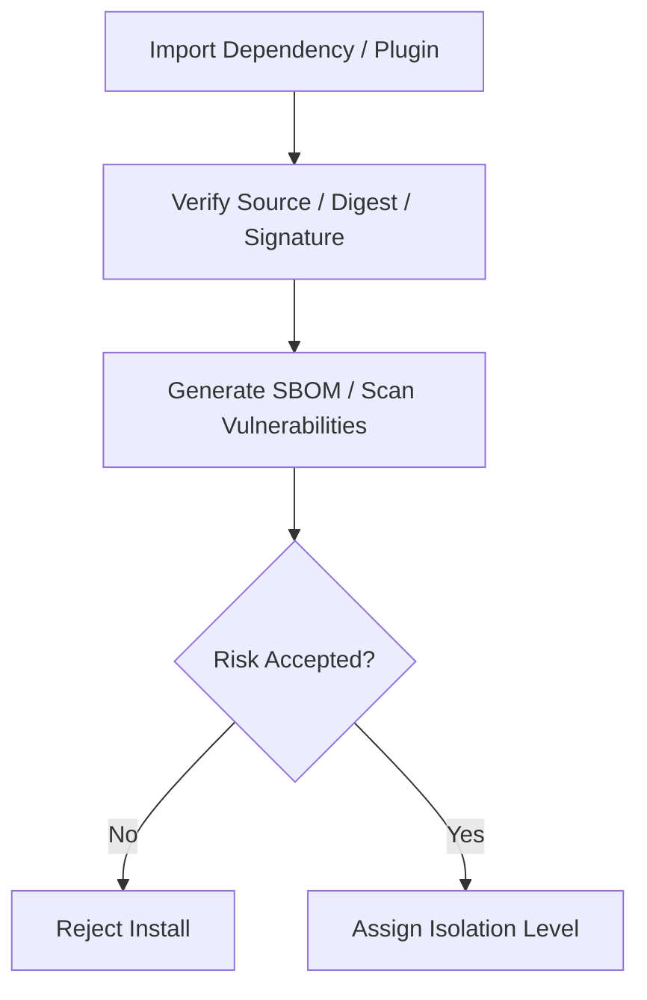

# Supply Chain And Dependency Security Contract

---

## OAPEFLIR Association

This contract participates in the following stages of the OAPEFLIR eight-stage cycle:

- **Observe**: Signal collection and aggregation
- **Assess**: Pre-execution assessment and risk judgment
- **Plan**: Task decomposition and DAG construction
- **Execute**: Step execution and fault tolerance
- **Feedback**: Signal collection and preprocessing
- **Learn**: Pattern detection and knowledge extraction
- **Improve**: Improvement candidate evaluation and rollout
- **Release**: Controlled release and rollback

---

## 1. Scope

This contract defines supply chain security baseline for dependencies, plugins, skills, MCP, and third-party distribution units.

Related documents:

- `tool_skill_plugin_contract.md`
- `ecosystem_extension_plane_contract.md`
- `enterprise_secret_management_contract.md`
- `sandbox_and_auth_contract.md`

## 2. Goals

- Reduce supply chain risks introduced by third-party dependencies, plugins, and external execution units.
- Unify rules for installation, updates, signing, scanning, and isolation levels.
- Provide traceable evidence for industrial-grade audit and admission.

## 3. Minimum Requirements

- Dependency locking
- Package source verification
- Signature or integrity verification
- SBOM generation
- Vulnerability scanning
- Third-party plugin isolation levels
- `PluginTrustStore`

## 4. Distribution Unit Classification

| Type | Minimum Requirements |
| --- | --- |
| `first_party tool` | locked dependency + review evidence |
| `skill bundle` | source provenance + permission declaration |
| `plugin bundle` | signature / digest + capability declaration |
| `MCP server` | trust level + isolation level + domain allowlist |

## 4A. `PluginTrustStore` Minimum Fields

- `trust_store_id`
- `trust_roots`
- `active_signing_keys`
- `signing_key_rotation_policy`
- `revocation_list_ref`
- `security_advisory_ref`
- `quarantine_status`
- `tenant_impact_scope`

## 5. Isolation Levels

- `trusted_first_party`
- `reviewed_partner`
- `untrusted_third_party`

Rules:

- `untrusted_third_party` must not default to destructive permissions.
- MCP must not impersonate local trusted tool.
- Plugin permissions must not bypass ToolRegistry and Policy Engine.
- `PluginTrustStore` must support trust root management, signing key rotation, revocation list, security advisory, and isolation quarantine.
- Plugins/dependencies that are revoked, hit by advisory, or entered quarantine must not continue new installation or activate on affected tenants.
- `tenant_impact_scope` must allow locating supply chain event impact scope by tenant / workspace / organization.

## 6. Security Check Process

## 7. Audit Requirements

Must record:

- install source
- version / digest
- approver
- granted capability scope
- scan result summary
- disable / revoke action
- trust root / signing key version
- revocation / advisory / quarantine decision
- tenant impact summary

## 8. Closure Conclusion

Industrial-grade extension ecosystem cannot just ask "can it be installed".

It must simultaneously answer:

- Whether source is trusted
- Whether permissions are minimal
- Whether updates are traceable
- Whether it can be quickly disabled and traced when problems occur

## v4.3 Architecture Remediation

The following items fix contract deviations recorded in `platform-architecture-implementation-consistency-audit.md`. If this document's historical paragraphs conflict with this section, this section, `docs_zh/architecture/00-platform-architecture.md`, ADR-109 through ADR-113, and `src/platform/contracts/executable-contracts/` take precedence.

- T-49: This document originally only covered "scan at import time" and coarse-grained trust level. Root cause: supply chain contract remained at pre-installation verification perspective, did not make plugin trust roots, signing key rotation, revocation/advisory, and tenant impact scope into continuous governance objects. Fix: This version adds `PluginTrustStore`, and writes trust root, signing key rotation, revocation list, security advisory, quarantine, tenant impact as required capabilities.

Mandatory rules: State transitions must go through `RuntimeStateMachine.transition(command)`; execution plans must use `PlanGraphBundle`; execution results must use `NodeAttemptReceipt`; truth events must only use `platform.*`; OAPEFLIR can only be used as `oapeflir.view.*` / rationale projection; budget must use `BudgetLedger` / `BudgetReservation` / `BudgetSettlement`.