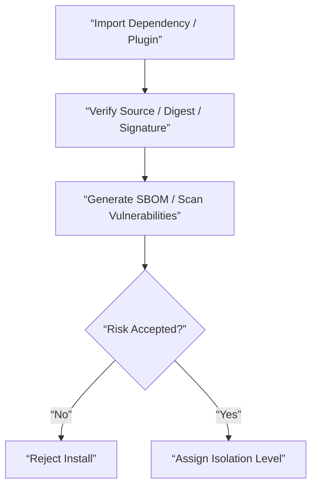

# Supply Chain And Dependency Security Contract

## 1. Scope

This contract defines supply chain security baseline for dependencies, plugins, skills, MCP, and third-party distribution units.

Related documents:

- `tool_skill_plugin_contract.md`
- `ecosystem_extension_plane_contract.md`
- `enterprise_secret_management_contract.md`
- `sandbox_and_auth_contract.md`

## 2. Goals

- Reduce supply chain risks from third-party dependencies, plugins, and external execution units.
- Unify rules for installation, updates, signing, scanning, and isolation levels.
- Provide traceable evidence for industrial-grade audit and admission.

## 3. Minimum Requirements

- Dependency pinning
- Package source verification
- Signature or integrity verification
- SBOM generation
- Vulnerability scanning
- Third-party plugin isolation levels

## 4. Distribution Unit Classification

| Type | Minimum Requirements |
| --- | --- |
| `first_party tool` | locked dependency + review evidence |
| `skill bundle` | source provenance + permission declaration |
| `plugin bundle` | signature / digest + capability declaration |
| `MCP server` | trust level + isolation level + domain allowlist |

## 5. Isolation Levels

- `trusted_first_party`
- `reviewed_partner`
- `untrusted_third_party`

Rules:

- `untrusted_third_party` must not by default get destructive permissions.
- MCP must not impersonate local trusted tools.
- Plugin permissions must not bypass ToolRegistry and Policy Engine.

## 6. Security Check Process

## 7. Audit Requirements

Must record:

- install source
- version / digest
- approver
- granted capability scope
- scan result summary
- disable / revoke action

## 8. Conclusion

Industrial-grade extension ecosystem cannot just ask “can it be installed”.

It must simultaneously answer:

- Is the source trusted
- Are permissions minimal
- Are updates traceable
- Can it be quickly disabled and traced when problems occur
