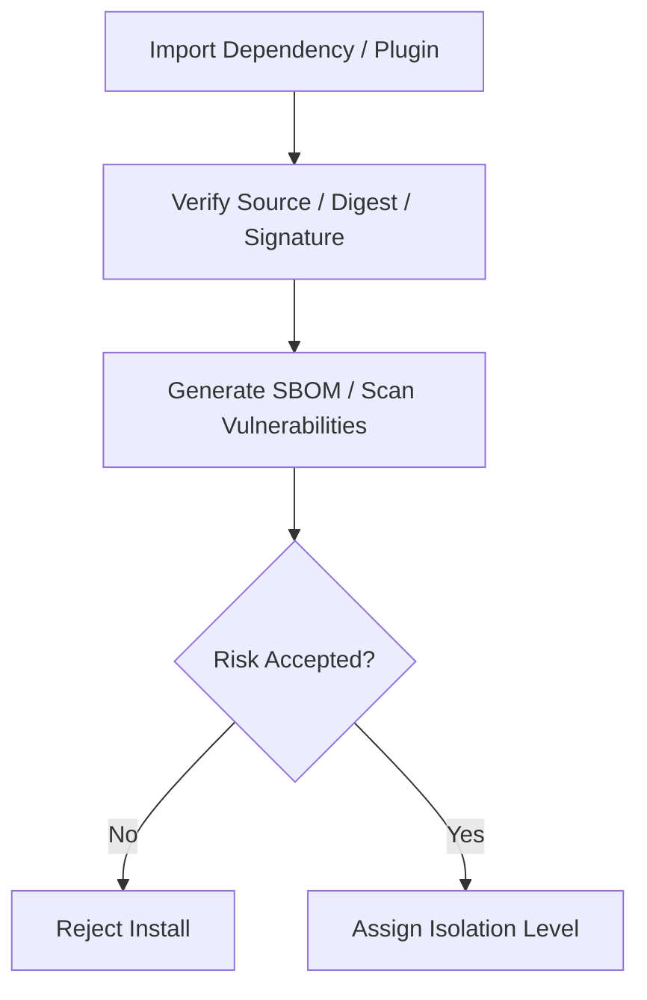

# Supply Chain And Dependency Security Contract

---

## OAPEFLIR 关联

本 contract 参vs OAPEFLIR 八阶段循环中的以下阶段：

- **Observe**：信号采集vs聚合
- **Assess**：执lines前评估vs风险判断
- **Plan**：任务分解vs DAG 构建
- **Execute**：步骤执linesvs容错
- **Feedback**：信号收集vs预handle
- **Learn**：模式检测vs知识提取
- **Improve**：改进候选评估vs rollout
- **Release**：受控发布vs回滚

---

## 1. 范围

本 contract definesrelies on、插件、skill、MCP 和第三方分发单元的供应链security基线。

相关文档：

- `tool_skill_plugin_contract.md`
- `ecosystem_extension_plane_contract.md`
- `enterprise_secret_management_contract.md`
- `sandbox_and_auth_contract.md`

## 2. 目标

- 降低第三方relies on、插件和外部执lines单元带来的供应链风险。
- 让安装、更新、签名、扫描、隔离等级有统一规则。
- 为工业级审计和准入提供可追溯证据。

## 3. 最小要求

- relies on锁定
- 包来源校验
- 签名或完整性校验
- SBOM 生成
- 漏洞扫描
- 第三方插件隔离等级
- `PluginTrustStore`

## 4. 分发单元分class

| class型 | 最低要求 |
| --- | --- |
| `first_party tool` | locked dependency + review evidence |
| `skill bundle` | source provenance + permission declaration |
| `plugin bundle` | signature / digest + capability declaration |
| `MCP server` | trust level + isolation level + domain allowlist |

## 4A. `PluginTrustStore` 最小字段

- `trust_store_id`
- `trust_roots`
- `active_signing_keys`
- `signing_key_rotation_policy`
- `revocation_list_ref`
- `security_advisory_ref`
- `quarantine_status`
- `tenant_impact_scope`

## 5. 隔离等级

- `trusted_first_party`
- `reviewed_partner`
- `untrusted_third_party`

规则：

- `untrusted_third_party` 不得defaults to获得 destructive permission。
- MCP 不得as本地 trusted tool。
- 插件permission不得bypassing ToolRegistry 和 Policy Engine。
- `PluginTrustStore` 必须supported trust root manage、签名key轮换、撤销列table、security公告和隔离封禁。
- 被撤销、被公告命中或进入 quarantine 的插件/relies on不得继续新安装或在受Impact tenant 上激活。
- `tenant_impact_scope` 必须允许按 tenant / workspace / organization 定位供应链事件波及面。

## 6. security检查流程

## 7. 审计要求

必须record：

- install source
- version / digest
- approver
- granted capability scope
- scan result summary
- disable / revoke action
- trust root / signing key version
- revocation / advisory / quarantine decision
- tenant impact summary

## 8. 收口Conclusion

工业级扩展生态不能只问“能不能装上去”。

它必须同时回答：

- 来源isno可信
- permissionisno最小
- 更新isno可追踪
- 出Issue时能no快速disabled和追责

## v4.3 Architecture Remediation

以下条目修复 `platform-architecture-implementation-consistency-audit.md` 中record的 contract 偏差。本文档历史段落如vs本节conflicts，以本节、`docs_zh/architecture/00-platform-architecture.md`、ADR-109 至 ADR-113、以及 `src/platform/contracts/executable-contracts/` 为准。

- T-49: 本文原先只覆盖“import时扫描”和粗粒度 trust level，Root cause: 供应链合同停留在安装前校验视角，没有把插件信任根、签名key轮换、撤销/公告和租户Impact面做成持续治理对象。修复：正文现新增 `PluginTrustStore`，并把 trust root、signing key rotation、revocation list、security advisory、quarantine、tenant impact 写成必备能力。

mandatory规则：Status迁移必须via `RuntimeStateMachine.transition(command)`；执lines计划必须uses `PlanGraphBundle`；执lines结果必须uses `NodeAttemptReceipt`；truth event 只能uses `platform.*`；OAPEFLIR 只能作为 `oapeflir.view.*` / rationale 投影；budget必须uses `BudgetLedger` / `BudgetReservation` / `BudgetSettlement`。
