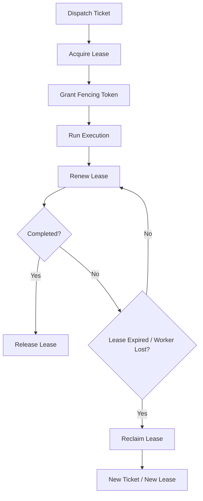

# Task Lease And Fencing Contract

---

## OAPEFLIR 关联

本 contract 参vs OAPEFLIR 八阶段循环中的以下阶段：

- **Observe**：信号采集vs聚合
- **Assess**：执lines前评估vs风险判断
- **Plan**：任务分解vs DAG 构建
- **Execute**：步骤执linesvs容错
- **Feedback**：信号收集vs预handle
- **Learn**：模式检测vs知识提取
- **Improve**：改进候选评估vs rollout
- **Release**：受控发布vs回滚

---

## 1. 范围

本 contract defines工业级执lines平面里的任务租约、续约、回收和 fencing token 规则。

它回答的Issueis：当 `NodeRun` 被派发到 worker 后，系统如何保证只有当前合法持有者能继续写结果，避免双写、脏写和 stale worker 回写。

相关文档：

- `runtime_execution_contract.md`
- `execution_plane_contract.md`
- `storage_schema_contract.md`
- `distributed_locking_contract.md`

## 2. 目标

- 为每个 active `NodeRun` 建立 authoritative lease。
- 用 `visibility timeout` 和 `lease renew` 控制执lines权生命cycle。
- 用 `fencing token` 拒绝旧 worker 的回写。
- 让恢复、接管、重试和死信进入统一链路。

## 3. 非目标

- 本 contract 不规定具体队列产品。
- 本 contract 不替代任务主Status机。
- Phase 1a 不要求完整分布式部署，但 contract 从一开始按多 worker 语义defines。

## 4. 关键对象

- `LeaseGrant`
- `LeaseRenewal`
- `LeaseReclaimDecision`
- `FencingToken`
- `StaleWriteRejection`
- `QueueDispatchRecord`
- `LeaseAuditRecord`
- `LeaseReconciliationRecord`

## 5. `LeaseGrant` 最小字段

| 字段 | class型 | Description |
|---|-------|--------|
| `lease_id` | `string` | 租约 ID |
| `node_run_id` | `string` | 目标 `NodeRun` |
| `worker_id` | `string` | 当前持有者 |
| `attempt_id` | `string` | 关联 `NodeAttempt` |
| `fencing_token` | `integer` | 单调递增执lines权版本 |
| `leased_at` | `timestamp` | 获取time |
| `expires_at` | `timestamp` | 当前到期time |
| `status` | `active \| expired \| released \| reclaimed \| handed_over` | 租约Status（`handed_over` 见 §8A lease handover，对齐 `execution_plane_contract.md` §9） |

规则：

- 同一 `node_run_id` 在任一时刻只能有一个 `active` lease。
- 每iterations重新派发、接管或回收后重新授予 lease 时，`fencing_token` 必须递增。
- 任何副作用writes都必须带上当前 `fencing_token`。

## 6. 生命cycle

## 7. 续约vs回收

- worker 必须在 `expires_at` 前完成续约。
- 连续续约failed达到threshold后，lease 进入 `expired`，原 worker 失去执lines权。
- 回收动作必须record `reason_code`，如：
  - `heartbeat_missing`
  - `worker_disconnected`
  - `worker_unhealthy`
  - `operator_takeover`
  - `budget_forced_stop`

## 8. Fencing Token 规则

- `fencing_token` is `NodeRun` 写permission版本号，不is展示字段。
- storage 层更新 `NodeRun`、artifact、tool result、side-effect receipt 时必须比较 token。
- 小于当前 authoritative token 的writes必须被拒绝，并record `stale_write_rejected` 审计事件。
- worker 本地cache的旧 lease 即使尚未感知过期，也不得被系统accepts。

## 8A. Lease Handover

### 8A.1 语义

Handover is指在不中断 execution 的前提下，由当前 worker 主动将 lease 转移给新 worker 的受控操作。vs lease 过期后的被动回收不同，handover is协作式的、可追踪的。

### 8A.2 `HandoverExecutionLeaseInput`

| 字段 | class型 | Description |
|---|-------|--------|
| `leaseId` | `string` | 当前 active lease |
| `workerId` | `string` | 原 worker（必须is当前持有者） |
| `newWorkerId` | `string` | 目标 worker |
| `ttlMs` | `number` | 新 lease 的存活time |
| `reasonCode?` | `string` | handover 原因（如 `worker_draining`、`load_rebalance`、`upgrade_migration`） |

### 8A.3 `ExecutionLeaseHandoverDecision`

| 字段 | class型 | Description |
|---|-------|--------|
| `outcome` | `handed_over \| blocked` | 结果 |
| `reasonCode` | `string?` | 如果被阻塞，原因码 |
| `previousLease` | `ExecutionLeaseRecord?` | 原 lease（已标记 `released`） |
| `lease` | `ExecutionLeaseRecord?` | 新 lease（新 fencing token） |

### 8A.4 规则

- handover 必须在单个事务内完成：释放旧 lease → 创建新 lease → 递增 fencing token → 更新 execution owner 和 worker snapshot。
- 只有 `active` Status的 lease 才能 handover。
- 旧 lease 的 `workerId` 必须匹配request中的 `workerId`。
- handover 完成后必须writes `lease_audit`（event_type: `handover`），record source worker、target worker 和 lineage。
- handover failed不应导致 execution 变为no主Status。

### 8A.5 典型场景

| 场景 | 触发方 | reasonCode |
|---|-------|--------|
| worker 进入 draining | worker 自身 | `worker_draining` |
| 负载再平衡 | control plane | `load_rebalance` |
| 滚动升级 | 运维 | `upgrade_migration` |
| 运维主动切换 | operator | `operator_handover` |

## 9. vs恢复链的关系

- lease 过期不等于任务failed。
- lease 过期后，系统应进入恢复判断：
  - `resume_same_worker`
  - `retry_new_ticket`
  - `manual_takeover`
  - `move_dead_letter`

## 10. 队列绑定vs审计

`QueueDispatchRecord` 最小字段：

- `dispatch_id`
- `node_run_id`
- `queue_name`
- `enqueued_at`
- `dequeued_at?`
- `worker_id?`
- `lease_id?`
- `status` (`queued | dequeued | leased | completed | abandoned`)

`LeaseAuditRecord` 最小字段：

- `audit_id`
- `node_run_id`
- `lease_id`
- `worker_id`
- `event_type` (`lease_granted | lease_renewed | lease_expired | lease_reclaimed | stale_write_rejected | lease_released`)
- `reason_code?`
- `recorded_at`

规则：

- dispatch、lease 和最终写permission拒绝必须能串成一条审计链。
- queue Statusused for回答“任务isno已via被派发、isno已被取走、isno已获得 lease”。
- stale write rejection 必须writes lease 审计，而不能只落到临时日志里。

## 11. Reconciliation

`LeaseReconciliationRecord` 最小字段：

- `reconciliation_id`
- `node_run_id`
- `lease_id`
- `issue_type` (`stale_lease | duplicate_owner | replay_recovery_needed | orphan_queue_claim`)
- `detected_at`
- `resolution_action` (`extend | release | reclaim | handover | block_for_manual`)
- `resolved_at?`

### 11.1 Dispatch Reconciliation 扫描

Reconciliation 服务扫描所有 `pending` 或 `claimed` Status的 `NodeRun` dispatch ticket，检测以下异常：

| issue_type | 检测条件 | 修复动作 |
|---|-------|--------|
| `execution_terminal` | ticket 关联的 execution 已达终态（`succeeded / failed / cancelled / superseded`） | 作废 ticket（不生成替代 ticket） |
| `missing_active_lease` | ticket 已被 claim 但no active lease | 作废旧 ticket + 创建替代 ticket（requeue） |
| `lease_ticket_mismatch` | lease 的 leaseId 或 workerId vs ticket 不匹配 | 作废旧 ticket + 创建替代 ticket |
| `lease_expired_unreclaimed` | lease 已过 `expires_at` 但未被回收 | 作废旧 ticket + 创建替代 ticket |

### 11.2 Requeue 语义

替代 ticket 继承原 ticket 的以下属性：

- `node_run_id`、`priority`、`queue_name`
- `dispatch_target`、`required_isolation_level`、`required_capabilities`
- `dispatch_after`

替代 ticket 重置：`status = pending`、新的 `ticket_id`、新的 `created_at`。

### 11.3 Reconciliation 事件

| 事件 | 含义 |
| --- | --- |
| `dispatch:ticket_reconciled` | ticket 因 issue 被作废 |
| `dispatch:ticket_requeued` | 新替代 ticket 被创建 |

两者在同一事务内原子发出，事件 payload 必须contains `issueType` 和 `reasonCode`。

### 11.4 规则

- 系统必须cycle性扫描 stale lease、duplicate owner 和 orphan queue claim。
- reconciliation is authoritative repair lines为，不得只relies on人工日志排查。
- duplicate owner 决议后，必须显式record winner，并对 loser writes stale/fenced 结果。
- terminal execution 的 ticket 只作废不 requeue，避免为completed的执lines创建no效 ticket。

## 12. 一致性要求

工业级最低一致性要求：

- `NodeRun` 当前 lease：强一致
- fencing token 比较：强一致
- heartbeat 展示：最终一致
- worker UI Status：最终一致

## 13. Phase 边界

Phase 1a / 1b：

- 允许单实例 control plane
- 允许 lease authoritative store 暂落在 SQLite/PG 抽象之下
- 必须先把 token 语义和 stale write rejection 定死

Phase 2+：

- 扩展到多 worker、多 queue、多租户隔离

## 14. 收口Conclusion

Lease 解决“谁现在可以执lines”，fencing token 解决“谁现在可以写结果”。

工业级系统必须同时具备这两层，才能避免repeats执lines和旧结果覆盖新结果。

## 15. Legacy / Deprecated 映射

| 旧名 | 新语义 |
| --- | --- |
| `execution_id` | legacy queue / repository 字段；v4.3 规范对象应映射为 `node_run_id` |
| `attempt` | legacy attempt 序号；v4.3 规范对象应映射为 `attempt_id` / `NodeAttempt` |
| `task lease` | only保留叙事语义；权威对象is `NodeRun` lease |

## v4.3 Architecture Remediation

以下条目修复 `platform-architecture-implementation-consistency-audit.md` 中record的 contract 偏差。本文档历史段落如vs本节conflicts，以本节、`docs_zh/architecture/00-platform-architecture.md`、ADR-109 至 ADR-113、以及 `src/platform/contracts/executable-contracts/` 为准。

- T-6: uses已废弃术语 execution_id，Architecturev4.0统一为 node_run_id。Root Cause：该文档accesses along用了 v3 execution-centric 队列/租约术语，但没有随 `HarnessRun` / `NodeRun` 权威对象迁移synchronous更新。修复：`LeaseGrant`、`QueueDispatchRecord`、`LeaseAuditRecord`、`LeaseReconciliationRecord` vs requeue 语义均已收敛到 `node_run_id` / `attempt_id`；`execution_id` 只保留为 legacy 映射Description。

mandatory规则：Status迁移必须via `RuntimeStateMachine.transition(command)`；执lines计划必须uses `PlanGraphBundle`；执lines结果必须uses `NodeAttemptReceipt`；truth event 只能uses `platform.*`；OAPEFLIR 只能作为 `oapeflir.view.*` / rationale 投影；budget必须uses `BudgetLedger` / `BudgetReservation` / `BudgetSettlement`。
