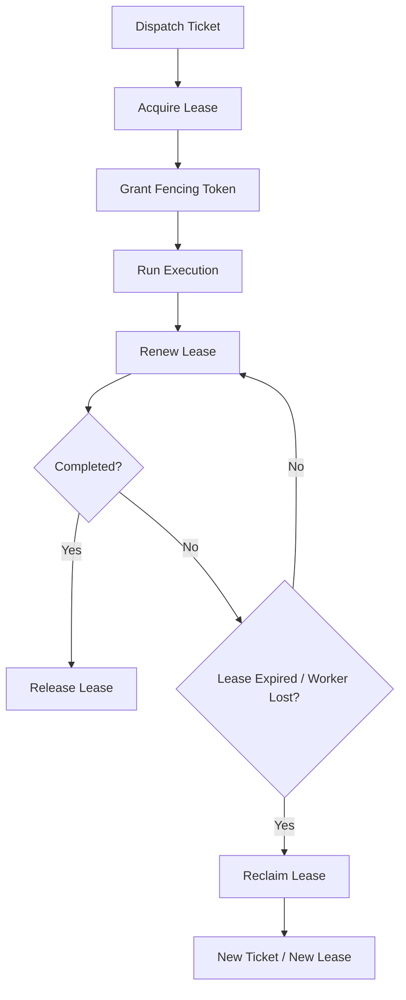

# Task Lease And Fencing Contract

## 1. Scope

This contract defines industrial-grade execution plane task lease, renewal, reclaim, and fencing token rules.

It answers the question: When execution is dispatched to worker, how does the system ensure only current legitimate holder can continue writing results, avoiding double-write, dirty write, and stale worker writeback.

Related documents:

- `runtime_execution_contract.md`
- `execution_plane_contract.md`
- `storage_schema_contract.md`
- `distributed_locking_contract.md`

## 2. Goals

- Establish authoritative lease for each active execution.
- Use `visibility timeout` and `lease renew` to control execution rights lifecycle.
- Use `fencing token` to reject old worker writeback.
- Let recovery, takeover, retry, and dead-letter enter unified chain.

## 3. Non-Goals

- This contract does not specify specific queue product.
- This contract does not replace task main state machine.
- Phase 1a does not require complete distributed deployment, but contract from the start defines by multi-worker semantics.

## 4. Key Objects

- `LeaseGrant`
- `LeaseRenewal`
- `LeaseReclaimDecision`
- `FencingToken`
- `StaleWriteRejection`
- `QueueDispatchRecord`
- `LeaseAuditRecord`
- `LeaseReconciliationRecord`

## 5. `LeaseGrant` Minimum Fields

| Field | Type | Description |
| --- | --- | --- |
| `lease_id` | `string` | Lease ID |
| `execution_id` | `string` | Target execution |
| `worker_id` | `string` | Current holder |
| `attempt` | `integer` | Execution attempt |
| `fencing_token` | `integer` | Monotonically increasing execution rights version |
| `leased_at` | `timestamp` | Acquisition time |
| `expires_at` | `timestamp` | Current expiration time |
| `status` | `active \| expired \| released \| reclaimed \| handed_over` | Lease status (`handed_over` see section 8A lease handover, aligned with `execution_plane_contract.md` section 9) |

Rules:

- Same `execution_id` at any moment can only have one `active` lease.
- Each time lease is re-dispatched, taken over, or reclaimed and re-granted, `fencing_token` must increase.
- Any side-effect write must carry current `fencing_token`.

## 6. Lifecycle

## 7. Renewal and Reclaim

- Worker must complete renewal before `expires_at`.
- After consecutive renewal failures reach threshold, lease enters `expired` and original worker loses execution rights.
- Reclaim action must record `reason_code`, such as:
  - `heartbeat_missing`
  - `worker_disconnected`
  - `worker_unhealthy`
  - `operator_takeover`
  - `budget_forced_stop`

## 8. Fencing Token Rules

- `fencing_token` is execution write permission version number and is not a display field.
- Storage layer updates execution, artifact, step output, tool result must compare token.
- Writes smaller than current authoritative token must be rejected and record `stale_write_rejected` audit event.
- Even if old lease held by worker local cache has not yet perceived expiration, system must not accept it.

## 8A. Lease Handover

### 8A.1 Semantics

Handover refers to controlled operation where current worker actively transfers lease to new worker without interrupting execution. Unlike passive reclaim after lease expiration, handover is collaborative and traceable.

### 8A.2 `HandoverExecutionLeaseInput`

| Field | Type | Description |
| --- | --- | --- |
| `leaseId` | `string` | Current active lease |
| `workerId` | `string` | Original worker (must be current holder) |
| `newWorkerId` | `string` | Target worker |
| `ttlMs` | `number` | New lease TTL |
| `reasonCode?` | `string` | Handover reason (e.g., `worker_draining`, `load_rebalance`, `upgrade_migration`) |

### 8A.3 `ExecutionLeaseHandoverDecision`

| Field | Type | Description |
| --- | --- | --- |
| `outcome` | `handed_over \| blocked` | Result |
| `reasonCode` | `string?` | If blocked, reason code |
| `previousLease` | `ExecutionLeaseRecord?` | Old lease (marked `released`) |
| `lease` | `ExecutionLeaseRecord?` | New lease (new fencing token) |

### 8A.4 Rules

- Handover must complete in single transaction: release old lease → create new lease → increment fencing token → update execution owner and worker snapshot.
- Only `active` lease can handover.
- Old lease `workerId` must match workerId in request.
- After handover completes, must write `lease_audit` (event_type: `handover`), recording source worker, target worker, and lineage.
- Handover failure should not cause execution to become ownerless.

### 8A.5 Typical Scenarios

| Scenario | Triggered By | reasonCode |
| --- | --- | --- |
| Worker entering draining | Worker itself | `worker_draining` |
| Load rebalance | Control plane | `load_rebalance` |
| Rolling upgrade | Ops | `upgrade_migration` |
| Ops active switch | Operator | `operator_handover` |

## 9. Relationship with Recovery Chain

- Lease expiration does not equal task failure.
- After lease expires, system should enter recovery judgment:
  - `resume_same_worker`
  - `retry_new_ticket`
  - `manual_takeover`
  - `move_dead_letter`

## 10. Queue Binding and Audit

`QueueDispatchRecord` minimum fields:

- `dispatch_id`
- `execution_id`
- `queue_name`
- `enqueued_at`
- `dequeued_at?`
- `worker_id?`
- `lease_id?`
- `status` (`queued | dequeued | leased | completed | abandoned`)

`LeaseAuditRecord` minimum fields:

- `audit_id`
- `execution_id`
- `lease_id`
- `worker_id`
- `event_type` (`lease_granted | lease_renewed | lease_expired | lease_reclaimed | stale_write_rejected | lease_released`)
- `reason_code?`
- `recorded_at`

Rules:

- Dispatch, lease, and final write permission rejection must be linked together as one audit chain.
- Queue state answers "whether task has been dispatched, whether been taken, whether obtained lease".
- Stale write rejection must be written to lease audit and cannot only go to temporary log.

## 11. Reconciliation

`LeaseReconciliationRecord` minimum fields:

- `reconciliation_id`
- `execution_id`
- `lease_id`
- `issue_type` (`stale_lease | duplicate_owner | replay_recovery_needed | orphan_queue_claim`)
- `detected_at`
- `resolution_action` (`extend | release | reclaim | handover | block_for_manual`)
- `resolved_at?`

### 11.1 Dispatch Reconciliation Scan

Reconciliation service scans all execution tickets in `pending` or `claimed` state and detects the following anomalies:

| issue_type | Detection Condition | Fix Action |
| --- | --- | --- |
| `execution_terminal` | Ticket associated execution already in terminal state (`succeeded / failed / cancelled / superseded`) | Invalidate ticket (do not generate replacement ticket) |
| `missing_active_lease` | Ticket claimed but no active lease | Invalidate old ticket + create replacement ticket (requeue) |
| `lease_ticket_mismatch` | Lease's leaseId or workerId does not match ticket | Invalidate old ticket + create replacement ticket |
| `lease_expired_unreclaimed` | Lease passed `expires_at` but not reclaimed | Invalidate old ticket + create replacement ticket |

### 11.2 Requeue Semantics

Replacement ticket inherits the following attributes from original ticket:

- `execution_id`, `priority`, `queue_name`
- `dispatch_target`, `required_isolation_level`, `required_capabilities`
- `dispatch_after`

Replacement ticket resets: `status = pending`, new `ticket_id`, new `created_at`.

### 11.3 Reconciliation Events

| Event | Meaning |
| --- | --- |
| `dispatch:ticket_reconciled` | Ticket invalidated due to issue |
| `dispatch:ticket_requeued` | New replacement ticket created |

Both atomically emitted in same transaction, event payload must include `issueType` and `reasonCode`.

### 11.4 Rules

- System must periodically scan stale lease, duplicate owner, and orphan queue claim.
- Reconciliation is authoritative repair behavior and must not rely only on manual log investigation.
- After duplicate owner resolution, must explicitly record winner and write stale/fenced result for loser.
- Terminal execution ticket only invalidated, not requeued, to avoid creating invalid ticket for already completed execution.

## 12. Consistency Requirements

Industrial-grade minimum consistency requirements:

- Execution current lease: strongly consistent
- Fencing token comparison: strongly consistent
- Heartbeat display: eventually consistent
- Worker UI state: eventually consistent

## 13. Phase Boundaries

Phase 1a / 1b:

- Allows single-instance control plane
- Allows lease authoritative store temporarily under SQLite/PG abstraction
- Must first freeze token semantics and stale write rejection

Phase 2+:

- Expand to multi-worker, multi-queue, multi-tenant isolation

## 14. Closure Conclusion

Lease solves "who can currently execute," fencing token solves "who can currently write results."

Industrial-grade system must have both layers simultaneously to avoid duplicate execution and old