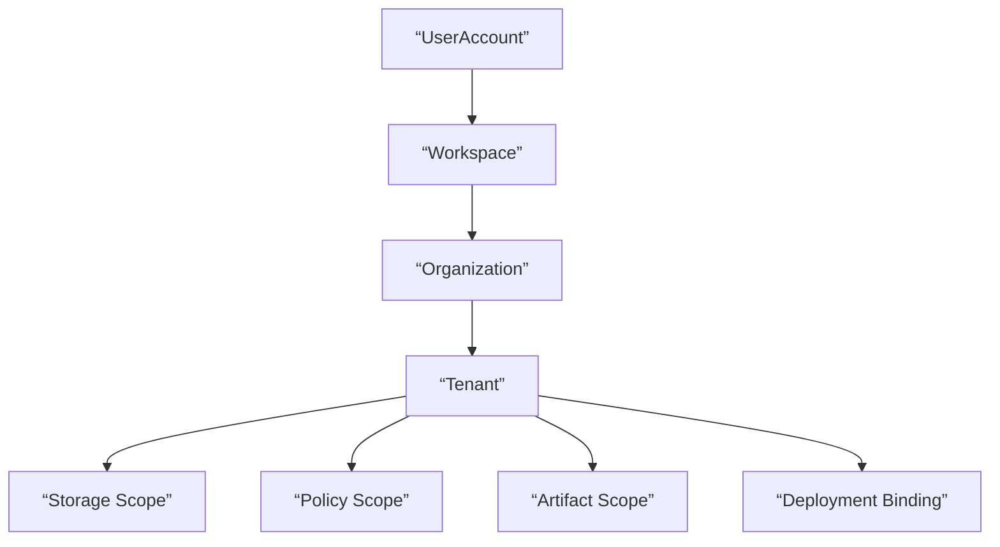
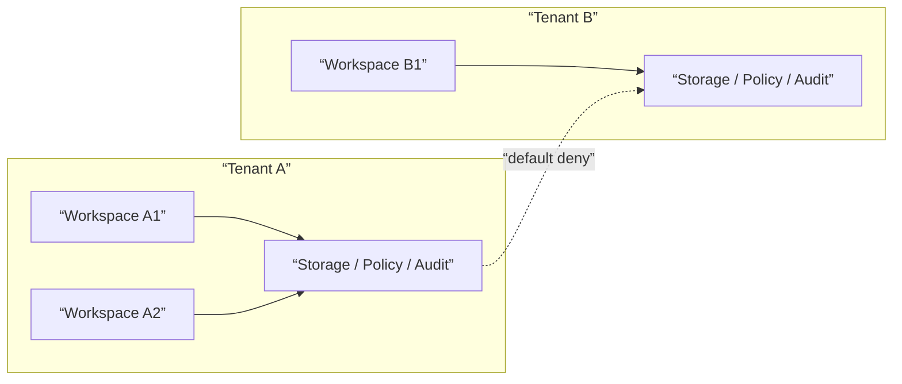
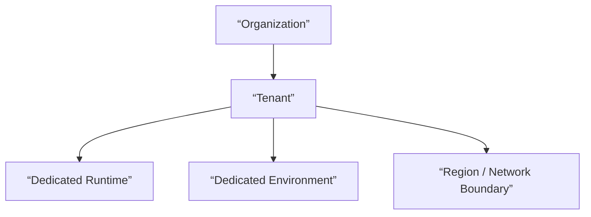

# Tenant And Organization Contract

## 1. Scope

This contract defines the user, workspace, organization, tenant, and enterprise privatization boundaries for the final platform.

It extends `billing_and_tenant_contract.md` to answer “who belongs to whom, which data and permissions need isolation, which resources are owned at what level”.

## 2. Goals

- Clarify hierarchical relationship of `user / workspace / organization / tenant`.
- Clarify tenant-aware boundaries for storage, identity, policy, artifact, and audit.
- Lay foundation for enterprise privatization, organization-level operations, and billing aggregation.

## 3. Non-Goals

- This contract does not directly define payment provider or invoice processes.
- This contract does not replace auth provider technical implementation details.
- This contract does not require Phase 1a to implement complete enterprise organization tree.

## 4. Hierarchy Model

`UserAccount -> Workspace -> Organization -> Tenant`

Explanation:

- `UserAccount` is the identity subject.
- `Workspace` is the default product usage boundary and collaboration boundary.
- `Organization` is the management and governance affiliation of multiple workspaces.
- `Tenant` is the isolation boundary for storage, policy, deployment, and audit.

## 5. Phased Implementation Strategy

- Phase 3 can first enable `UserAccount + Workspace`.
- Phase 4 then adds `Organization + Tenant` formal governance model.
- Enterprise privatization must use `Tenant` as the final isolation unit.

## 6. Key Objects

- `UserAccount`
- `Workspace`
- `WorkspaceMembership`
- `Organization`
- `OrganizationMembership`
- `Tenant`
- `TenantIsolationMode`
- `DeploymentBinding`

## 7. `Workspace` Minimum Fields

| Field | Type | Description |
| --- | --- | --- |
| `workspace_id` | `string` | Workspace ID |
| `owner_id` | `string` | Workspace owner |
| `display_name` | `string` | Display name |
| `plan_id` | `string` | Current plan |
| `default_policy_set` | `string` | Default governance set |
| `organization_id?` | `string` | Parent organization |
| `created_at` | `timestamp` | Creation time |

## 8. `Organization` Minimum Fields

- `organization_id`
- `display_name`
- `billing_account_id`
- `default_tenant_id`
- `created_at`

## 9. `Tenant` Minimum Fields

- `tenant_id`
- `organization_id`
- `storage_scope`
- `identity_scope`
- `policy_scope`
- `artifact_scope`
- `deployment_mode`
- `created_at`

## 10. `TenantIsolationMode`

Recommended enum:

- `shared_logical`
- `shared_hard_scoped`
- `dedicated_runtime`
- `dedicated_environment`

Explanation:

- `shared_logical`: suitable for early Pro / small teams.
- `shared_hard_scoped`: shared infrastructure but hard isolation at data and permission layers.
- `dedicated_runtime`: independent runtime resources.
- `dedicated_environment`: privatization or enterprise-exclusive environment.

## 11. Membership Rules

`WorkspaceMembership` at minimum includes:

- `workspace_id`
- `user_id`
- `role`
- `joined_at`

`OrganizationMembership` at minimum includes:

- `organization_id`
- `user_id`
- `role`
- `joined_at`

Rules:

- Users can belong to multiple workspaces.
- Workspace can belong to one organization.
- Organization is responsible for centralized governance, billing, and tenant allocation.

## 12. Isolation Boundaries

Domains that must explicitly isolate by tenant include:

- transaction data
- artifact/object
- identity/session
- policy / governance
- audit / observability
- billing / entitlement

Rules:

- Differences between Pro and Enterprise cannot be expressed by UI or configuration convention alone.
- Cross-tenant references, search, and artifact access must default to deny.
- Tenant scope must be able to traverse execution, artifact, analytics, and audit chains.
- Tenant scope must be able to traverse cache keys, debug dumps, inspect APIs, and manual takeover actions.
- Tenant / organization migration must not silently rewrite historical ownership; must preserve mapping change audit and traceable lineage.

### 12.1 Isolation Boundary Diagram

### 12.2 Organization and Deployment Binding Diagram

## 13. Deployment Binding

`DeploymentBinding` minimum fields:

- `binding_id`
- `tenant_id`
- `environment_id`
- `deployment_mode`
- `region`
- `network_boundary`
- `created_at`

Purpose:

- Explains which runtime environment a tenant corresponds to.
- Supports enterprise privatization, region restrictions, and compliance requirements.

## 14. Cross-Tenant Rules

Default rules:

- Cross-tenant data access defaults to deny.
- Cross-tenant search defaults to deny.
- Cross-tenant artifact sharing must go through explicit authorization or sanitized export.
- Cross-tenant replay / analytics aggregation must be a special case allowed by governance.
- Any cross-tenant special case must explicitly record policy, approval, or governance basis, and must not rely on code-built exemptions by default.

## 15. Relationship with Metering and Governance

- `monetization_metering_plane_contract.md` is responsible for usage / entitlement / ledger.
- Tenant / organization contract is responsible for ownership boundaries of these billing objects.
- `governance_control_plane_contract.md` is responsible for governance entry points for cross-tenant management actions.

## 16. Failure Mode

Key points to prevent:

- Identity scope correct, but artifact scope leaks.
- Legacy workspace references remain after moving workspace to different organization.
- Enterprise privatization environment inconsistent with tenant mapping.
- Cross-tenant analytics aggregation inversely exposes sensitive information.

Handling principles:

- Isolation errors prioritize fail-closed.
- Tenant boundary related changes must carry audit and migration plans.
- If tenant / deployment binding is inconsistent, prioritize blocking execution rather than continuing on wrong isolation surface.

## 17. Phased Introduction

- Phase 3: workspace / Pro boundary and basic membership.
- Phase 4: organization / tenant / private deployment / enterprise isolation.

## 18. Conclusion

The core of tenant and organization plane is not “adding one more tenant_id field”, but mapping product-layer collaboration, platform-layer isolation, and enterprise-layer deployment binding into the same hierarchical model.

All subsequent enterprise, billing, policy, and deployment designs should first return to the hierarchy definitions in this contract.
