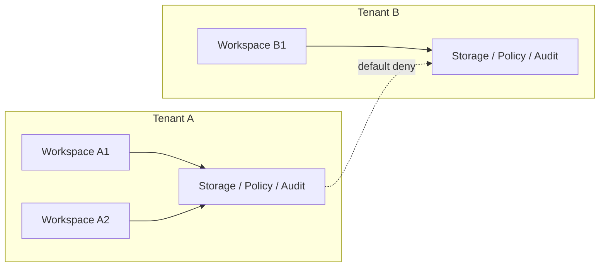
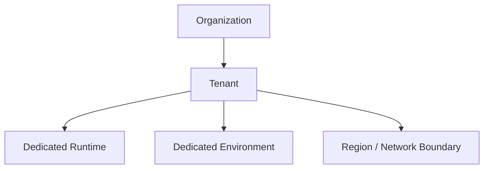

# Tenant And Organization Contract

---

## OAPEFLIR Association

This contract participates in the following stages of the OAPEFLIR eight-stage cycle:

- **Observe**: Signal collection and aggregation
- **Assess**: Pre-execution assessment and risk judgment
- **Plan**: Task decomposition and DAG construction
- **Execute**: Step execution and fault tolerance
- **Feedback**: Signal collection and preprocessing
- **Learn**: Pattern detection and knowledge extraction
- **Improve**: Improvement candidate evaluation and rollout
- **Release**: Controlled release and rollback

---

## 1. Scope

This contract defines the user, workspace, organization, tenant, and enterprise privatization boundaries of the final platform.

It extends `billing_and_tenant_contract.md` to answer "who belongs to whom, which data and permissions need isolation, and which resources are owned at what layer."

## 2. Objectives

- Clarify the hierarchy of `user / workspace / organization / tenant`.
- Clarify tenant-aware boundaries for storage, identity, policy, artifacts, and audit.
- Lay the foundation for enterprise privatization, organization-level operations, and billing aggregation.

## 3. Non-Objectives

- This contract does not directly define payment providers or invoice processes.
- This contract does not replace auth provider technical implementation details.
- This contract does not require Phase 1a to implement a complete enterprise organization tree.

## 4. Hierarchy Model

`UserAccount -> Workspace -> Organization -> Tenant`

Explanation:

- `UserAccount` is the identity principal.
- `Workspace` is the default product usage boundary and collaboration boundary.
- `Organization` is the management and governance affiliation of multiple workspaces.
- `Tenant` is the isolation boundary for final storage, policy, deployment, and audit.

## 5. Phased Implementation Strategy

- Phase 3 can first enable `UserAccount + Workspace`.
- Phase 4 will add the formal governance model for `Organization + Tenant`.
- Enterprise privatization must use `Tenant` as the final isolation unit.

## 6. Key Objects

- `UserAccount`
- `Workspace`
- `WorkspaceMembership`
- `Organization`
- `OrganizationMembership`
- `Tenant`
- `TenantIsolationMode`
- `DeploymentBinding`

## 7. `Workspace` Minimum Fields

| Field | Type | Description |
| --- | --- | --- |
| `workspace_id` | `string` | workspace ID |
| `owner_id` | `string` | workspace owner |
| `display_name` | `string` | display name |
| `plan_id` | `string` | current plan |
| `default_policy_set` | `string` | default governance set |
| `organization_id?` | `string` | parent organization |
| `created_at` | `timestamp` | creation time |

## 8. `Organization` Minimum Fields

- `organization_id`
- `display_name`
- `billing_account_id`
- `default_tenant_id`
- `created_at`

## 9. `Tenant` Minimum Fields

- `tenant_id`
- `organization_id`
- `storage_scope`
- `identity_scope`
- `policy_scope`
- `artifact_scope`
- `deployment_mode`
- `created_at`

## 10. `TenantIsolationMode`

Recommended enum:

- `shared_logical`
- `shared_hard_scoped`
- `dedicated_runtime`
- `dedicated_environment`

Description:

- `shared_logical`: Suitable for early Pro / small teams.
- `shared_hard_scoped`: Shared infrastructure but hard-isolated at data and permission layers.
- `dedicated_runtime`: Execution resources are independent.
- `dedicated_environment`: Privatized or enterprise-exclusive environment.

## 11. Membership Rules

`WorkspaceMembership` must include at least:

- `workspace_id`
- `user_id`
- `role`
- `joined_at`

`OrganizationMembership` must include at least:

- `organization_id`
- `user_id`
- `role`
- `joined_at`

Rules:

- A user can belong to multiple workspaces.
- A workspace can belong to one organization.
- An organization is responsible for centralized governance, billing, and tenant allocation.

## 12. Isolation Boundaries

Domains that must be explicitly isolated by tenant include:

- transaction data
- artifact/object
- identity/session
- policy / governance
- audit / observability
- billing / entitlement

Rules:

- The difference between Pro and Enterprise cannot be expressed solely through UI or configuration conventions.
- Cross-tenant references, searches, and artifact access must default to denial.
- Tenant scope must run through execution, artifact, analytics, and audit chains.
- Tenant scope must run through cache keys, debug dumps, inspect APIs, and manual takeover actions.
- Tenant / organization migration must not silently rewrite historical attribution; mapping change audit and traceable lineage must be preserved.

### 12.1 Isolation Boundary Diagram

### 12.2 Organization and Deployment Binding Diagram

## 13. Deployment Binding

`DeploymentBinding` minimum fields:

- `binding_id`
- `tenant_id`
- `environment_id`
- `deployment_mode`
- `region`
- `network_boundary`
- `created_at`

Purpose:

- Specifies which runtime environment a tenant corresponds to.
- Supports enterprise privatization, region restrictions, and compliance requirements.

## 14. Cross-Tenant Rules

Default rules:

- Cross-tenant data access defaults to denial.
- Cross-tenant search defaults to denial.
- Cross-tenant artifact sharing must go through explicit authorization or sanitized export.
- Cross-tenant replay / analytics aggregation must be an allowed exception under governance.
- Any cross-tenant exception must explicitly record policy, approval, or governance basis, and must not rely on code-built-in exemptions by default.

## 15. Relationship with Metering and Governance

- `monetization_metering_plane_contract.md` is responsible for usage / entitlement / ledger.
- The tenant / organization contract is responsible for the attribution boundaries of these billing objects.
- `governance_control_plane_contract.md` is responsible for the governance entry point for cross-tenant management actions.

## 16. Failure Mode

Key protections needed:

- Identity scope is correct, but artifact scope leaks.
- Old tenant references remain after workspace migration to organization.
- Enterprise privatization environment has inconsistent tenant mapping.
- Cross-tenant analytics aggregation inversely exposes sensitive information.

Handling principles:

- Isolation errors prefer fail-closed.
- Tenant boundary-related changes must include audit and migration plans.
- If tenant / deployment binding is inconsistent, execution should be blocked first, rather than continuing to run on the wrong isolation plane.

## 17. Phased Introduction

- Phase 3: workspace / Pro boundary and basic membership.
- Phase 4: organization / tenant / private deployment / enterprise isolation.

## 18. Conclusion

The core of the tenant and organization plane is not "one more tenant_id field", but binding product-layer collaboration, platform-layer isolation, and enterprise-layer deployment into the same hierarchical model.

All subsequent enterprise, billing, policy, and deployment designs should first return to this contract's hierarchy definition.