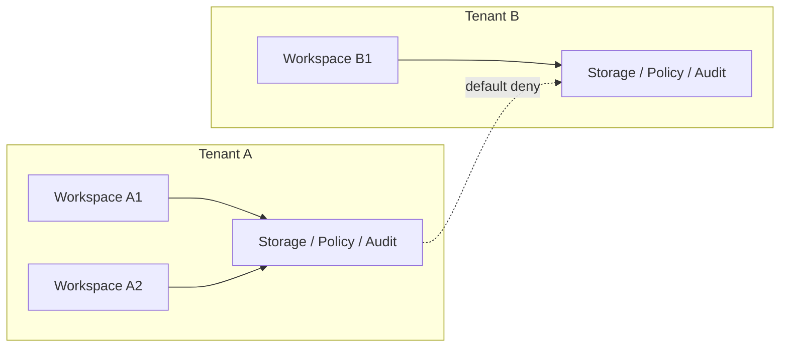
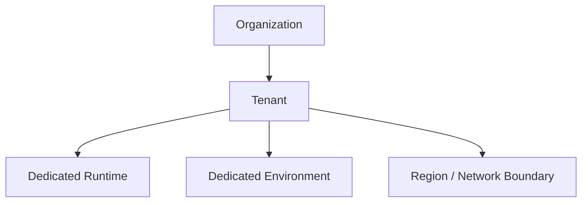

# Tenant And Organization Contract

---

## OAPEFLIR 关联

本 contract 参vs OAPEFLIR 八阶段循环中的以下阶段：

- **Observe**：信号采集vs聚合
- **Assess**：执lines前评估vs风险判断
- **Plan**：任务分解vs DAG 构建
- **Execute**：步骤执linesvs容错
- **Feedback**：信号收集vs预handle
- **Learn**：模式检测vs知识提取
- **Improve**：改进候选评估vs rollout
- **Release**：受控发布vs回滚

---

## 1. 范围

本 contract defines最终平台的user、workspace、organization、tenant vs enterprise 私有化边界。

它扩展 `billing_and_tenant_contract.md`，used for回答“谁belongs to谁、哪些datavspermission需要隔离、哪些资源在什么层被拥有”。

## 2. 目标

- 明确 `user / workspace / organization / tenant` 的层级关系。
- 明确storage、身份、策略、artifact 和审计的 tenant-aware 边界。
- 为 enterprise 私有化、组织级运营和账务归集打基础。

## 3. 非目标

- 本 contract 不directlydefines payment provider 或发票流程。
- 本 contract 不替代 auth provider 的技术implementation details。
- 本 contract 不要求 Phase 1a 就实现完整 enterprise 组织树。

## 4. 层级模型

`UserAccount -> Workspace -> Organization -> Tenant`

解释：

- `UserAccount` is身份主体。
- `Workspace` isdefaults to的产品uses边界和协作边界。
- `Organization` is多 workspace 的via营vs治理归属。
- `Tenant` is最终storage、策略、部署和审计的隔离边界。

## 5. 分阶段落地策略

- Phase 3 可先enabled `UserAccount + Workspace`。
- Phase 4 再补 `Organization + Tenant` 的正式治理模型。
- Enterprise 私有化必须以 `Tenant` 为最终隔离单位。

## 6. 关键对象

- `UserAccount`
- `Workspace`
- `WorkspaceMembership`
- `Organization`
- `OrganizationMembership`
- `Tenant`
- `TenantIsolationMode`
- `DeploymentBinding`

## 7. `Workspace` 最小字段

| 字段 | class型 | Description |
|---|-------|--------|
| `workspace_id` | `string` | workspace ID |
| `owner_id` | `string` | workspace owner |
| `display_name` | `string` | 展示名 |
| `plan_id` | `string` | 当前套餐 |
| `default_policy_set` | `string` | defaults to治理集 |
| `organization_id?` | `string` | 所属组织 |
| `created_at` | `timestamp` | 创建time |

## 8. `Organization` 最小字段

- `organization_id`
- `display_name`
- `billing_account_id`
- `default_tenant_id`
- `created_at`

## 9. `Tenant` 最小字段

- `tenant_id`
- `organization_id`
- `storage_scope`
- `identity_scope`
- `policy_scope`
- `artifact_scope`
- `deployment_mode`
- `created_at`

## 10. `TenantIsolationMode`

Recommendation枚举：

- `shared_logical`
- `shared_hard_scoped`
- `dedicated_runtime`
- `dedicated_environment`

Description：

- `shared_logical`: 适合早期 Pro / 小团队。
- `shared_hard_scoped`: 共享基础设施但在datavspermission层硬隔离。
- `dedicated_runtime`: 运lines资源独立。
- `dedicated_environment`: 私有化或企业专属环境。

## 11. Membership 规则

`WorkspaceMembership` 至少includes：

- `workspace_id`
- `user_id`
- `role`
- `joined_at`

`OrganizationMembership` 至少includes：

- `organization_id`
- `user_id`
- `role`
- `joined_at`

规则：

- user可belongs to多个 workspace。
- workspace 可belongs to一个 organization。
- organization 负责集中治理、账务和 tenant 分配。

## 12. 隔离边界

必须显式按 tenant 隔离的域includes：

- transaction data
- artifact/object
- identity/session
- policy / governance
- audit / observability
- billing / entitlement

规则：

- Pro vs Enterprise 的差异不能只靠 UI 或configure约定table达。
- 跨 tenant 的references用、搜索和 artifact 访问必须defaults to拒绝。
- tenant scope 必须能贯穿 execution、artifact、analytics 和审计链。
- tenant scope 必须能贯穿 cache key、debug dump、inspect API 和人工接管动作。
- tenant / organization 迁移不得静默改写历史归属；必须保留映射变更审计vs可追溯 lineage。

### 12.1 隔离边界图

### 12.2 组织vs部署绑定图

## 13. Deployment 绑定

`DeploymentBinding` 最小字段：

- `binding_id`
- `tenant_id`
- `environment_id`
- `deployment_mode`
- `region`
- `network_boundary`
- `created_at`

用途：

- Description某 tenant 对应哪套运lines环境。
- 支撑 enterprise 私有化、region 限制和合规要求。

## 14. Cross-Tenant 规则

defaults to规则：

- 跨 tenant data访问defaults to拒绝。
- 跨 tenant 搜索defaults to拒绝。
- 跨 tenant artifact 分享必须走显式authorization或脱敏export。
- 跨 tenant replay / analytics 聚合必须is治理允许的特例。
- 任何跨 tenant 特例都必须显式record policy、审批或治理依据，defaults to不得relies oncode内置豁免。

## 15. vs计量和治理的关系

- `monetization_metering_plane_contract.md` 负责 usage / entitlement / ledger。
- tenant / organization contract 负责这些账务对象的归属边界。
- `governance_control_plane_contract.md` 负责跨 tenant manage动作的治理入口。

## 16. Failure Mode

需要重点防范：

- identity scope 正确，但 artifact scope 泄漏。
- workspace 迁移 organization 后遗留旧 tenant references用。
- enterprise 私有化环境vs tenant 映射inconsistent。
- 跨 tenant analytics 聚合反向暴露敏感信息。

handleprinciple：

- 隔离错误优先 fail-closed。
- tenant boundary 相关变更必须带审计vs迁移计划。
- 若 tenant / deployment binding inconsistent，应优先阻断执lines，而不is继续在错误隔离面上运lines。

## 17. 分阶段references入

- Phase 3: workspace / Pro 边界vs基础成员关系。
- Phase 4: organization / tenant / private deployment / enterprise isolation。

## 18. 收口Conclusion

Tenant and organization plane 的核心不is“多一个 tenant_id 字段”，而is把产品层协作、平台层隔离、企业层部署绑定到同一套层级模型中。

后续所有 enterprise、billing、policy 和 deployment 设计，都应先回到这份 contract 的层级defines上。
