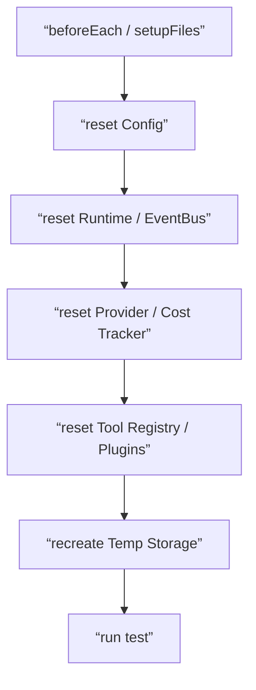

# Testing Singleton Reset Contract

## 1. Scope

This contract defines reset rules for global singletons, caches, registries, and long-lived runtime objects in test environments.

Related documents:

- `project_structure_contract.md`
- `context_propagation_contract.md`
- `runtime_repository_and_migration_contract.md`

## 2. Goals

The test reset system must at least ensure:

- Unit tests and integration tests do not pollute each other's global state.
- Each test run can return to a predictable minimal clean environment.
- Reset capability is a formal API, not scattered private hacks.

## 3. Objects That Must Support Reset

Phase 1a minimum includes:

- runtime registry / active execution map
- SQLite connections and memory cache
- provider client cache / health cache
- tool registry / plugin registry
- event bus listeners / in-memory queues
- config cache / feature flags
- cost tracker / quota counters
- AsyncLocalStorage test harness

## 4. Naming and Exposure Rules

Recommended naming:

- `_resetRuntimeForTesting()`
- `_resetStorageForTesting()`
- `_resetProviderForTesting()`
- `_resetEventBusForTesting()`
- `_resetToolRegistryForTesting()`
- `_resetConfigForTesting()`

Rules:

- Reset APIs must explicitly have `ForTesting` suffix.
- By default, only callable under `NODE_ENV=test`.
- Reset behavior must be idempotent; multiple calls produce consistent results.

## 5. `TestResetReport`

| Field | Type | Description |
| --- | --- | --- |
| `component` | `string` | Component being reset |
| `reset_applied` | `boolean` | Whether successful |
| `cleared_items` | `number?` | Number cleared |
| `warnings` | `string[]` | Anomaly warnings |

## 6. Global Test Entry Point

Rules:

- Test setup should uniformly call the main entry point, rather than each test file assembling reset order on its own.
- Reset failures should directly fail the test, not silently ignore.

## 7. Temporary Resource Rules

- Temporary SQLite databases should be isolatable per test file or test case.
- Temporary artifact directories should be cleaned up in teardown.
- Temporary network mocks / fake gateway states should also be included in the reset flow.

## 8. Boundary with Implementation Code

- Reset only serves testing and must not become a substitute for production recovery mechanisms.
- Shutdown / cleanup in production code and test reset can share underlying logic, but external entry points should be separate.

## 9. Phase Boundaries

Phase 1a does:

- Key singleton reset APIs
- Unified test setup calls
- `NODE_ENV=test` guard

Phase 1b does:

- More integration / e2e shared harness
- Additional reset entry points for gateway / orchestration testing

## 10. Conclusion

A test without a unified reset system will quickly degrade from “regression protection” to “occasionally passing random scripts”; this contract formally freezes the test isolation boundaries.
