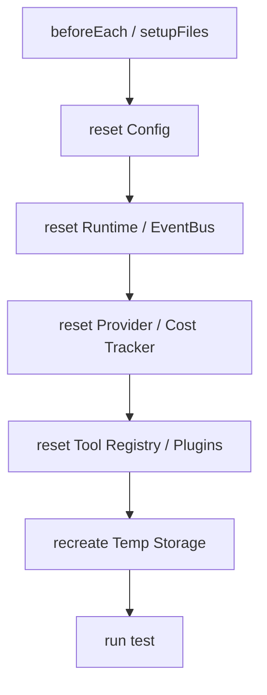

# Testing Singleton Reset Contract

---

## OAPEFLIR 关联

本 contract 参vs OAPEFLIR 八阶段循环中的以下阶段：

- **Observe**：信号采集vs聚合
- **Assess**：执lines前评估vs风险判断
- **Plan**：任务分解vs DAG 构建
- **Execute**：步骤执linesvs容错
- **Feedback**：信号收集vs预handle
- **Learn**：模式检测vs知识提取
- **Improve**：改进候选评估vs rollout
- **Release**：受控发布vs回滚

---

## 1. 范围

本 contract defines测试环境下globallysingleton、cache、注册table和长生命cycle运lines对象的 reset 规则。

相关文档：

- `project_structure_contract.md`
- `context_propagation_contract.md`
- `runtime_repository_and_migration_contract.md`

## 2. 目标

测试 reset 体系至少要保证：

- 单元测试、集成测试之间不会互相污染globallyStatus。
- 每个测试运lines前都能回到可预测的最小干净环境。
- reset 能力is正式 API，而不is零散私有 hack。

## 3. 必须supported reset 的对象

Phase 1a 最少includes：

- runtime registry / active execution map
- SQLite connectvs内存cache
- provider client cache / health cache
- tool registry / plugin registry
- event bus listeners / in-memory queues
- config cache / feature flags
- cost tracker / quota counters
- AsyncLocalStorage test harness

## 4. 命名vs暴露规则

Recommendation命名：

- `_resetRuntimeForTesting()`
- `_resetStorageForTesting()`
- `_resetProviderForTesting()`
- `_resetEventBusForTesting()`
- `_resetToolRegistryForTesting()`
- `_resetConfigForTesting()`

规则：

- reset API 必须显式带 `ForTesting` 后缀。
- defaults toonly允许在 `NODE_ENV=test` 下call。
- reset lines为必须幂等，多iterationscall结果一致。

## 5. `TestResetReport`

| 字段 | class型 | Description |
|---|-------|--------|
| `component` | `string` | 被 reset 的组件 |
| `reset_applied` | `boolean` | isnosuccess |
| `cleared_items` | `number?` | 清理count |
| `warnings` | `string[]` | 异常告警 |

## 6. globally测试入口

规则：

- 测试 setup 应统一call总入口，而不is每个测试文件each拼凑 reset 顺序。
- reset failed应directly让测试failed，而不is静默忽略。

## 7. 临时资源规则

- 临时 SQLite data库每个 test file 或 test case 应可隔离创建。
- 临时 artifact 目录应在 teardown 清理。
- 临时 network mock / fake gateway state 也应纳入 reset 流程。

## 8. vs实现code的边界

- reset 只服务测试，不得成为生产恢复机制的替代。
- 生产code中的 shutdown / cleanup vs测试 reset 可共享底层逻辑，但对外入口应分开。

## 9. Phase 边界

Phase 1a 做：

- 关键singleton reset API
- 测试 setup 统一call
- `NODE_ENV=test` 守卫

Phase 1b 做：

- 更多 integration / e2e 共享 harness
- gateway / orchestration 测试的额外 reset 入口

## 10. 收口Conclusion

没有统一 reset 体系的测试，很快就会从“回归保护”退化成“偶尔via的随机脚本”；这份 contract 就is把测试隔离边界正式冻结下来。
