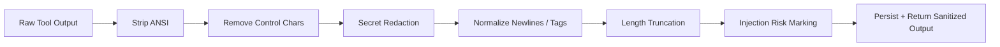

# Tool Output Sanitization Contract

---

## OAPEFLIR 关联

本 contract 参vs OAPEFLIR 八阶段循环中的以下阶段：

- **Observe**：信号采集vs聚合
- **Assess**：执lines前评估vs风险判断
- **Plan**：任务分解vs DAG 构建
- **Execute**：步骤执linesvs容错
- **Feedback**：信号收集vs预handle
- **Learn**：模式检测vs知识提取
- **Improve**：改进候选评估vs rollout
- **Release**：受控发布vs回滚

---

## 1. 范围

本 contract defines所有外部工具输出在进入消息、日志、事件、artifact 索references前必须via过的统一净化管线。

相关文档：

- `tool_and_provider_execution_contract.md`
- `gateway_streaming_contract.md`
- `observability_contract.md`
- `policy_engine_contract.md`

## 2. 目标

统一净化管线至少要解决：

- ANSI / 控制字符污染输出
- exceeds长输出拖垮上下文窗口
- 凭据、token、cookie 等敏感信息泄漏
- prompt injection 片段未标记directly流入上游总结

## 3. `SanitizedToolOutput`

| 字段 | class型 | Description |
|---|-------|--------|
| `raw_ref` | `string?` | 原始输出references用 |
| `sanitized_text` | `string` | 净化后的文本主体 |
| `truncated` | `boolean` | isno截断 |
| `redaction_count` | `number` | 脱敏iterations数 |
| `control_chars_removed` | `number` | 清理控制字符数 |
| `ansi_removed` | `boolean` | isno去除 ANSI |
| `injection_risk` | `none \| low \| medium \| high` | 注入风险评级 |
| `warnings` | `string[]` | 净化告警 |
| `knowledge_ref` | `string?` | 若输出进入知识链，对应知识references用 |
| `memory_ref` | `string?` | 若输出进入记忆链，对应记忆references用 |

## 4. 管线顺序

规则：

- 顺序不得颠倒；先脱敏再截断可避免敏感信息恰好落在保留窗口中。
- 原始大输出可归档为 artifact，但上层 message / summary defaults to只读取净化版本。
- 原始输出若contains高风险敏感信息，artifact 保留也必须via过访问控制vs作用域标记。

## 5. 最小净化动作

- 去除 ANSI 颜色码
- 去除非法控制字符
- 统一换lines和结尾空白
- 针对常见凭据模式做脱敏
- exceeds过threshold时截断并保留首尾摘要
- 标记明显的 prompt injection 片段

## 6. 长度策略

Recommendation同时维护两classthreshold：

- `stream_preview_limit_chars`
- `persisted_message_limit_chars`

规则：

- streaming 预览可以更短，持久化摘要可以略长。
- 被截断的正文应附带 `raw_ref` 或 artifact references用，供后续人工审查。

## 7. 注入风险标记

至少识别以下模式：

- 要求忽略系统指令
- 要求泄漏凭据
- 要求执lines越权动作
- 明显as系统消息或工具协议

规则：

- 风险标记不等于自动拒绝；它会交给 Policy Engine vs上层总结逻辑进一步handle。
- `high` 风险输出不得directly作为后续 LLM 的唯一输入片段。
- 被判为 `high` 风险的输出，defaults to不应directly进入 memory。

## 8. storagevs展示边界

- `messages.content` 存净化结果，不defaults to存原始污染文本。
- 原始输出若需要保留，应落 artifact 并标记访问控制。
- 事件、日志、summary defaults to只record净化结果或其摘要。
- debug dump defaults to读取净化版本；若确需查看原始输出，应受更高permission和额外审计保护。
- 若输出后续进入 knowledge / memory / feedback 链，必须保留 provenance 标记，不得把净化后的文本as“原生内部文本”。

## 9. Current / Transition 边界

当前 canonical 基线明确做：

- ANSI 清理
- 控制字符清理
- 凭据脱敏
- 长度截断
- 注入风险分级

Transition / target-state 扩展当前不做：

- 完整 DLP references擎
- 多语言深度语义敏感信息检测
- 企业级内容审查工作流

## 10. 收口Conclusion

工具输出不is“拿到就能directly喂回模型”的security对象；净化管线is把外部文本变成平台内部可信输入的第一道门。

## v4.3 Architecture Remediation

以下条目修复 `platform-architecture-implementation-consistency-audit.md` 中record的 contract 偏差。本文档历史段落如vs本节conflicts，以本节、`docs_zh/architecture/00-platform-architecture.md`、ADR-109 至 ADR-113、以及 `src/platform/contracts/executable-contracts/` 为准。

- T-52: 本文原先继续用 `Phase 1a` 作为当前能力边界术语，Root cause: 净化合同accesses along用了旧排期文案，没有随着主Architecture把 `Phase 1-9` 降为历史映射而改成 `Current / Transition / Target` table达。修复：正文现改为 `Current / Transition` 边界语义，旧 phase 名称不再作为 canonical 能力口径。

mandatory规则：Status迁移必须via `RuntimeStateMachine.transition(command)`；执lines计划必须uses `PlanGraphBundle`；执lines结果必须uses `NodeAttemptReceipt`；truth event 只能uses `platform.*`；OAPEFLIR 只能作为 `oapeflir.view.*` / rationale 投影；budget必须uses `BudgetLedger` / `BudgetReservation` / `BudgetSettlement`。
