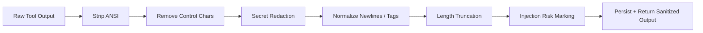

# Tool Output Sanitization Contract

## 1. Scope

This contract defines the unified sanitization pipeline that all external tool outputs must pass through before entering messages, logs, events, and artifact indexes.

Related documents:

- `tool_and_provider_execution_contract.md`
- `gateway_streaming_contract.md`
- `observability_contract.md`
- `policy_engine_contract.md`

## 2. Goals

Unified sanitization pipeline at minimum solves:

- ANSI / control character pollution output
- Over-length output dragging down context window
- Sensitive information leakage such as credentials, tokens, cookies
- Prompt injection fragments unmarked directly flowing into upstream summarization

## 3. `SanitizedToolOutput`

| Field | Type | Description |
| --- | --- | --- |
| `raw_ref` | `string?` | Raw output reference |
| `sanitized_text` | `string` | Sanitized text body |
| `truncated` | `boolean` | Whether truncated |
| `redaction_count` | `number` | Desensitization count |
| `control_chars_removed` | `number` | Control characters removed |
| `ansi_removed` | `boolean` | Whether ANSI removed |
| `injection_risk` | `none \| low \| medium \| high` | Injection risk rating |
| `warnings` | `string[]` | Sanitization warnings |

## 4. Pipeline Order

Rules:

- Order must not be reversed; desensitize then truncate to avoid sensitive information just happening to be in preserved window.
- Original large output can be archived as artifact, but upper-layer message / summary by default only reads sanitized version.
- If original output contains high-risk sensitive information, artifact retention must also have access control and scope tagging.

## 5. Minimum Sanitization Actions

- Remove ANSI color codes
- Remove illegal control characters
- Normalize newlines and trailing whitespace
- Desensitize common credential patterns
- Truncate when exceeding threshold and retain beginning and ending summary
- Mark obvious prompt injection fragments

## 6. Length Strategy

Recommended to simultaneously maintain two threshold types:

- `stream_preview_limit_chars`
- `persisted_message_limit_chars`

Rules:

- Streaming preview can be shorter, persisted summary can be slightly longer.
- Truncated body should be accompanied by `raw_ref` or artifact reference for subsequent manual review.

## 7. Injection Risk Marking

At minimum identify the following patterns:

- Request to ignore system instructions
- Request to leak credentials
- Request to execute unauthorized actions
- Obviously disguised as system message or tool protocol

Rules:

- Risk marking does not equal auto-rejection; it goes to Policy Engine and upper-layer summarization logic for further processing.
- `high` risk output must not be used as sole input fragment for subsequent LLM.
- Output judged as `high` risk should by default not directly enter memory.

## 8. Storage and Display Boundaries

- `messages.content` stores sanitization result and does not by default store raw polluted text.
- If original output needs retention, should land as artifact and tag access control.
- Events, logs, summary by default only record sanitization result or its summary.
- Debug dump by default reads sanitized version; if raw output truly needs viewing, should be protected by higher permissions and additional audit.

## 9. Phase Boundaries

Phase 1a explicitly does:

- ANSI cleanup
- Control character cleanup
- Credential desensitization
- Length truncation
- Injection risk classification

Currently does not do:

- Complete DLP engine
- Multi-language deep semantic sensitive information detection
- Enterprise content review workflow

## 10. Closure Conclusion

Tool output is not a "can be directly fed back to model" secure object; sanitization pipeline is the first gate converting external text