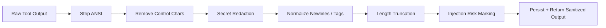

# Tool Output Sanitization Contract

---

## OAPEFLIR Association

This contract participates in the following stages of the OAPEFLIR eight-stage cycle:

- **Observe**: Signal collection and aggregation
- **Assess**: Pre-execution assessment and risk judgment
- **Plan**: Task decomposition and DAG construction
- **Execute**: Step execution and fault tolerance
- **Feedback**: Signal collection and preprocessing
- **Learn**: Pattern detection and knowledge extraction
- **Improve**: Improvement candidate evaluation and rollout
- **Release**: Controlled release and rollback

---

## 1. Scope

This contract defines the unified sanitization pipeline that all external tool outputs must pass through before entering messages, logs, events, or artifact indexes.

Related documents:

- `tool_and_provider_execution_contract.md`
- `gateway_streaming_contract.md`
- `observability_contract.md`
- `policy_engine_contract.md`

## 2. Objectives

The unified sanitization pipeline must at minimum address:

- ANSI / control character contamination of output
- Over-length output overwhelming context windows
- Sensitive information leakage such as credentials, tokens, cookies
- Unmarked prompt injection fragments directly flowing into upstream summaries

## 3. `SanitizedToolOutput`

| Field | Type | Description |
| --- | --- | --- |
| `raw_ref` | `string?` | Raw output reference |
| `sanitized_text` | `string` | Sanitized text body |
| `truncated` | `boolean` | Whether truncated |
| `redaction_count` | `number` | Redaction count |
| `control_chars_removed` | `number` | Number of control characters removed |
| `ansi_removed` | `boolean` | Whether ANSI removed |
| `injection_risk` | `none \| low \| medium \| high` | Injection risk rating |
| `warnings` | `string[]` | Sanitization warnings |
| `knowledge_ref` | `string?` | If output enters knowledge chain, corresponding knowledge reference |
| `memory_ref` | `string?` | If output enters memory chain, corresponding memory reference |

## 4. Pipeline Order

Rules:

- Order must not be reversed; redaction before truncation avoids sensitive information happening to fall in the preserved window.
- Large raw outputs may be archived as artifacts, but upper-layer messages/summaries default to reading the sanitized version.
- If raw output contains high-risk sensitive information, artifact retention must also go through access control and scope marking.

## 5. Minimum Sanitization Actions

- Remove ANSI color codes
- Remove illegal control characters
- Normalize newlines and trailing whitespace
- Redact common credential patterns
- Truncate and preserve head/tail summary when exceeding threshold
- Mark obvious prompt injection fragments

## 6. Length Strategy

Recommended to maintain two threshold types simultaneously:

- `stream_preview_limit_chars`
- `persisted_message_limit_chars`

Rules:

- Streaming previews can be shorter; persisted summaries can be slightly longer.
- Truncated body should be accompanied by `raw_ref` or artifact reference for subsequent manual review.

## 7. Injection Risk Marking

Must recognize at minimum the following patterns:

- Requests to ignore system instructions
- Requests to leak credentials
- Requests to perform unauthorized actions
- Clearly disguised as system messages or tool protocols

Rules:

- Risk marking does not equal automatic rejection; it is handed to the Policy Engine and upper-layer summary logic for further processing.
- `high` risk output must not be used as the sole input fragment for subsequent LLMs.
- Output judged as `high` risk should not by default directly enter memory.

## 8. Storage and Display Boundaries

- `messages.content` stores sanitization results, not raw contaminated text by default.
- If raw output needs to be retained, it should land in artifacts with access control marking.
- Events, logs, and summaries default to recording only sanitization results or their summaries.
- Debug dumps default to reading sanitized versions; if raw output确实 needs to be viewed, it should be protected by higher permissions and additional audit.
- If output subsequently enters knowledge/memory/feedback chains, provenance marking must be retained, and sanitized text must not be masqueraded as "native internal text".

## 9. Current / Transition Boundaries

Current canonical baseline explicitly does:

- ANSI cleanup
- Control character cleanup
- Credential redaction
- Length truncation
- Injection risk classification

Transition/target-state extensions currently do not do:

- Full DLP engine
- Multi-language deep semantic sensitive information detection
- Enterprise content review workflow

## 10. Conclusion

Tool output is not a security object that can be "directly fed back to the model once obtained"; the sanitization pipeline is the first gate that transforms external text into trusted platform internal input.

## v4.3 Architecture Remediation

The following entries fix contract deviations recorded in `platform-architecture-implementation-consistency-audit.md`. If historical sections of this document conflict with this section, this section, `docs_zh/architecture/00-platform-architecture.md`, ADR-109 through ADR-113, and `src/platform/contracts/executable-contracts/` take precedence.

- T-52: This document previously continued using `Phase 1a` as the current capability boundary term. Root cause: the sanitization contract followed old scheduling copy and did not change to `Current / Transition / Target` expression as the main architecture reduced `Phase 1-9` to historical mapping. Fix: The main text now changes to `Current / Transition` boundary semantics, and old phase names no longer serve as canonical capability口径.

Mandatory rules: State transitions must go through `RuntimeStateMachine.transition(command)`; execution plans must use `PlanGraphBundle`; execution results must use `NodeAttemptReceipt`; truth events must only use `platform.*`; OAPEFLIR may only be used as `oapeflir.view.*` / rationale projections; budgets must use `BudgetLedger` / `BudgetReservation` / `BudgetSettlement`.