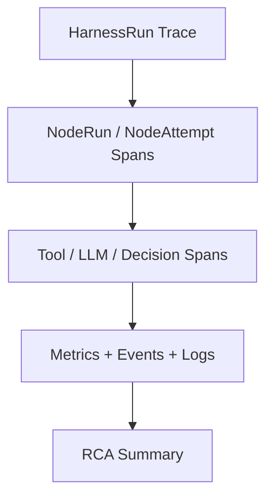

# Trace And Root Cause Observability Contract

## 1. 范围

本 contract defines trace/span 模型、业务vs技术指标分层，以及故障Root Cause分析辅助能力。

相关文档：

- `observability_contract.md`
- `debug_inspect_health_backpressure_contract.md`
- `diagnostics_snapshot_and_repro_bundle_contract.md`
- `event_registry_and_ops_threshold_contract.md`

## 2. 目标

- 让一iterations `HarnessRun` 从入口到 node、tool、LLM、decision 都能在 trace 上串起来。
- 把业务 dashboard vs技术 dashboard 分开治理。
- 让故障后自动生成初步 RCA 线索，而不is只留下分散日志。

## 3. Trace 模型

最小层级：

- 一个 `HarnessRun` = 一个 `trace`
- 一个 `NodeRun` = 一个主执lines `span`
- 一个 `NodeAttempt` = 一个尝试 `span`
- 一iterations tool call = 一个 `span`
- 一iterations LLM call = 一个 `span`
- 一iterations decision / escalation = 一个 `span`
- 一iterations `oapeflir.view.*` 阶段解释可以映射为上层 view span，但不得充当 runtime truth

必须传播的关联字段：

- `trace_id`
- `span_id`
- `parent_span_id`
- `correlation_id`
- `harness_run_id`
- `node_run_id?`
- `attempt_id?`
- `task_id?`
- `execution_id?`
- `session_id`

推荐 baggage：

- `tenant_id`
- `workspace_id`
- `organization_id?`
- `agent_id?`
- `user_id?`
- `priority?`
- `stage_view_ref?`
- `loop_iteration?`
- `domain_id?`

## 4. Trace Carrier vs传播规则

推荐 carrier class型：

- `http_headers`
- `message_attributes`
- `queue_metadata`
- `worker_runtime_context`

最小要求：

- gateway ingress 必须能创建或提取 trace context。
- runtime / worker / gateway / approval / remote bridge 之间必须显式注入vs提取 trace context。
- trace 传播failed不得中断主任务执lines，但必须record observability warning。
- trace sink、callback、subscriber 或 exporter 的异常不得反向打断主执lines链；观测面defaults to fail-open，但必须保留 warning / dropped event 证据。

推荐字段：

- `traceparent`
- `tracestate`
- `x-correlation-id`
- `x-tenant-scope`

## 5. Trace Sampling

推荐规则：

| 条件 | 采样率 |
| --- | --- |
| debug / operator takeover | `100%` |
| error / dead-letter / stale write | `100%` |
| approval / policy escalation | `100%` |
| normal harness run | `10%` |
| background / periodic maintenance | `1%` |

## 6. 指标分层

| 层 | 指标示例 |
| --- | --- |
| `oapeflir` | loop 收敛率、feedback 正负比、rollout success率 |
| `business` | 任务success率、审批率、事业部产出、user升级率 |
| `platform` | 吞吐、队列积压、恢复success率、租约回收数 |
| `runtime` | worker 心跳、执lines时长、重试率、背压触发率 |
| `infra` | DB delay、cache 命中、CPU、内存、事件循环delay |

## 7. Root Cause分析辅助

故障视图至少应自动聚合：

- 最近相关事件
- 最近相关configure变更
- 最近相关 prompt / model / policy 变更
- 最近相关 worker / lease 切换
- 最近相关成本异常
- 最近相关 feedback / learning / rollout 动作

## 8. 异常模式检测

至少supported识别：

- 某角色连续卡在同一 node
- 某工具近期failed率激增
- 某租户或事业部成本异常抬升
- 某 worker 心跳抖动异常
- 某 loop 长time不收敛
- 某 rollout 连续受阻或回滚

## 9. 可视化目标

## 10. 收口Conclusion

工业级可观测性不能停留在“有日志”和“有 healthz”。

它必须supported：

- HarnessRun 级 trace 串联
- 业务vs技术指标分层
- 故障后自动收束Root Cause线索

## v4.3 Architecture Remediation

以下条目修复 `platform-architecture-implementation-consistency-audit.md` 中record的 contract 偏差。本文档历史段落如vs本节conflicts，以本节、`docs_zh/architecture/00-platform-architecture.md`、ADR-109 至 ADR-113、以及 `src/platform/contracts/executable-contracts/` 为准。

- T-39: 本文原先把 `task` 当作 trace 主体，Root cause:  observability 合同继承了旧 task-centric 单机执lines模型，没有随着 `HarnessRun / NodeRun / NodeAttempt` 成为 runtime truth 一起重写追踪主键。修复：正文现明确 `一个 HarnessRun = 一个 trace`，并把 `harness_run_id / node_run_id / attempt_id` 提升为必传关联字段，`task_id / execution_id` 只保留为 legacy / projection 关联键。

mandatory规则：Status迁移必须via `RuntimeStateMachine.transition(command)`；执lines计划必须uses `PlanGraphBundle`；执lines结果必须uses `NodeAttemptReceipt`；truth event 只能uses `platform.*`；OAPEFLIR 只能作为 `oapeflir.view.*` / rationale 投影；budget必须uses `BudgetLedger` / `BudgetReservation` / `BudgetSettlement`。
