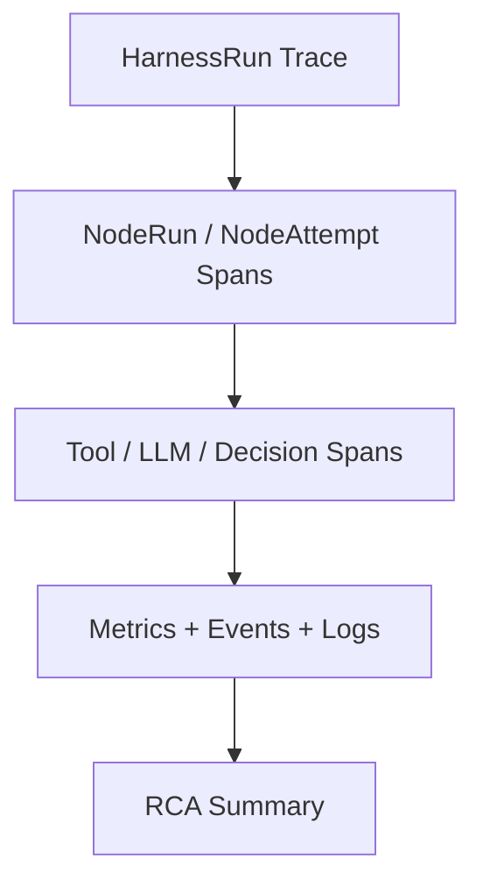

# Trace And Root Cause Observability Contract

## 1. Scope

This contract defines the trace / span model, the layering of business and technical metrics, and the auxiliary capabilities for fault root cause analysis.

Related documents:

- `observability_contract.md`
- `debug_inspect_health_backpressure_contract.md`
- `diagnostics_snapshot_and_repro_bundle_contract.md`
- `event_registry_and_ops_threshold_contract.md`

## 2. Goals

- Let a single `HarnessRun` be linked end-to-end on trace, from the entry point to node, tool, LLM, and decision.
- Manage the business dashboard and the technical dashboard separately.
- After a fault, automatically generate preliminary RCA clues, rather than leaving only scattered logs.

## 3. Trace Model

Minimum levels:

- One `HarnessRun` = one `trace`
- One `NodeRun` = one main execution `span`
- One `NodeAttempt` = one attempt `span`
- One tool call = one `span`
- One LLM call = one `span`
- One decision / escalation = one `span`
- One `oapeflir.view.*` stage explanation can be mapped to an upper-layer view span, but must not serve as runtime truth

Correlation fields that must be propagated:

- `trace_id`
- `span_id`
- `parent_span_id`
- `correlation_id`
- `harness_run_id`
- `node_run_id?`
- `attempt_id?`
- `task_id?`
- `execution_id?`
- `session_id`

Recommended baggage:

- `tenant_id`
- `workspace_id`
- `organization_id?`
- `agent_id?`
- `user_id?`
- `priority?`
- `stage_view_ref?`
- `loop_iteration?`
- `domain_id?`

## 4. Trace Carrier and Propagation Rules

Recommended carrier types:

- `http_headers`
- `message_attributes`
- `queue_metadata`
- `worker_runtime_context`

Minimum requirements:

- The gateway ingress must be able to create or extract trace context.
- Trace context must be explicitly injected and extracted between runtime / worker / gateway / approval / remote bridge.
- Trace propagation failure must not interrupt the main task execution, but must record an observability warning.
- Anomalies in trace sink, callback, subscriber, or exporter must not reversely interrupt the main execution chain; the observability surface defaults to fail-open, but must retain warning / dropped event evidence.

Recommended fields:

- `traceparent`
- `tracestate`
- `x-correlation-id`
- `x-tenant-scope`

## 5. Trace Sampling

Recommended rules:

| Condition | Sampling Rate |
| --- | --- |
| debug / operator takeover | `100%` |
| error / dead-letter / stale write | `100%` |
| approval / policy escalation | `100%` |
| normal harness run | `10%` |
| background / periodic maintenance | `1%` |

## 6. Metric Layering

| Layer | Metric Example |
| --- | --- |
| `oapeflir` | Loop convergence rate, feedback positive / negative ratio, rollout success rate |
| `business` | Task success rate, approval rate, division output, user upgrade rate |
| `platform` | Throughput, queue backlog, recovery success rate, lease reclaim count |
| `runtime` | Worker heartbeat, execution duration, retry rate, backpressure trigger rate |
| `infra` | DB latency, cache hit, CPU, memory, event loop latency |

## 7. Root Cause Analysis Assistance

The fault view should at least automatically aggregate:

- Recent related events
- Recent related configuration changes
- Recent related prompt / model / policy changes
- Recent related worker / lease switches
- Recent related cost anomalies
- Recent related feedback / learning / rollout actions

## 8. Anomaly Pattern Detection

Must at least support identifying:

- A role continuously stuck on the same node
- A tool with a recent surge in failure rate
- A tenant or division with abnormally rising cost
- A worker with abnormal heartbeat jitter
- A loop not converging for a long time
- A rollout continuously blocked or rolled back

## 9. Visualization Goal

## 10. Closure Conclusion

Industrial-grade observability cannot stop at "having logs" and "having healthz".

It must support:

- HarnessRun-level trace linking
- Separation of business and technical metric layers
- Automatic collection of root cause clues after a fault

## v4.3 Architecture Remediation

The following entries fix the contract deviations recorded in `platform-architecture-implementation-consistency-audit.md`. If any historical section of this document conflicts with this section, this section, `docs_zh/architecture/00-platform-architecture.md`, ADR-109 through ADR-113, and `src/platform/contracts/executable-contracts/` take precedence.

- T-39: This document originally took `task` as the trace subject. The root cause was that the observability contract inherited the old task-centric single-machine execution model, and did not rewrite the tracking primary key as `HarnessRun / NodeRun / NodeAttempt` became the runtime truth. Fix: The main text now makes clear that "one HarnessRun = one trace", and elevates `harness_run_id / node_run_id / attempt_id` to required correlation fields, while `task_id / execution_id` are retained only as legacy / projection correlation keys.

Mandatory rules: state transitions must go through `RuntimeStateMachine.transition(command)`; execution plans must use `PlanGraphBundle`; execution results must use `NodeAttemptReceipt`; truth events may only use `platform.*`; OAPEFLIR may only act as `oapeflir.view.*` / rationale projection; budgets must use `BudgetLedger` / `BudgetReservation` / `BudgetSettlement`.
