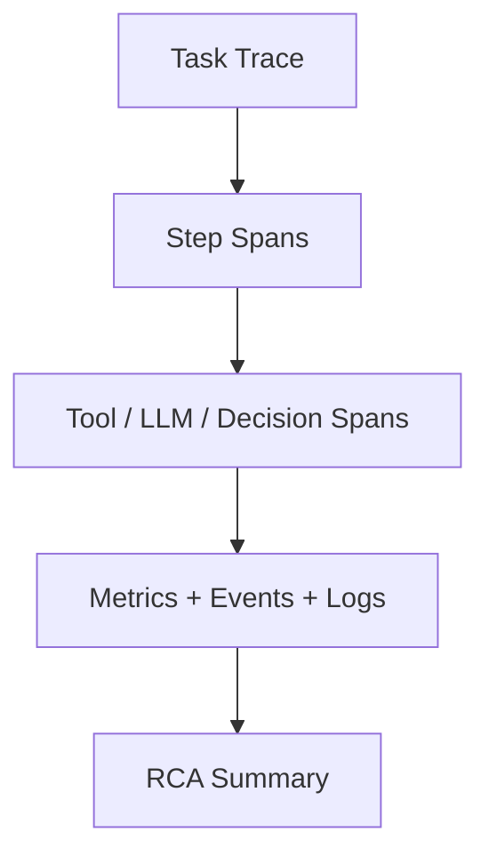

# Trace And Root Cause Observability Contract

## 1. Scope

This contract defines trace/span model, business and technical metric layering, and fault root cause analysis assistance capabilities.

Related documents:

- `observability_contract.md`
- `debug_inspect_health_backpressure_contract.md`
- `diagnostics_snapshot_and_repro_bundle_contract.md`
- `event_registry_and_ops_threshold_contract.md`

## 2. Goals

- Let a task from entry to step, tool, LLM, decision all be connected in series on trace.
- Separate business dashboard and technical dashboard governance.
- Let preliminary RCA clues automatically generated after failure rather than only leaving scattered logs.

## 3. Trace Model

Minimum layers:

- One task = one `trace`
- One agent step = one `span`
- One tool call = one `span`
- One LLM call = one `span`
- One decision / escalation = one `span`

Fields that must be propagated:

- `trace_id`
- `span_id`
- `parent_span_id`
- `correlation_id`
- `task_id`
- `execution_id`
- `session_id`

Recommended baggage:

- `tenant_id`
- `workspace_id`
- `organization_id?`
- `agent_id?`
- `user_id?`
- `priority?`

## 4. Trace Carrier and Propagation Rules

Recommended carrier types:

- `http_headers`
- `message_attributes`
- `queue_metadata`
- `worker_runtime_context`

Minimum requirements:

- Gateway ingress must create or extract trace context.
- Runtime / worker / gateway / approval / remote bridge must explicitly inject and extract trace context.
- Trace propagation failure must not interrupt main task execution but must record observability warning.
- Trace sink, callback, subscriber, or exporter exceptions must not reverse interrupt main execution chain; observability surface defaults to fail-open but must retain warning / dropped event evidence.

Recommended fields:

- `traceparent`
- `tracestate`
- `x-correlation-id`
- `x-tenant-scope`

## 5. Trace Sampling

Recommended rules:

| Condition | Sampling Rate |
| --- | --- |
| debug / operator takeover | `100%` |
| error / dead-letter / stale write | `100%` |
| approval / policy escalation | `100%` |
| normal task | `10%` |
| background / periodic maintenance | `1%` |

## 6. Metric Layering

| Layer | Metric Examples |
| --- | --- |
| `business` | Task success rate, approval rate, business unit output, user escalation rate |
| `platform` | Throughput, queue backlog, recovery success rate, lease reclaim count |
| `runtime` | Worker heartbeat, execution duration, retry rate, backpressure trigger rate |
| `infra` | DB latency, cache hit, CPU, memory, event loop delay |

## 7. Root Cause Analysis Assistance

Fault view at minimum should automatically aggregate:

- Recent related events
- Recent related configuration changes
- Recent related prompt / model / policy changes
- Recent related worker / lease switches
- Recent related cost anomalies

## 8. Anomaly Pattern Detection

At minimum support identifying:

- Some role continuously stuck at same step
- Tool recent failure rate surge
- Some tenant or business unit cost abnormal rise
- Some worker heartbeat jitter anomaly

## 9. Visualization Goals

## 10. Closure Conclusion

Industrial-grade observability cannot stop at "has logs" and "has healthz".

It must support:

- Trace-level series connection
- Business and technical metric layering
- Automatic aggregation of root cause clues after failure
