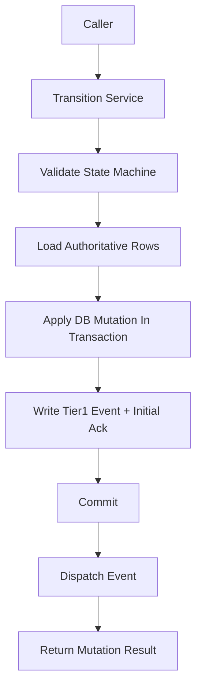

# Transition Service Contract

## 1. Scope

This contract drills down `state_transition_matrix_contract.md` to the unified state change entry points that must be frozen before implementation.

It answers 3 questions:

- Which service functions are the only allowed state write entry points.
- What context should a single state transition carry.
- How are transaction, event, and recovery order constrained when closing cross-table state.

Related documents:

- `runtime_state_machine_contract.md`
- `state_transition_matrix_contract.md`
- `runtime_repository_and_migration_contract.md`
- `event_bus_contract.md`
- `app_error_contract.md`

## 2. Core Principles

- Callers must not directly scatter-write state fields.
- All state transitions must carry `reason_code`, `trace_id`, and `occurred_at`.
- Cross-table state transitions prefer aggregated transition rather than multiple local updates.
- Tier 1 state facts must first be persisted to database before entering event distribution chain.

## 3. Key Objects

### 3.1 `TransitionCommand`

Description:

- TypeScript implementation uses camelCase field names according to repository conventions, but semantics correspond one-to-one with this table.
- Implementation field mapping: `entityKind` / `entityId` / `fromStatus` / `toStatus` / `reasonCode` / `reasonDetail` / `traceId` / `actorType` / `actorId` / `idempotencyKey` / `occurredAt` / `metadataJson`.

| Field | Type | Description |
| --- | --- | --- |
| `entity_kind` | `task \| workflow \| session \| approval \| execution` | Target entity type |
| `entity_id` | `string` | Target ID |
| `from_status` | `string?` | Expected old state, optional optimistic guard |
| `to_status` | `string` | Target state |
| `reason_code` | `string` | Transition reason code |
| `reason_detail` | `string?` | Auditable supplementary explanation |
| `trace_id` | `string` | Trace ID |
| `actor_type` | `user \| agent \| system \| scheduler \| admin \| webhook \| recovery` | Who triggered the change (aligned with `audit_lineage_and_retention_contract.md` §4 unified actor model, extended `recovery` for recovery chain) |
| `actor_id` | `string?` | Actor ID |
| `idempotency_key` | `string?` | Idempotency key |
| `occurred_at` | `timestamp` | Time fact occurred |
| `metadata_json` | `json?` | Additional context |

### 3.2 `TransitionMutationResult`

- `applied`
- `previous_status`
- `current_status`
- `mutation_group_id`
- `updated_rows`
- `emitted_event_types`

### 3.3 `TransitionGuardFailure`

- `expected_status_mismatch`
- `invalid_transition`
- `terminal_state_reentry`
- `missing_dependency`
- `duplicate_mutation`

## 4. Service Entry Points

Phase 1a / 1b at minimum freezes the following entry points:

- `transitionTaskStatus(command)`
- `transitionWorkflowStatus(command)`
- `transitionSessionStatus(command)`
- `transitionApprovalStatus(command)`
- `transitionExecutionStatus(command)`
- `transitionBlockedForApproval(input)`
- `transitionTaskTerminalState(input)`

Aggregated entry point descriptions:

- `transitionBlockedForApproval(...)`
  - Simultaneously transitions `tasks.status=awaiting_decision`
  - `workflow_state.status=paused`
  - `executions.status=blocked`
  - Creates or associates `approvals`
  - Appends Tier 1 events
- `transitionTaskTerminalState(...)`
  - Unified closure of `task / workflow / session / execution`
  - Responsible for success, failure, cancel three terminal states

## 5. Call Order and Transaction Boundaries

Rules:

- State validity checking must precede database writes.
- Transitions requiring cross-table consistency must write main state and Tier 1 events in the same transaction.
- Event distribution failure must not rollback committed state facts; recovery chain should resend based on `events` and `event_consumer_acks`.

## 6. State Transition Constraints

### 6.1 Single Entity Transition

- Single entity transition must verify legal transitions in `runtime_state_machine_contract.md`.
- If `from_status` is provided, database update must carry old state condition to avoid concurrent overwrite.
- Terminal state duplicate writes are treated as idempotent no-op by default, only returning error when field semantics conflict.

### 6.2 Aggregated Transition

- When `task=done`, `workflow=completed` and `session=completed` should be completed in the same aggregated transition or same recovery closure.
- When `execution=blocked` and reason is approval wait, must not omit `task=awaiting_decision`.
- When `approval=approved / rejected / expired` takes effect, must be able to trace back to the blocked execution.
- When `task` has active execution, concurrent calls must not create a second active transition owner; if entering recovery or takeover, must first complete explicit closure of old execution.

### 6.3 Terminal State Reentry and Attempt Rules

- `done` tasks must not re-enter `in_progress` through normal transition.
- If `failed / cancelled` needs recovery, must create new execution attempt and retain old terminal state, old error code, and old trace evidence.
- For duplicate `completed` writes on the same step, only allowed to return as idempotent no-op, must not repeatedly derive new side effects or Tier 1 events.

## 7. Idempotency and Recovery

- Each transition should support `idempotency_key` for handling recovery replay or retry.
- Duplicate requests with same `entity_kind + entity_id + to_status + idempotency_key` take effect only once by default.
- If transaction has completed but caller hasn't received response, safe replay should be allowed and final state returned.
- Recovery logic must not bypass Transition Service to directly write terminal state.
- Aggregated transition's `idempotency_key` should cover the entire cross-table change group, not just a single table update.

## 8. Error Semantics

Typical error codes:

- `workflow.invalid_transition`
- `validation.invalid_input`
- `runtime.recovery_required`
- `storage.write_failed`
- `internal.unexpected_error`

Supplementary rules:

- Optimistic guard failure should return identifiable error rather than silently overwriting.
- Terminal state conflict must return non-retryable error.
- If half-completed write is detected, Transition Service should throw `runtime.recovery_required` and hand over to recovery chain.

## 9. Minimum Audit Fields

Each transition must at minimum be able to trace:

- Who triggered
- From what state to what state
- Why the transition
- Which tables were modified
- Which Tier 1 events were written

## 10. Phase Boundaries

Phase 1a explicitly only does:

- Unified transition service within single process
- Aggregated transition within SQLite transactions
- Minimum anti-replay based on `idempotency_key`

Currently does not do:

- Cross-process distributed state coordination
- saga orchestrator
- General state diagram DSL

## 11. Conclusion

Whether the main state machine is clear ultimately depends on whether state can only be changed through a set of tightened entry points; this contract is the authoritative boundary for this set of entry points.
