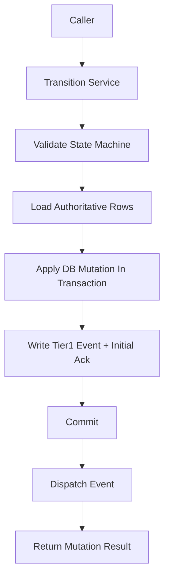

# Transition Service Contract

> **OAPEFLIR 相关**：本 contract defines OAPEFLIR 8 阶段Status转换，对应 ADR-016。
> **更新日期**：2026-04-17

## 1. 范围

本 contract 把 `state_transition_matrix_contract.md` 下钻到实现前必须冻结的统一Status变更入口。

它回答 3 个Issue：

- 哪些服务functionis唯一允许的Statuswrites口。
- 一iterationsStatus推进应携带哪些上下文。
- 跨tableStatus收口时事务、事件和恢复顺序如何约束。

相关文档：

- `runtime_state_machine_contract.md`
- [ADR-016 OAPEFLIR 八阶段模型](../adr/016-oapeflir-loop-model.md)
- `state_transition_matrix_contract.md`
- `runtime_repository_and_migration_contract.md`
- `event_bus_contract.md`
- `app_error_contract.md`

## 2. 核心principle

- 不允许call方directly散写Status字段。
- 所有Status推进都必须带 `reason_code`、`trace_id` 和 `occurred_at`。
- 跨tableStatus推进优先走聚合 transition，而不is多iterations局部更新。
- Tier 1 Status事实必须先落库，再进入事件分发链。

## 3. 关键对象

### 3.1 `TransitionCommand`

Description：

- TypeScript 实现按仓库约定uses camelCase 字段名，但语义vs本table一一对应。
- 实现字段映射为：`entityKind` / `entityId` / `fromStatus` / `toStatus` / `reasonCode` / `reasonDetail` / `traceId` / `actorType` / `actorId` / `idempotencyKey` / `occurredAt` / `metadataJson`。

| 字段 | class型 | Description |
|---|-------|--------|
| `entity_kind` | `harness_run \| node_run \| side_effect \| budget_reservation \| session_projection \| approval_projection \| task_projection \| workflow_projection` | 目标实体class型 |
| `entity_id` | `string` | 目标 ID |
| `from_status` | `string?` | 期望旧Status，optional optimistic guard |
| `to_status` | `string` | 目标Status |
| `reason_code` | `string` | 推进原因码 |
| `reason_detail` | `string?` | 可审计的附加Description |
| `trace_id` | `string` | 链路追踪 ID |
| `actor_type` | `user \| agent \| system \| scheduler \| admin \| webhook \| recovery` | 谁触发了变更（对齐 `audit_lineage_and_retention_contract.md` §4 统一 actor model，扩展 `recovery` used for恢复链） |
| `actor_id` | `string?` | 触发者 ID |
| `idempotency_key` | `string?` | 防重入键 |
| `occurred_at` | `timestamp` | 事实发生time |
| `metadata_json` | `json?` | 附加上下文 |

规则：

- `harness_run`、`node_run`、`side_effect`、`budget_reservation` is truth entity kind；`task_projection`、`workflow_projection`、`session_projection`、`approval_projection` 只允许作为投影更新目标。
- `execution`、`task`、`workflow` 这class pre-v4.3 `entity_kind` 只能作为 migration input，在入口归一化后不得继续作为 canonical transition target。

### 3.2 `TransitionMutationResult`

- `applied`
- `previous_status`
- `current_status`
- `mutation_group_id`
- `updated_rows`
- `emitted_event_types`

### 3.3 `TransitionGuardFailure`

- `expected_status_mismatch`
- `invalid_transition`
- `terminal_state_reentry`
- `missing_dependency`
- `duplicate_mutation`

## 4. 服务入口

Phase 1a / 1b 最少冻结以下入口：

- `RuntimeStateMachine.transition(command)`
- `transitionHarnessRun(command)`
- `transitionNodeRun(command)`
- `transitionSideEffect(command)`
- `transitionBudgetReservation(command)`
- `projectHarnessRunToTaskView(input)`
- `projectNodeRunToWorkflowView(input)`
- `projectNodeRunToSessionView(input)`
- `projectDecisionToApprovalView(input)`
- `transitionBlockedForApproval(input)`
- `transitionHarnessTerminalState(input)`

聚合入口Description：

- `transitionBlockedForApproval(...)`
  - truth 上推进 `node_run=awaiting_hitl` 或 `policy_blocked`
  - truth 上保持或推进 `harness_run=running / paused`
  - 投影上synchronous `tasks.status=awaiting_decision`
  - 投影上synchronous `workflow_state.status=paused`
  - 创建或关联 approval projection
  - 同事务追加 `platform.*` Tier 1 事件
- `transitionHarnessTerminalState(...)`
  - truth 上统一收口 `harness_run / node_run / budget reservation / side-effect`
  - 投影上统一收口 `task / workflow / session`
  - 负责success、failed、取消三class终态

## 5. call顺序vs事务边界

规则：

- Status合法性校验必须先于写库。
- 需要跨table一致性的 transition 必须在同一事务内writes主Status和 Tier 1 事件。
- 事件分发failed不得回滚已提交的事实Status；恢复链应based on `events` vs `event_consumer_acks` 补发。

## 6. Status推进约束

### 6.1 单实体推进

- 单实体推进必须验证 `runtime_state_machine_contract.md` 中的合法跃迁。
- 若提供 `from_status`，data库更新必须带旧Status条件，避免concurrent覆盖。
- 终态repeatswritesdefaults to视为幂等 no-op，only当字段semantic conflict时返回错误。

### 6.2 聚合推进

- `harness_run=completed` 时，`task_projection=done`、`workflow_projection=completed` vs `session_projection=completed` 应在同一聚合 transition 或同一恢复收口中完成。
- `node_run=awaiting_hitl` 或 `policy_blocked` 且原因为审批等待时，不得遗漏 `task_projection=awaiting_decision`。
- `DecisionDirective(approve / deny / expire_approval)` 生效时，必须能回溯对应被阻塞的 `node_run` / `budget_reservation` / `side_effect`。
- `harness_run` 存在活跃 `node_run` 时，不得由concurrentcall创建第二个活跃推进者；若进入恢复或接管，必须先完成旧 node attempt 的显式收口。

### 6.3 终态重入vs attempt 规则

- `completed` / `failed` / `aborted` 的 `HarnessRun` 不得via普通 transition 重新进入活跃态。
- `failed / cancelled / aborted` 的 `NodeRun` 若要恢复，必须创建新的 `NodeAttempt` 或追加 `GraphPatch`，并保留旧终态、旧错误码和旧 trace 证据。
- 对同一 step 的repeats `completed` writes，只允许作为幂等 no-op 返回，不得repeats派生新的副作用或 Tier 1 事件。

## 7. 幂等vs恢复

- 每个 transition 应supported `idempotency_key`，used forhandle恢复重放或重试。
- 相同 `entity_kind + entity_id + to_status + idempotency_key` 的repeatsrequestdefaults to只生效一iterations。
- 若事务已via完成但call方未收到response，应允许security重放并返回最终Status。
- 恢复逻辑不得bypassing Transition Service directly写终态。
- 聚合 transition 的 `idempotency_key` 应覆盖整组跨table变更，而不is只覆盖单table update。

## 8. 错误语义

典型错误码：

- `workflow.invalid_transition`
- `validation.invalid_input`
- `runtime.recovery_required`
- `storage.write_failed`
- `internal.unexpected_error`

补充规则：

- optimistic guard failed应返回可识别错误，而不is静默覆盖。
- 终态conflicts必须返回不可重试错误。
- 半完成writes若被检测到，Transition Service 应抛出 `runtime.recovery_required` 并交由恢复链handle。

## 9. 最小审计字段

每iterations transition 至少要能追溯：

- 谁触发
- 从什么Status到什么Status
- 为什么推进
- 哪些table被改动
- 写了哪些 Tier 1 事件

## 10. Phase 边界

Phase 1a 明确只做：

- 单机进程内统一 transition service
- SQLite 事务内聚合推进
- based on `idempotency_key` 的最小防重

当前不做：

- 跨进程分布式Status协调
- saga 编排器
- 通用Status图 DSL

## 11. 收口Conclusion

主Status机isno清晰，最终取决于Statusis不is只能via一组收紧后的入口变更；本 contract 就is这组入口的 authoritative 边界。

## v4.3 Architecture Remediation

以下条目修复 `platform-architecture-implementation-consistency-audit.md` 中record的 contract 偏差。本文档历史段落如vs本节conflicts，以本节、`docs_zh/architecture/00-platform-architecture.md`、ADR-109 至 ADR-113、以及 `src/platform/contracts/executable-contracts/` 为准。

- T-32: 本文原先把 `TransitionCommand.entity_kind` 绑定在 `task / workflow / session / approval / execution` 这组 pre-v4.3 对象上，Root cause:  transition service directly继承了旧 repository table模型，没有随着 `HarnessRun / NodeRun / SideEffect / BudgetReservation` 成为 truth aggregate 一起迁移。修复：正文现把 canonical `entity_kind` 收敛到 `harness_run / node_run / side_effect / budget_reservation`，其余only保留为 projection 或 migration 输入。

mandatory规则：Status迁移必须via `RuntimeStateMachine.transition(command)`；执lines计划必须uses `PlanGraphBundle`；执lines结果必须uses `NodeAttemptReceipt`；truth event 只能uses `platform.*`；OAPEFLIR 只能作为 `oapeflir.view.*` / rationale 投影；budget必须uses `BudgetLedger` / `BudgetReservation` / `BudgetSettlement`。
