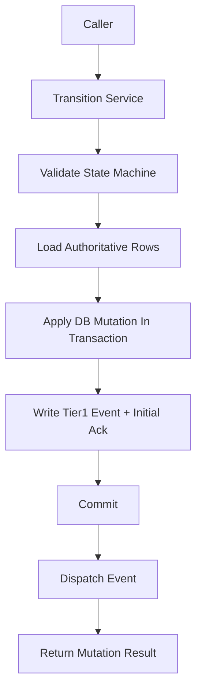

# Transition Service Contract

> **OAPEFLIR Related**: This contract defines the 8-stage state transitions of OAPEFLIR, corresponding to ADR-016.
> **Update Date**: 2026-04-17

## 1. Scope

This contract drills down `state_transition_matrix_contract.md` into the unified state change entry that must be frozen before implementation.

It answers 3 questions:

- Which service functions are the only allowed state write entries.
- What context a state advancement should carry.
- How transaction, event, and recovery ordering are constrained when closing state across tables.

Related documents:

- `runtime_state_machine_contract.md`
- [ADR-016 OAPEFLIR Eight-Stage Model](../adr/016-oapeflir-loop-model.md)
- `state_transition_matrix_contract.md`
- `runtime_repository_and_migration_contract.md`
- `event_bus_contract.md`
- `app_error_contract.md`

## 2. Core Principles

- Callers are not allowed to directly scatter-write state fields.
- All state advancements must carry `reason_code`, `trace_id`, and `occurred_at`.
- Cross-table state advancement should prefer aggregate transitions rather than multiple local updates.
- Tier 1 state facts must be persisted before entering the event distribution chain.

## 3. Key Objects

### 3.1 `TransitionCommand`

Description:

- The TypeScript implementation uses camelCase field names per repository convention, but the semantics correspond one-to-one with this table.
- The implementation field mapping is: `entityKind` / `entityId` / `fromStatus` / `toStatus` / `reasonCode` / `reasonDetail` / `traceId` / `actorType` / `actorId` / `idempotencyKey` / `occurredAt` / `metadataJson`.

| Field | Type | Description |
| --- | --- | --- |
| `entity_kind` | `harness_run \| node_run \| side_effect \| budget_reservation \| session_projection \| approval_projection \| task_projection \| workflow_projection` | Target entity type |
| `entity_id` | `string` | Target ID |
| `from_status` | `string?` | Expected old status, optional optimistic guard |
| `to_status` | `string` | Target status |
| `reason_code` | `string` | Advancement reason code |
| `reason_detail` | `string?` | Additional auditable description |
| `trace_id` | `string` | Trace tracking ID |
| `actor_type` | `user \| agent \| system \| scheduler \| admin \| webhook \| recovery` | Who triggered the change (aligned with `audit_lineage_and_retention_contract.md` §4 unified actor model, extended `recovery` for recovery chain) |
| `actor_id` | `string?` | Trigger ID |
| `idempotency_key` | `string?` | Anti-reentry key |
| `occurred_at` | `timestamp` | Fact occurrence time |
| `metadata_json` | `json?` | Additional context |

Rules:

- `harness_run`, `node_run`, `side_effect`, `budget_reservation` are truth entity kinds; `task_projection`, `workflow_projection`, `session_projection`, `approval_projection` are only allowed as projection update targets.
- Pre-v4.3 `entity_kind` values such as `execution`, `task`, `workflow` can only be used as migration input, and after normalization at the entry they must not continue to serve as canonical transition targets.

### 3.2 `TransitionMutationResult`

- `applied`
- `previous_status`
- `current_status`
- `mutation_group_id`
- `updated_rows`
- `emitted_event_types`

### 3.3 `TransitionGuardFailure`

- `expected_status_mismatch`
- `invalid_transition`
- `terminal_state_reentry`
- `missing_dependency`
- `duplicate_mutation`

## 4. Service Entry Points

Phase 1a / 1b must at least freeze the following entry points:

- `RuntimeStateMachine.transition(command)`
- `transitionHarnessRun(command)`
- `transitionNodeRun(command)`
- `transitionSideEffect(command)`
- `transitionBudgetReservation(command)`
- `projectHarnessRunToTaskView(input)`
- `projectNodeRunToWorkflowView(input)`
- `projectNodeRunToSessionView(input)`
- `projectDecisionToApprovalView(input)`
- `transitionBlockedForApproval(input)`
- `transitionHarnessTerminalState(input)`

Aggregate entry description:

- `transitionBlockedForApproval(...)`
  - Advance `node_run=awaiting_hitl` or `policy_blocked` on truth
  - Keep or advance `harness_run=running / paused` on truth
  - Synchronize `tasks.status=awaiting_decision` on projection
  - Synchronize `workflow_state.status=paused` on projection
  - Create or associate approval projection
  - Append `platform.*` Tier 1 events in the same transaction
- `transitionHarnessTerminalState(...)`
  - Unify closing of `harness_run / node_run / budget reservation / side-effect` on truth
  - Unify closing of `task / workflow / session` on projection
  - Responsible for the three terminal states: success, failure, cancellation

## 5. Call Order and Transaction Boundary

Rules:

- State validity verification must precede the write to the database.
- Transitions that require cross-table consistency must write the main state and Tier 1 events in the same transaction.
- Event distribution failure must not roll back the already-committed fact state; the recovery chain should be based on `events` and `event_consumer_acks` to re-deliver.

## 6. State Advancement Constraints

### 6.1 Single-Entity Advancement

- Single-entity advancement must verify the legal transitions in `runtime_state_machine_contract.md`.
- If `from_status` is provided, the database update must include the old status condition, to avoid concurrent overwriting.
- Repeated writes to terminal state are by default treated as idempotent no-op, and only return an error when the field semantics conflict.

### 6.2 Aggregate Advancement

- When `harness_run=completed`, `task_projection=done`, `workflow_projection=completed`, and `session_projection=completed` should be completed in the same aggregate transition or the same recovery closing.
- When `node_run=awaiting_hitl` or `policy_blocked` and the reason is approval wait, `task_projection=awaiting_decision` must not be missed.
- When `DecisionDirective(approve / deny / expire_approval)` takes effect, it must be traceable to the corresponding blocked `node_run` / `budget_reservation` / `side_effect`.
- When `harness_run` has an active `node_run`, a concurrent call must not create a second active advancer; if entering recovery or takeover, the old node attempt must be explicitly closed first.

### 6.3 Terminal State Re-entry and Attempt Rules

- `HarnessRun` in `completed` / `failed` / `aborted` must not re-enter the active state through a normal transition.
- `NodeRun` in `failed / cancelled / aborted`, if it needs to recover, must create a new `NodeAttempt` or append a `GraphPatch`, and retain the old terminal state, old error code, and old trace evidence.
- Repeated `completed` writes for the same step are only allowed to return as idempotent no-op, and must not repeatedly derive new side effects or Tier 1 events.

## 7. Idempotency and Recovery

- Each transition should support `idempotency_key`, used to handle recovery replay or retry.
- Repeated requests with the same `entity_kind + entity_id + to_status + idempotency_key` only take effect once by default.
- If the transaction has been completed but the caller did not receive a response, safe replay should be allowed and the final state should be returned.
- Recovery logic must not bypass the Transition Service to directly write terminal state.
- The `idempotency_key` of an aggregate transition should cover the entire set of cross-table changes, not just a single table update.

## 8. Error Semantics

Typical error codes:

- `workflow.invalid_transition`
- `validation.invalid_input`
- `runtime.recovery_required`
- `storage.write_failed`
- `internal.unexpected_error`

Additional rules:

- Optimistic guard failure should return a recognizable error, rather than silently overwriting.
- Terminal state conflict must return a non-retryable error.
- If a half-completed write is detected, the Transition Service should throw `runtime.recovery_required` and hand it over to the recovery chain.

## 9. Minimum Audit Fields

Each transition must at least be traceable for:

- Who triggered it
- From what status to what status
- Why it was advanced
- Which tables were modified
- Which Tier 1 events were written

## 10. Phase Boundary

Phase 1a clearly only does:

- Unified transition service within a single-machine process
- Aggregate advancement within SQLite transactions
- Minimum anti-duplication based on `idempotency_key`

Currently not doing:

- Cross-process distributed state coordination
- saga orchestrator
- general state graph DSL

## 11. Closure Conclusion

Whether the main state machine is clear ultimately depends on whether state can only be changed through a set of tightened entry points; this contract is the authoritative boundary of these entry points.

## v4.3 Architecture Remediation

The following entries fix the contract deviations recorded in `platform-architecture-implementation-consistency-audit.md`. If any historical section of this document conflicts with this section, this section, `docs_zh/architecture/00-platform-architecture.md`, ADR-109 through ADR-113, and `src/platform/contracts/executable-contracts/` take precedence.

- T-32: This document originally bound `TransitionCommand.entity_kind` to the pre-v4.3 objects `task / workflow / session / approval / execution`. The root cause was that the transition service directly inherited the old repository table model, and did not migrate as `HarnessRun / NodeRun / SideEffect / BudgetReservation` became the truth aggregate. Fix: The main text now converges the canonical `entity_kind` to `harness_run / node_run / side_effect / budget_reservation`, with the rest retained only as projection or migration input.

Mandatory rules: state transitions must go through `RuntimeStateMachine.transition(command)`; execution plans must use `PlanGraphBundle`; execution results must use `NodeAttemptReceipt`; truth events may only use `platform.*`; OAPEFLIR may only act as `oapeflir.view.*` / rationale projection; budgets must use `BudgetLedger` / `BudgetReservation` / `BudgetSettlement`.
