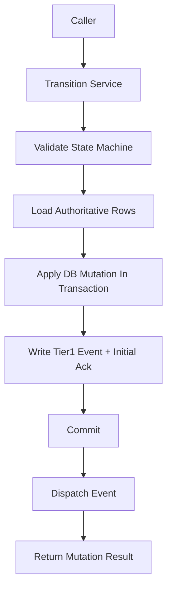

# Transition Service Contract

> **OAPEFLIR Association**: This contract defines OAPEFLIR 8-stage state transitions, corresponding to ADR-016.
> **Last Updated**: 2026-04-17

## 1. Scope

This contract drills down from `state_transition_matrix_contract.md` to the unified state change entry point that must be frozen before implementation.

It answers three questions:

- Which service functions are the only allowed state write entry points.
- What context should accompany a state advancement.
- How transactions, events, and recovery order are constrained when state converges across tables.

Related documents:

- `runtime_state_machine_contract.md`
- [ADR-016 OAPEFLIR Eight-Stage Model](../adr/016-oapeflir-loop-model.md)
- `state_transition_matrix_contract.md`
- `runtime_repository_and_migration_contract.md`
- `event_bus_contract.md`
- `app_error_contract.md`

## 2. Core Principles

- Callers are not allowed to directly write state fields scattered.
- All state advancements must carry `reason_code`, `trace_id`, and `occurred_at`.
- Cross-table state advancement prefers aggregate transitions rather than multiple partial updates.
- Tier 1 state facts must be persisted to the database before entering the event distribution chain.

## 3. Key Objects

### 3.1 `TransitionCommand`

Description:

- The TypeScript implementation uses camelCase field names according to repository conventions, but semantics map one-to-one with this specification.
- Implementation field mapping: `entityKind` / `entityId` / `fromStatus` / `toStatus` / `reasonCode` / `reasonDetail` / `traceId` / `actorType` / `actorId` / `idempotencyKey` / `occurredAt` / `metadataJson`.

| Field | Type | Description |
| --- | --- | --- |
| `entity_kind` | `harness_run \| node_run \| side_effect \| budget_reservation \| session_projection \| approval_projection \| task_projection \| workflow_projection` | Target entity type |
| `entity_id` | `string` | Target ID |
| `from_status` | `string?` | Expected old state, optional optimistic guard |
| `to_status` | `string` | Target state |
| `reason_code` | `string` | Transition reason code |
| `reason_detail` | `string?` | Auditable additional explanation |
| `trace_id` | `string` | Trace ID |
| `actor_type` | `user \| agent \| system \| scheduler \| admin \| webhook \| recovery` | Who triggered the change (aligned with unified actor model in `audit_lineage_and_retention_contract.md` §4, extended `recovery` for recovery chains) |
| `actor_id` | `string?` | Actor ID |
| `idempotency_key` | `string?` | Idempotency key |
| `occurred_at` | `timestamp` | Time of occurrence |
| `metadata_json` | `json?` | Additional context |

Rules:

- `harness_run`, `node_run`, `side_effect`, `budget_reservation` are truth entity kinds; `task_projection`, `workflow_projection`, `session_projection`, `approval_projection` are only allowed as projection update targets.
- Pre-v4.3 `entity_kind` such as `execution`, `task`, `workflow` may only be used as migration input; after normalization at the entry point, they must not continue as canonical transition targets.

### 3.2 `TransitionMutationResult`

- `applied`
- `previous_status`
- `current_status`
- `mutation_group_id`
- `updated_rows`
- `emitted_event_types`

### 3.3 `TransitionGuardFailure`

- `expected_status_mismatch`
- `invalid_transition`
- `terminal_state_reentry`
- `missing_dependency`
- `duplicate_mutation`

## 4. Service Entry Points

Phase 1a / 1b must freeze at minimum the following entry points:

- `RuntimeStateMachine.transition(command)`
- `transitionHarnessRun(command)`
- `transitionNodeRun(command)`
- `transitionSideEffect(command)`
- `transitionBudgetReservation(command)`
- `projectHarnessRunToTaskView(input)`
- `projectNodeRunToWorkflowView(input)`
- `projectNodeRunToSessionView(input)`
- `projectDecisionToApprovalView(input)`
- `transitionBlockedForApproval(input)`
- `transitionHarnessTerminalState(input)`

Aggregate entry point descriptions:

- `transitionBlockedForApproval(...)`
  - On truth, advances `node_run=awaiting_hitl` or `policy_blocked`
  - On truth, maintains or advances `harness_run=running / paused`
  - On projection, synchronizes `tasks.status=awaiting_decision`
  - On projection, synchronizes `workflow_state.status=paused`
  - Creates or associates approval projection
  - Within the same transaction, appends `platform.*` Tier 1 event
- `transitionHarnessTerminalState(...)`
  - On truth, uniformly closes `harness_run / node_run / budget reservation / side-effect`
  - On projection, uniformly closes `task / workflow / session`
  - Responsible for success, failure, and cancellation terminal states

## 5. Call Sequence and Transaction Boundaries

Rules:

- State validity checking must precede database writes.
- Transitions requiring cross-table consistency must write main state and Tier 1 event within the same transaction.
- Event distribution failure must not roll back already committed facts; the recovery chain should resend based on `events` and `event_consumer_acks`.

## 6. State Transition Constraints

### 6.1 Single Entity Transition

- Single entity transition must verify legal transitions in `runtime_state_machine_contract.md`.
- If `from_status` is provided, database updates must include old state conditions to avoid concurrent overwrites.
- Re-writing terminal state is treated as an idempotent no-op by default; errors are only returned when field semantics conflict.

### 6.2 Aggregate Transition

- When `harness_run=completed`, `task_projection=done`, `workflow_projection=completed`, and `session_projection=completed` should be completed in the same aggregate transition or same recovery closure.
- When `node_run=awaiting_hitl` or `policy_blocked` with the reason being approval wait, `task_projection=awaiting_decision` must not be omitted.
- When `DecisionDirective(approve / deny / expire_approval)` takes effect, the corresponding blocked `node_run` / `budget_reservation` / `side_effect` must be traceable.
- When an active `node_run` exists for a `harness_run`, a second active transition creator must not be created by concurrent calls; if entering recovery or takeover, the old node attempt must be explicitly closed first.

### 6.3 Terminal State Re-entry and Attempt Rules

- `completed` / `failed` / `aborted` `HarnessRun` must not re-enter active state through normal transitions.
- If `failed / cancelled / aborted` `NodeRun` needs to resume, a new `NodeAttempt` must be created or `GraphPatch` appended, retaining old terminal state, old error code, and old trace evidence.
- For duplicate `completed` writes on the same step, only idempotent no-op returns are allowed; new side effects or Tier 1 events must not be derived.

## 7. Idempotency and Recovery

- Each transition should support `idempotency_key` for handling recovery replay or retry.
- Duplicate requests with the same `entity_kind + entity_id + to_status + idempotency_key` take effect only once by default.
- If the transaction has completed but the caller did not receive a response, safe replay should be allowed and the final state returned.
- Recovery logic must not bypass the Transition Service to directly write terminal state.
- The `idempotency_key` for aggregate transitions should cover the entire cross-table change group, not just a single table update.

## 8. Error Semantics

Typical error codes:

- `workflow.invalid_transition`
- `validation.invalid_input`
- `runtime.recovery_required`
- `storage.write_failed`
- `internal.unexpected_error`

Supplementary rules:

- Optimistic guard failure should return a recognizable error rather than silently overwriting.
- Terminal state conflicts must return non-retryable errors.
- If half-completed writes are detected, the Transition Service should throw `runtime.recovery_required` and hand over to the recovery chain.

## 9. Minimum Audit Fields

Each transition must be traceable for at minimum:

- Who triggered it
- From what state to what state
- Why it was advanced
- Which tables were modified
- Which Tier 1 events were written

## 10. Phase Boundaries

Phase 1a explicitly only does:

- Unified transition service within a single process
- Aggregate transition within SQLite transaction
- Minimal deduplication based on `idempotency_key`

Currently not doing:

- Cross-process distributed state coordination
- Saga orchestrator
- General-purpose state graph DSL

## 11. Closure Conclusion

Whether the main state machine is clear ultimately depends on whether state can only be changed through a tightened set of entry points; this contract is the authoritative boundary for this set of entry points.

## v4.3 Architecture Remediation

The following items fix contract deviations recorded in `platform-architecture-implementation-consistency-audit.md`. If this document's historical paragraphs conflict with this section, this section, `docs_zh/architecture/00-platform-architecture.md`, ADR-109 through ADR-113, and `src/platform/contracts/executable-contracts/` take precedence.

- T-32: This document originally bound `TransitionCommand.entity_kind` to the pre-v4.3 object set of `task / workflow / session / approval / execution`. The root cause was that the transition service directly inherited the old repository table model and did not migrate along with `HarnessRun / NodeRun / SideEffect / BudgetReservation` becoming truth aggregates. Fix: Main text now converges canonical `entity_kind` to `harness_run / node_run / side_effect / budget_reservation`; others are retained only as projections or migration inputs.

Mandatory rules: State transitions must go through `RuntimeStateMachine.transition(command)`; execution plans must use `PlanGraphBundle`; execution results must use `NodeAttemptReceipt`; truth events must only use `platform.*`; OAPEFLIR can only be used as `oapeflir.view.*` / rationale projection; budgets must use `BudgetLedger` / `BudgetReservation` / `BudgetSettlement`.