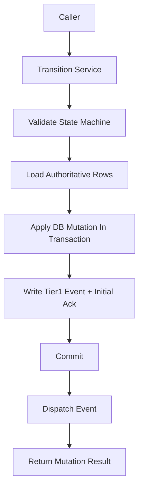

# Transition Service Contract

> **OAPEFLIR Association**: This contract defines the OAPEFLIR 8-stage state transitions, corresponding to ADR-016.
> **Update Date**: 2026-04-17

## 1. Scope

This contract drills down from `state_transition_matrix_contract.md` to the unified state change entry that must be frozen before implementation.

It answers three questions:

- Which service functions are the only allowed state write entries.
- What context should a single state advancement carry.
- How are transaction, event, and recovery order constrained when cross-table state converges.

Related documents:

- `runtime_state_machine_contract.md`
- [ADR-016 OAPEFLIR Eight-Stage Model](../adr/016-oapeflir-loop-model.md)
- `state_transition_matrix_contract.md`
- `runtime_repository_and_migration_contract.md`
- `event_bus_contract.md`
- `app_error_contract.md`

## 2. Core Principles

- Callers are not allowed to directly scatter-write state fields.
- All state advancements must carry `reason_code`, `trace_id`, and `occurred_at`.
- Cross-table state advancement prioritizes aggregate transitions, not multiple partial updates.
- Tier 1 state facts must be persisted to database first, then enter the event distribution chain.

## 3. Key Objects

### 3.1 `TransitionCommand`

Explanation:

- TypeScript implementation uses camelCase field names according to repository conventions, but semantics map one-to-one with this table.
- Implementation field mapping: `entityKind` / `entityId` / `fromStatus` / `toStatus` / `reasonCode` / `reasonDetail` / `traceId` / `actorType` / `actorId` / `idempotencyKey` / `occurredAt` / `metadataJson`.

| Field | Type | Description |
| --- | --- | --- |
| `entity_kind` | `task \| workflow \| session \| approval \| execution` | Target entity type |
| `entity_id` | `string` | Target ID |
| `from_status` | `string?` | Expected old state, optional optimistic guard |
| `to_status` | `string` | Target state |
| `reason_code` | `string` | Advancement reason code |
| `reason_detail` | `string?` | Auditable additional explanation |
| `trace_id` | `string` | Trace ID |
| `actor_type` | `user \| agent \| system \| scheduler \| admin \| webhook \| recovery` | Who triggered the change (aligns with unified actor model in `audit_lineage_and_retention_contract.md` §4, extending `recovery` for recovery chain) |
| `actor_id` | `string?` | Trigger ID |
| `idempotency_key` | `string?` | Anti-replay key |
| `occurred_at` | `timestamp` | When the fact occurred |
| `metadata_json` | `json?` | Additional context |

### 3.2 `TransitionMutationResult`

- `applied`
- `previous_status`
- `current_status`
- `mutation_group_id`
- `updated_rows`
- `emitted_event_types`

### 3.3 `TransitionGuardFailure`

- `expected_status_mismatch`
- `invalid_transition`
- `terminal_state_reentry`
- `missing_dependency`
- `duplicate_mutation`

## 4. Service Entry Points

Phase 1a / 1b must freeze at minimum the following entry points:

- `transitionTaskStatus(command)`
- `transitionWorkflowStatus(command)`
- `transitionSessionStatus(command)`
- `transitionApprovalStatus(command)`
- `transitionExecutionStatus(command)`
- `transitionBlockedForApproval(input)`
- `transitionTaskTerminalState(input)`

Aggregate entry explanation:

- `transitionBlockedForApproval(...)`
  - Simultaneously advances `tasks.status=awaiting_decision`
  - `workflow_state.status=paused`
  - `executions.status=blocked`
  - Creates or associates `approvals`
  - Appends Tier 1 event
- `transitionTaskTerminalState(...)`
  - Unifies convergence of `task / workflow / session / execution`
  - Responsible for success, failure, cancellation three terminal types

## 5. Call Order and Transaction Boundaries

Rules:

- State legality validation must precede database writes.
- Transitions requiring cross-table consistency must write master state and Tier 1 event within the same transaction.
- Event distribution failure must not rollback already-committed state facts; recovery chain should replay based on `events` and `event_consumer_acks`.

## 6. State Advancement Constraints

### 6.1 Single Entity Advancement

- Single entity advancement must verify legal transitions in `runtime_state_machine_contract.md`.
- If `from_status` is provided, database update must carry old state condition to avoid concurrent overwrite.
- Terminal state duplicate writes default to idempotent no-op, only return error when field semantics conflict.

### 6.2 Aggregate Advancement

- When `task=done`, `workflow=completed` and `session=completed` should complete within the same aggregate transition or the same recovery convergence.
- When `execution=blocked` and reason is approval wait, must not omit `task=awaiting_decision`.
- When `approval=approved / rejected / expired` takes effect, must be able to trace back to the blocked execution.
- When a task has an active execution, concurrent calls must not create a second active advancer; if entering recovery or takeover, must first complete explicit convergence of the old execution.

### 6.3 Terminal State Re-entry and Attempt Rules

- `done` tasks must not re-enter `in_progress` through normal transitions.
- If `failed / cancelled` needs recovery, must create a new execution attempt, preserving old terminal state, old error code, and old trace evidence.
- Duplicate `completed` writes for the same step only allowed as idempotent no-op return, must not derive new side effects or Tier 1 events repeatedly.

## 7. Idempotency and Recovery

- Each transition should support `idempotency_key` for handling recovery replay or retry.
- Duplicate requests with same `entity_kind + entity_id + to_status + idempotency_key` default to only taking effect once.
- If transaction has completed but caller did not receive response, safe replay should be allowed and final state returned.
- Recovery logic must not bypass Transition Service to directly write terminal state.
- Aggregate transition's `idempotency_key` should cover the entire cross-table change group, not just a single table update.

## 8. Error Semantics

Typical error codes:

- `workflow.invalid_transition`
- `validation.invalid_input`
- `runtime.recovery_required`
- `storage.write_failed`
- `internal.unexpected_error`

Supplementary rules:

- Optimistic guard failure should return identifiable error, not silently overwrite.
- Terminal state conflict must return non-retryable error.
- If half-completed write is detected, Transition Service should throw `runtime.recovery_required` and hand to recovery chain.

## 9. Minimum Audit Fields

Each transition must be traceable at minimum:

- Who triggered it
- From what state to what state
- Why it advanced
- Which tables were modified
- Which Tier 1 events were written

## 10. Phase Boundaries

Phase 1a explicitly only does:

- Single-process in-process unified transition service
- SQLite transaction aggregate advancement
- Minimum anti-replay based on `idempotency_key`

Currently does not do:

- Cross-process distributed state coordination
- Saga orchestrator
- Generic state graph DSL

## 11. Closure Conclusion

Whether the master state machine is clear ultimately depends on whether state can only be changed through a tightened set of entry points; this contract is the authoritative boundary for this set of entry points.
