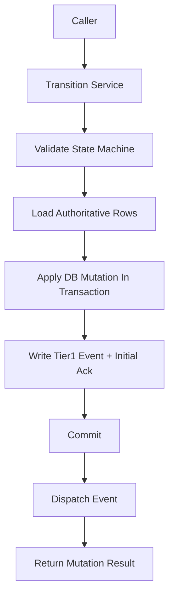

# Transition Service Contract

> **OAPEFLIR Related**: This contract defines OAPEFLIR 8-stage state transitions, corresponding to ADR-016.
> **Update Date**: 2026-04-17

## 1. Scope

This contract drills down from `state_transition_matrix_contract.md` to the unified state change entry points that must be frozen before implementation.

It answers 3 questions:

- Which service functions are the only allowed state write entry points.
- What context should a state progression carry.
- How are transaction, events, and recovery order constrained when cross-table state closes.

Related Documents:

- `runtime_state_machine_contract.md`
- [ADR-016 OAPEFLIR Eight-Stage Model](../adr/016-oapeflir-loop-model.md)
- `state_transition_matrix_contract.md`
- `runtime_repository_and_migration_contract.md`
- `event_bus_contract.md`
- `app_error_contract.md`

## 2. Core Principles

- Callers must not directly scatter write state fields.
- All state progressions must carry `reason_code`, `trace_id`, and `occurred_at`.
- Cross-table state progression prioritizes aggregate transition, not multiple local updates.
- Tier 1 state facts must be persisted to database first, then enter event distribution chain.

## 3. Key Objects

### 3.1 `TransitionCommand`

Description:

- TypeScript implementation uses camelCase field names per repository conventions, but semantics have one-to-one correspondence with this table.
- Implementation field mapping: `entityKind` / `entityId` / `fromStatus` / `toStatus` / `reasonCode` / `reasonDetail` / `traceId` / `actorType` / `actorId` / `idempotencyKey` / `occurredAt` / `metadataJson`.

| Field | Type | Description |
| --- | --- | --- |
| `entity_kind` | `harness_run \| node_run \| side_effect \| budget_reservation \| session_projection \| approval_projection \| task_projection \| workflow_projection` | Target entity type |
| `entity_id` | `string` | Target ID |
| `from_status` | `string?` | Expected old state, optional optimistic guard |
| `to_status` | `string` | Target state |
| `reason_code` | `string` | Progression reason code |
| `reason_detail` | `string?` | Auditable supplementary explanation |
| `trace_id` | `string` | Trace ID |
| `actor_type` | `user \| agent \| system \| scheduler \| admin \| webhook \| recovery` | Who triggered the change (aligned with `audit_lineage_and_retention_contract.md` §4 unified actor model, extended `recovery` for recovery chain) |
| `actor_id` | `string?` | Trigger ID |
| `idempotency_key` | `string?` | Anti-replay key |
| `occurred_at` | `timestamp` | When the fact occurred |
| `metadata_json` | `json?` | Supplementary context |

Rules:

- `harness_run`, `node_run`, `side_effect`, `budget_reservation` are truth entity kinds; `task_projection`, `workflow_projection`, `session_projection`, `approval_projection` are only permitted as projection update targets.
- Pre-v4.3 `entity_kind` like `execution`, `task`, `workflow` can only be used as migration input; after entry normalization, must not continue as canonical transition target.

### 3.2 `TransitionMutationResult`

- `applied`
- `previous_status`
- `current_status`
- `mutation_group_id`
- `updated_rows`
- `emitted_event_types`

### 3.3 `TransitionGuardFailure`

- `expected_status_mismatch`
- `invalid_transition`
- `terminal_state_reentry`
- `missing_dependency`
- `duplicate_mutation`

## 4. Service Entry Points

Phase 1a/1b freezes at minimum the following entry points:

- `RuntimeStateMachine.transition(command)`
- `transitionHarnessRun(command)`
- `transitionNodeRun(command)`
- `transitionSideEffect(command)`
- `transitionBudgetReservation(command)`
- `projectHarnessRunToTaskView(input)`
- `projectNodeRunToWorkflowView(input)`
- `projectNodeRunToSessionView(input)`
- `projectDecisionToApprovalView(input)`
- `transitionBlockedForApproval(input)`
- `transitionHarnessTerminalState(input)`

Aggregate entry point descriptions:

- `transitionBlockedForApproval(...)`
  - On truth: advances `node_run=awaiting_hitl` or `policy_blocked`
  - On truth: maintains or advances `harness_run=running / paused`
  - On projection: synchronizes `tasks.status=awaiting_decision`
  - On projection: synchronizes `workflow_state.status=paused`
  - Creates or associates approval projection
  - Within same transaction appends `platform.*` Tier 1 event
- `transitionHarnessTerminalState(...)`
  - On truth: unified closure of `harness_run / node_run / budget reservation / side-effect`
  - On projection: unified closure of `task / workflow / session`
  - Responsible for success, failure, and cancellation terminal states

## 5. Call Order and Transaction Boundaries

Rules:

- State legality validation must precede database write.
- Transitions requiring cross-table consistency must write primary state and Tier 1 event within the same transaction.
- Event distribution failure must not rollback already committed facts; recovery chain should resend based on `events` and `event_consumer_acks`.

## 6. State Progression Constraints

### 6.1 Single-Entity Progression

- Single-entity progression must validate legal transitions in `runtime_state_machine_contract.md`.
- If `from_status` is provided, database update must carry old state condition to avoid concurrent overwrite.
- Repeated write to terminal state defaults to idempotent no-op, only returns error when field semantics conflict.

### 6.2 Aggregate Progression

- When `harness_run=completed`, `task_projection=done`, `workflow_projection=completed`, and `session_projection=completed` should be completed within the same aggregate transition or same recovery closure.
- When `node_run=awaiting_hitl` or `policy_blocked` and reason is approval waiting, must not omit `task_projection=awaiting_decision`.
- When `DecisionDirective(approve / deny / expire_approval)` takes effect, must be able to trace back to the blocked `node_run` / `budget_reservation` / `side_effect`.
- When `harness_run` has an active `node_run`, must not allow concurrent calls to create a second active progressor; if entering recovery or takeover, must first complete explicit closure of old node attempt.

### 6.3 Terminal State Re-entry and Attempt Rules

- `completed` / `failed` / `aborted` `HarnessRun` must not re-enter active state through normal transition.
- `failed / cancelled / aborted` `NodeRun` that needs recovery must create new `NodeAttempt` or append `GraphPatch`, and preserve old terminal state, old error code, and old trace evidence.
- Repeated `completed` write for the same step is only permitted as idempotent no-op, must not derive new side effects or Tier 1 events.

## 7. Idempotency and Recovery

- Each transition should support `idempotency_key` for handling recovery replay or retry.
- Repeated requests with the same `entity_kind + entity_id + to_status + idempotency_key` default to taking effect only once.
- If transaction has completed but caller did not receive response, safe replay with final state should be allowed.
- Recovery logic must not bypass Transition Service to directly write terminal state.
- Aggregate transition's `idempotency_key` should cover the entire cross-table change set, not just single table update.

## 8. Error Semantics

Typical error codes:

- `workflow.invalid_transition`
- `validation.invalid_input`
- `runtime.recovery_required`
- `storage.write_failed`
- `internal.unexpected_error`

Supplementary Rules:

- Optimistic guard failure should return identifiable error, not silently overwrite.
- Terminal state conflict must return non-retryable error.
- If semi-complete write is detected, Transition Service should throw `runtime.recovery_required` and hand off to recovery chain.

## 9. Minimum Audit Fields

Each transition must be traceable at minimum:

- Who triggered it
- From what state to what state
- Why it progressed
- Which tables were modified
- Which Tier 1 events were written

## 10. Phase Boundaries

Phase 1a explicitly only does:

- Single-machine in-process unified transition service
- Aggregate progression within SQLite transaction
- Minimum anti-replay based on `idempotency_key`

Currently not doing:

- Cross-process distributed state coordination
- Saga orchestrator
- Generic state graph DSL

## 11. Closing Conclusion

Whether the main state machine is clear ultimately depends on whether state can only be changed through a set of tightened entry points; this contract is the authoritative boundary of this entry set.

## v4.3 Architecture Remediation

The following entries fix contract deviations recorded in `platform-architecture-implementation-consistency-audit.md`. If this document's historical paragraphs conflict with this section, this section, `docs_zh/architecture/00-platform-architecture.md`, ADR-109 through ADR-113, and `src/platform/contracts/executable-contracts/` take precedence.

- T-32: This document previously bound `TransitionCommand.entity_kind` to the pre-v4.3 object set `task / workflow / session / approval / execution`. The root cause was transition service directly inherited old repository table model, did not migrate along with `HarnessRun / NodeRun / SideEffect / BudgetReservation` becoming truth aggregates. Fix: The main text now converges canonical `entity_kind` to `harness_run / node_run / side_effect / budget_reservation`, others only retained as projection or migration input.

Mandatory Rules: State transitions must go through `RuntimeStateMachine.transition(command)`; execution plans must use `PlanGraphBundle`; execution results must use `NodeAttemptReceipt`; truth events must only use `platform.*`; OAPEFLIR must only be used as `oapeflir.view.*` / rationale projection; budgets must use `BudgetLedger` / `BudgetReservation` / `BudgetSettlement`.