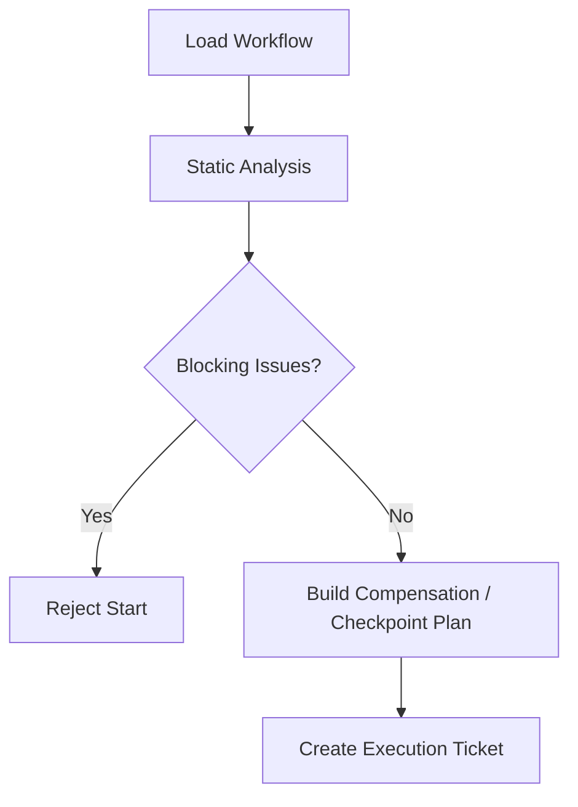

# Workflow Static Analysis And Compensation Contract

## 1. Scope

This contract defines workflow static analysis rules before execution, compensation transaction boundaries, and long-task sharding and partial commit semantics.

Related documents:

- `task_and_workflow_contract.md`
- `workflow_io_compatibility_precheck_contract.md`
- `idempotency_and_recovery_matrix_contract.md`
- `runtime_execution_contract.md`

## 2. Goals

- Block obvious errors before execution rather than exposing during execution.
- Provide formal compensation model for steps with side effects.
- Provide unified semantics for long tasks, subgraph recovery, and phased commit.

## 3. Static Analysis Minimum Checks

Before execution at minimum checks:

- Infinite loop detection
- Unreachable step detection
- Dependency closed loop detection
- Required input key missing
- Schema incompatible
- Timeout / retry missing or illegal
- Step type and side effect level inconsistent
- Step id uniqueness check
- Output key duplicate check
- Unknown dependency reference check

## 4. Analysis Result Objects

- `WorkflowLintReport`
- `StaticCompatibilityIssue`
- `DependencyCycle`
- `CompensationPlan`
- `CheckpointPlan`
- `WorkflowTemplate`

## 5. Compensation Model

Each step with side effects must declare one of:

- `idempotent_replay`
- `compare_and_swap_write`
- `compensating_action`
- `manual_reconciliation_required`

Compensation action at minimum should explain:

- trigger condition
- compensation owner
- compensation timeout
- compensation idempotency
- evidence artifact

## 6. Long Task Sharding

Long tasks at minimum support:

- checkpoint sharding
- subgraph recovery
- phased commit
- task-level partial commit

Rules:

- Checkpoint can only be established after side effect boundary.
- Subgraph recovery must not cross steps with incomplete compensation.
- Partial commit must be auditable and traceable to corresponding step group.
- If upstream step enters `failed` or `skipped` and dependency can no longer be satisfied, downstream steps must not indefinitely remain `blocked`; system should have explicit cascade failure or cascade skip semantics.

## 6.1 Templated Workflow / Recipe

If system supports workflow / recipe template, template at minimum should explicitly declare:

- `version`
- `title`
- `description`
- `instructions`
- `parameters`
- `required_extensions_or_capabilities`
- `prompt_or_execution_entry`

Rules:

- Template must not be just free-text prompt; parameters, extension dependencies, and execution entry must be structured.
- New template before entering shared directory, market, or team distribution should pass structural validation and minimum security scan.
- Template author guide should clarify: which fields required, which extensions need trust confirmation, which parameters must be explicit input.
- If system simultaneously has server, web console, desktop or other editing entry, template validation rules should as much as possible derive from unified authoritative schema artifact rather than hand-maintaining multiple parallel validation logics.
- `$ref`, composite types, and dependent fields in template schema should be consistently parsed across all entrypoints to avoid "server passes, editor fails" or vice versa.

## 7. Pre-Execution Gate

## 8. Phase Boundaries

Phase 1a:

- Key existence
- Dependency cycle
- Timeout / retry presence
- Side effect declaration required

Phase 1b / 2:

- Unreachable step
- More complete schema compatibility
- Compensation templates
- Partial commit orchestration

## 9. Closure Conclusion

Industrial-grade workflow cannot only "run" — it must also be analyzable, compensable, and recoverable.
