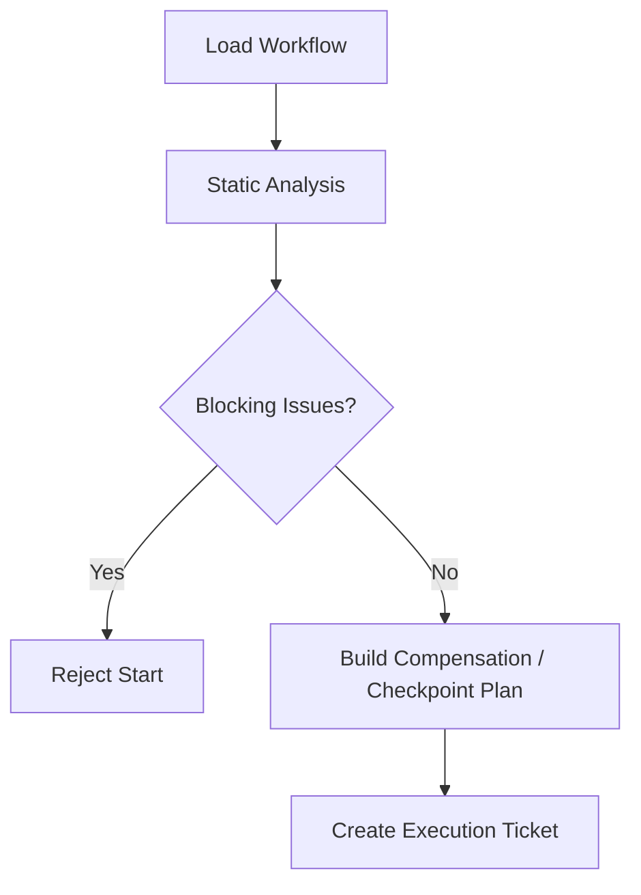

# Workflow Static Analysis And Compensation Contract

## 1. Scope

This contract defines static analysis rules for workflows before execution, compensation transaction boundaries, and long-task segmentation with partial commit semantics.

Related documents:

- `task_and_workflow_contract.md`
- `workflow_io_compatibility_precheck_contract.md`
- `idempotency_and_recovery_matrix_contract.md`
- `runtime_execution_contract.md`

## 2. Goals

- Block obvious errors before execution rather than exposing them during execution.
- Provide formal compensation model for steps with side effects.
- Provide unified semantics for long tasks, subgraph recovery, and phased commits.

## 3. Static Analysis Minimum Checks

Before execution, at minimum check:

- Infinite loop detection
- Unreachable node detection
- Dependency cycle detection
- Required input key missing
- Schema incompatibility
- Timeout / retry missing or invalid
- Node type and side effect level mismatch
- Node ID uniqueness check
- Output key duplicate check
- Unknown dependency reference check
- OAPEFLIR stage order legality
- Plugin / domain tool bundle reference existence
- Release rollback declares compensating_action or equivalent compensation strategy

## 4. Analysis Result Objects

- `WorkflowLintReport`
- `StaticCompatibilityIssue`
- `DependencyCycle`
- `CompensationPlan`
- `CheckpointPlan`
- `WorkflowTemplate`

v4.3 alignment note:

- Code-side `StaticCompatibilityIssue` is now exported as the canonical compatibility alias of `WorkflowLintIssue`, for direct consumption of issue arrays by contract calling surfaces.
- Code-side `WorkflowTemplate` is now exported as the compatibility alias of `MinimalWorkflowDefinition`, pointing uniformly to the authoritative workflow definition structure in the warehouse, rather than maintaining a second template entity separately.

## 5. Compensation Model

Each node with side effects must declare one of:

- `idempotent_replay`
- `compare_and_swap_write`
- `compensating_action`
- `manual_reconciliation_required`

Compensation action must at least explain:

- trigger condition
- compensation owner
- compensation timeout
- compensation idempotency
- evidence artifact

## 6. Long Task Segmentation

Long tasks must at least support:

- Checkpoint segmentation
- Subgraph recovery
- Phased commits
- Task-level partial commit

Rules:

- Checkpoints can only be established after side effect boundaries.
- Subgraph recovery must not cross nodes with incomplete compensation.
- Partial commit must be auditable and traceable to corresponding node group.
- If an upstream node enters `failed` or `skipped` and dependencies can no longer be satisfied, downstream nodes must not stay in `blocked` indefinitely; the system should have clear cascade failure or cascade skip semantics.

## 6.1 Templated Workflow / Recipe

If the system supports workflow / recipe templates, the template must at minimum explicitly declare:

- `version`
- `title`
- `description`
- `instructions`
- `parameters`
- `required_extensions_or_capabilities`
- `prompt_or_execution_entry`

Rules:

- Templates must not be just free-text prompts; parameters, extension dependencies, and execution entry must be structured.
- New templates should pass structural validation and minimum security scan before entering shared directory, marketplace, or team distribution.
- Template author guide should specify: which fields are required, which extensions need trust confirmation, which parameters must be explicitly input.
- If the system simultaneously has server, web console, desktop, or other editing entry points, template validation rules should be derived as much as possible from a unified authoritative schema artifact, rather than manually maintaining multiple parallel validation logics.
- `$ref`, composite types, and dependency fields in template schema should be consistently parsed across all entry points, avoiding "server passes but editor fails" or vice versa.

## 7. Pre-Execution Gate

## 8. Phase Boundaries

Phase 1a:

- Key existence
- Dependency cycle
- Timeout / retry presence
- Side effect declaration required
- OAPEFLIR stage order validity

Phase 1b / 2:

- Unreachable node
- More complete schema compatibility
- Compensation templates
- Partial commit orchestration
- Release rollback orchestration

## 9. Closure Conclusion

Industrial-grade workflow cannot just "run along".

It must know before starting:

- Whether structure is valid
- Which nodes have side effects
- How to compensate on failure
- How to segment and recover long tasks