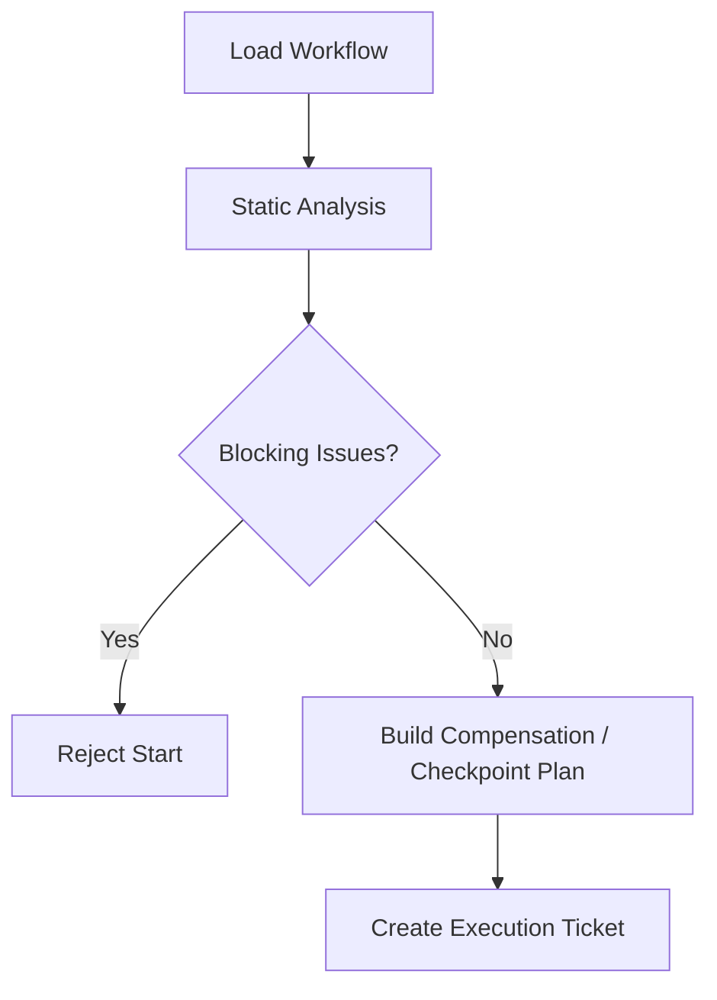

# Workflow Static Analysis And Compensation Contract

## 1. Scope

This contract defines the static analysis rules, compensation transaction boundaries, and long-task sharding and partial commit semantics of workflow before execution.

Related documents:

- `task_and_workflow_contract.md`
- `workflow_io_compatibility_precheck_contract.md`
- `idempotency_and_recovery_matrix_contract.md`
- `runtime_execution_contract.md`

## 2. Goals

- Block obvious errors before execution, rather than only exposing them during execution.
- Provide a formal compensation model for steps with side effects.
- Provide unified semantics for long tasks, subgraph recovery, and staged commit.

## 3. Minimum Static Analysis Checks

At least check before execution:

- Dead loop detection
- Unreachable node detection
- Dependency cycle detection
- Required input key missing
- Schema incompatibility
- Timeout / retry missing or invalid
- Node type inconsistent with side-effect level
- Node ID uniqueness check
- Output key duplication check
- Unknown dependency reference check
- Whether OAPEFLIR stage order is legal
- Whether the plugin / domain tool bundle reference exists
- Whether release rollback declares `compensating_action` or an equivalent compensation strategy

## 4. Analysis Result Objects

- `WorkflowLintReport`
- `StaticCompatibilityIssue`
- `DependencyCycle`
- `CompensationPlan`
- `CheckpointPlan`
- `WorkflowTemplate`

v4.3 alignment description:

- The code-side `StaticCompatibilityIssue` is now exported as the canonical compatibility alias of `WorkflowLintIssue`, so that the contract call surface can directly consume the issue array.
- The code-side `WorkflowTemplate` is now exported as the compatibility alias of `MinimalWorkflowDefinition`, uniformly pointing to the authoritative workflow definition structure in the repository, rather than maintaining a second template entity.

## 5. Compensation Model

Each node with side effects must declare one of the following:

- `idempotent_replay`
- `compare_and_swap_write`
- `compensating_action`
- `manual_reconciliation_required`

The compensation action should at least describe:

- trigger condition
- compensation owner
- compensation timeout
- compensation idempotency
- evidence artifact

## 6. Long-Task Sharding

Long tasks must at least support:

- checkpoint sharding
- subgraph recovery
- staged commit
- task-level partial commit

Rules:

- Checkpoints can only be established after the side-effect boundary.
- Subgraph recovery must not cross over a node with incomplete compensation.
- Partial commit must be auditable and traceable to the corresponding node group.
- If an upstream node enters `failed` or `skipped` and the dependency can no longer be satisfied, the downstream node must not stay in `blocked` indefinitely; the system should have explicit cascading failure or cascading skip semantics.

## 6.1 Templated Workflow / Recipe

If the system supports workflow / recipe templates, the template should at least explicitly declare:

- `version`
- `title`
- `description`
- `instructions`
- `parameters`
- `required_extensions_or_capabilities`
- `prompt_or_execution_entry`

Rules:

- The template should not be just free-form text prompt; parameters, extension dependencies, and execution entry must be structured.
- Before new templates enter the shared directory, market, or team distribution, they should pass structural verification and minimum security scanning.
- The template author guide should clarify: which fields are required, which extensions need trust confirmation, which parameters must be explicitly input.
- If the system has server, web console, desktop, or other editing entries at the same time, the template verification rules should be derived as much as possible from a unified authoritative schema artifact, rather than manually maintaining multiple parallel verification logics.
- The `$ref`, composite types, and dependency fields in the template schema should be consistently resolvable across entries, to avoid "the server passes but the editor does not" or vice versa.

## 7. Pre-Execution Gate

## 8. Phase Boundary

Phase 1a:

- key existence
- dependency cycle
- timeout / retry presence
- side effect declaration required
- OAPEFLIR stage order validity

Phase 1b / 2:

- unreachable node
- more complete schema compatibility
- compensation templates
- partial commit orchestration
- release rollback orchestration

## 9. Closure Conclusion

Industrial-grade workflow cannot only "run straight through".

It must know before starting:

- Whether the structure is valid
- Which nodes have side effects
- How to compensate after failure
- How to shard and recover long tasks
