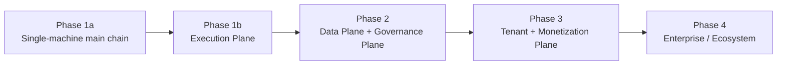
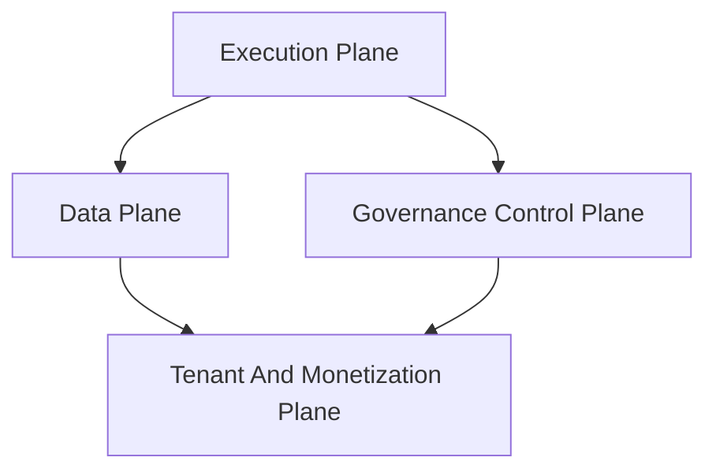

# Architecture Upgrade Roadmap

## 1. Goal

This document defines the top 4 architecture upgrade lines when advancing from current Phase 1a baseline to the final platform goal.

Current priorities:

1. `runtime -> execution plane`
2. `transaction storage -> data plane`
3. `approval/sandbox/budget -> governance control plane`
4. `billing/tenant -> tenant and monetization plane`

## 2. General Principles

- First clarify platform layer design, then enter corresponding implementation.
- Each upgrade line must have contract, phase goals, and exit thresholds.
- Long-term platform implementation is not allowed without upper-level contracts.

## 3. Roadmap Overview

## 4. Roadmap Matrix

| Upgrade Line | Current Baseline | Target Platform Layer | Main Corresponding Document | Suggested Start Phase |
| --- | --- | --- | --- | --- |
| runtime | single-machine runtime | execution plane | `runtime_execution_contract`, `execution_plane_contract` | Phase 1b |
| storage | SQLite transaction baseline | data plane | `storage_schema_contract`, `data_plane_contract` | Phase 2 |
| governance | approval/budget/security scattered | governance control plane | `approval_and_hitl`, `sandbox_and_auth`, `cost_and_budget`, `governance_control_plane` | Phase 2 |
| billing/tenant | minimum object model | tenant + monetization plane | `billing_and_tenant`, `tenant_and_organization`, `monetization_metering_plane` | Phase 3 |

## 5. Upgrade Line Details

### 5.1 Runtime -> Execution Plane

Current state:

- execution state machine
- single-machine runtime semantics
- execution repository/migration

Next steps:

- queue/dispatch
- lease/stale recovery
- worker registry/heartbeat
- handover/takeover

Prerequisites for implementation:

- ticket, lease, recovery, worker models in `execution_plane_contract.md` are accepted.
- Boundary between execution plane and existing runtime storage is clear.

### 5.2 Transaction Storage -> Data Plane

Current state:

- SQLite authoritative transaction store
- runtime-related table structure
- artifact minimum index

Next steps:

- memory/archive plane
- analytics plane
- replay dataset plane
- namespace/retention/residency

Prerequisites for implementation:

- owner and writeback boundary for each plane in `data_plane_contract.md` are clear.
- Transaction layer no longer confuses authoritative truth with analytics/archive.

### 5.3 Approval / Sandbox / Budget -> Governance Control Plane

Current state:

- approval object
- sandbox/auth baseline
- budget guard baseline

Next steps:

- unified decision request/result
- deny taxonomy
- freeze/kill/emergency control
- audit ledger and governance priority

Prerequisites for implementation:

- decision priority and action domain in `governance_control_plane_contract.md` are clear.
- High-risk actions unified into governance plane, no longer scattered in caller handwritten judgments.

### 5.4 Billing / Tenant -> Tenant And Monetization Plane

Current state:

- usage/quota/billing minimum object
- tenant boundary minimum model

Next steps:

- workspace/organization/tenant hierarchy
- entitlement evaluator
- usage ingestion
- quota enforcement
- billing ledger

Prerequisites for implementation:

- `tenant_and_organization_contract.md` clarifies hierarchy boundary.
- `monetization_metering_plane_contract.md` clarifies entitlement and ledger path.

## 6. Upgrade Relationship Diagram

## 7. Implementation Sequence Recommendations

1. Phase 1a completes minimum main chain implementation.
2. Phase 1b starts minimal execution plane upgrade.
3. Phase 2 simultaneously advances data plane and governance control plane baseline.
4. Phase 3 introduces tenant/monetization plane.

## 8. Current Conclusion

These 4 upgrade lines represent the main path from "runnable foundation" to "platform-level system".

Later implementations that deviate from this sequence easily result in:

- Multi-execution capability without governance and recovery
- Analytics reversely polluting authoritative source
- Billing capability unable to connect to runtime
- Tenant isolation only at UI layer
