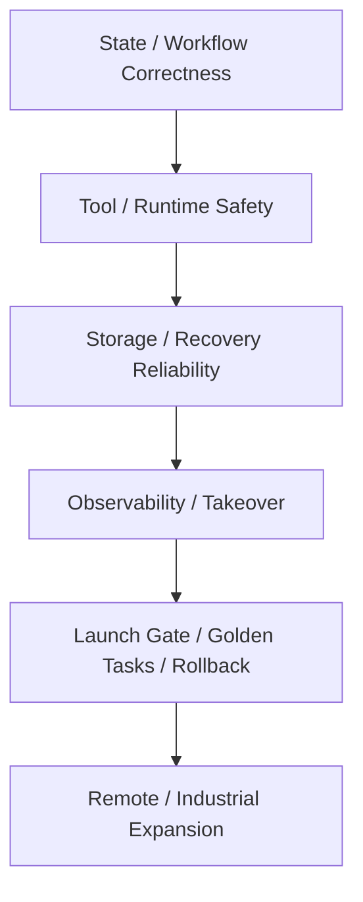

# Development Sequence Roadmap

## 1. Objective

This document transforms all current stabilization backlog items from "issue list" to "development sequence".

It answers 4 questions:

- If starting implementation now, which batch to do first.
- What can be done in parallel.
- What must wait for prerequisites to complete.
- How far each batch must go before entering the next batch.

## 2. Usage Principles

- High priority does not equal immediately doable, must follow dependency order.
- First do the foundations that reduce system instability sources, then do capability enhancements.
- If a batch's exit criteria are not met, should not enter the next batch.
- Before Stable Core runs stably, do not expand to remote worker, marketplace, multi-tenant, or complex evolution.

Unified execution terminology:

- Phase scope takes `implementation_plan.md` as authoritative.
- Actual status takes `project_progress_tracker.md` as authoritative.
- Current active items take `current_todo_list.md` as authoritative.
- This document only responsible for "batch order, dependencies, exit criteria".

Batch status enumeration:

- `not_started`
- `ready`
- `in_progress`
- `blocked`
- `done`

## 3. Overall Rhythm

```mermaid
flowchart LR
    A["Week 1\nState / Event / Workflow"] --> B["Week 2\nRuntime / Tool / Cancel"]
    B --> C["Week 3\nDB / Recovery / Reconcile"]
    C --> D["Week 4\nObservability / Ops / Takeover"]
    D --> E["Week 5\nQuality Gates / Golden Tasks / Rollback"]
    E --> F["Phase 1b Batch 1\nOrchestration / Task Board"]
    F --> G["Phase 1b Batch 2\nCompaction / Edit"]
    G --> H["Phase 1b Batch 3\nReplay / Backpressure"]
    H --> I["Week 6+\nRemote / PG-Redis / Enterprise Prep"]
```

### 3.1 Priority Order After Research Analysis Backfill

Combined with unified conclusions from `doc/research/analysis/`, the post-Week 6+ solution closure order is supplemented as follows:

1. `Phase 2a` continues to close high-consensus foundations in runtime / tool / storage:
   - Middleware formally connected to runtime
   - Tool parallel execution
   - Resource-aware retry
   - `max_output_tokens` continuation recovery
   - Effect Buffer
   - Compositional rate limiter
   - WebFetch
2. `Phase 2b` then supplements code understanding and memory enhancement:
   - `MEM-01` Real token counting
   - STM -> LTM auto migration
   - Structured long-term memory
   - patch DSL / multiedit
   - LSP diagnostics
   - Git snapshot undo / redo
   - Dynamic config constraint override
   - Currently completed `MEM-05` memory repository / recall / quality baseline, `MEM-01` token estimation precision, and `MEM-02` STM -> LTM consolidation three initial slices
3. `Phase 2c / 3` then supplements heavier optimization layer:
   - Semantic Repo Map
   - Tool recommend / deferred loading
   - few-shot / experience cache

### 3.2 Current Batch Summary

| Batch | Corresponding Phase | Current Status | Corresponding Work Packages | Exit Goes To |
| --- | --- | --- | --- | --- |
| `Week 1` | `Phase 1a` | `done` | `P1A-01` ~ `P1A-04` | `Week 2` |
| `Week 2` | `Phase 1a` | `done` | `P1A-05` ~ `P1A-08` | `Week 3` |
| `Week 3` | `Phase 1a` | `done` | `P1A-09` | `Week 4` |
| `Week 4` | `Phase 1a` | `done` | `P1A-10` | `Week 5` |
| `Week 5` | `Phase 1a` | `done` | `P1A-11` | Stable Core validation |
| `Phase 1a Evidence` | `Phase 1a` | `in_progress` | `P1A-EVID-72` | Phase closure |
| `Phase 1b Batch 1` | `Phase 1b` | `done` | `P1B-01` ~ `P1B-04` | `Phase 1b Batch 2` |
| `Phase 1b Batch 2` | `Phase 1b` | `done` | `P1B-05` / `P1B-06` | `Phase 1b Batch 3` |
| `Phase 1b Batch 3` | `Phase 1b` | `done` | `P1B-07` / `P1B-08` | `Week 6+` |
| `Phase 2a Batch 1` | `Phase 2a` | `done` | `P2A-01` ~ `P2A-10` | `Week 6+` |
| `Week 6+` | `Phase 2a / 2b` stabilization and capability expansion | `done` | remote / PG-Redis / enterprise prep, memory / tool / code understanding slices | `Phase 2c Batch 1` |
| `Phase 2c Batch 1` | `Phase 2c` | `done` | `TOOL-33`, `MEM-04`, `CODE-01`, `P2C-01`, `P2C-02` | `Phase 2c Stage` |
| `Phase 2c Stage` | `Phase 2c` | `done` | `P2C-03` | `Phase 3` |
| `Phase 3 Batch 1` | `Phase 3` | `done` | `P3-01` | `Phase 3 Batch 2` |
| `Phase 3 Batch 2` | `Phase 3` | `done` | `P3-02` | `Phase 3 Batch 3` |
| `Phase 3 Batch 3` | `Phase 3` | `done` | `P3-03` | `Phase 3 Batch 4` |
| `Phase 3 Batch 4` | `Phase 3` | `done` | `P3-04` | `Phase 3 Batch 5` |
| `Phase 3 Batch 5` | `Phase 3` | `done` | `REF-HERMES-01` ~ `REF-HERMES-10` | `Phase 4` |
| `Phase 4 Stage` | `Phase 4` | `done` | `P4-01` / `P4-02` / `IND-01A` / `IND-01B` / `IND-01C` | `Phase 1a Evidence` |

Current notes:

- Week 1 directory skeleton, core types, SQLite schema, and minimal happy path first version implemented.
- Week 2 event, policy, approval, inspect, health, structured log completed and tested.
- Week 3 startup consistency checker and recovery drill baseline completed and tested.
- Week 4 golden suite, timeline / diagnostics, and doctor self-check baseline completed and tested.
- Week 5 stable validation CLI and soak test framework completed and tested.
- `Phase 1a Evidence` currently `in_progress`: implementation, scripts, and gates all ready, 24h long-duration evidence completed and generated formal evidence bundle, current main line switched to 72h, so phase closure currently only constrained by real time elapsed.
- post-Week 5 first round stabilization closure completed and tested: workflow static validator, admission control, stalled execution detection, and doctor integration.
- `Phase 1b Batch 1` completed and tested: `intake_router`, `workflow_planner`, multi-Agent orchestration runner, task board/status query landed.
- `Phase 1b Batch 2` completed: two-phase context compaction, edit fuzzy/context-anchored replacement enhancement, write lock protection, and sandbox/security tests landed.
- `Phase 1b Batch 3` completed: VCR replay, stream chunk replay, provider success rate, degradation mode, and debug/repro bundle landed.
- `Phase 2a Batch 1` completed first ten items: multi-division loading chain, artifact store, artifact-aware inspect/timeline, runtime recovery repository, dead-letter audit, recovery replay report, cross-division recovery overview, stable recovery drill, execution ticket / dispatch baseline, worker claim / heartbeat handshake, and authoritative worker writeback / completion handshake landed.
- Week 6+ corresponding `Phase 2a / 2b` adopted slices closed, memory, tool, storage, code understanding, and stabilization enhancement currently all written back as completed.
- `Phase 2c Batch 1` completed: tool recommend / deferred loading, experience cache, semantic repo map, skill system, and HR Agent boundary capabilities landed.
- `Phase 2c Stage` completed: `P2C-03` evolution MVP and approval chain landed, completed unit / integration / sandbox-security / `npm test` `950/950`.
- `Phase 3 Batch 1` completed: `P3-01` PMF validation service, CLI, report persistence/export, artifact evidence, and division-scoped reporting landed, completed unit / integration / sandbox-security / `npm test` `957/957`.
- `Phase 3 Batch 2` completed: `P3-02` billing capability landed, including billing service, `billing` CLI, billing persistence and summary/export closure, completed full `npm test` `964/964` and stable validation.
- `Phase 3 Batch 3` completed: `P3-03` perception MVP landed, including perception service, `perception` CLI, source/intel/brief/proposal persistence and brief export closure, completed full `npm test` `969/969` and stable validation.
- `Phase 3 Batch 4` completed: `P3-04` Web/API productization landed, including Mission Control aggregate, versioned HTTP API, minimal Web console, OpenAPI documentation, and `api` CLI, completed full `npm test` `973/973` and stable validation.
- `Phase 3 Batch 5` completed: `REF-HERMES-01` gateway target directory and human-readable target resolution, `REF-HERMES-02` memory provider seam and async prefetch interface, `REF-HERMES-03` provider credential pool and unified cooldown governance, `REF-HERMES-04` conservative cheap-vs-strong model route, `REF-HERMES-05` workspace externalized shadow snapshot rollback capability, `REF-HERMES-06A` tool name fuzzy matching, `REF-HERMES-06B` tool parameter security correction, `REF-HERMES-07` turn-scoped fallback auto-recovery, `REF-HERMES-08` context file security scanning, `REF-HERMES-09` profile multi-instance isolation, and `REF-HERMES-10` prompt static/dynamic partition cache all landed, completed unit / integration / sandbox-security / full `npm test` regression.
- `Phase 4 Stage` completed: `P4-01` enterprise capability matrix and `P4-02` marketplace / ecosystem governance both landed, covering environment readiness registry, enterprise capability summary/export, marketplace package registry, review/publish/revoke and catalog export artifacts, completed `npm run test:integration` `388/388`, full `npm test` `1017/1017` and stable validation.
- `UI-01` deferred program completed: console second phase now supplemented Workflow Cockpit, Stability Panel, Admin Takeover Console, and corresponding shared query API and integration regression; current deferred program code work packages also closed.
- Week 6+ first item PG semantics preparation landed: SQLite migration ledger, checksum verification, schema freshness gate, and startup / doctor fail-closed ready.
- Week 6+ second item queue semantics preparation landed: dispatch reconciliation, orphan queue claim repair, and terminal execution ticket reconciliation ready.
- Week 6+ `QUEUE-01` current slice landed: added `stable-queue-delivery` rehearsal / CLI, formally rehearsed "queue replay rebuild dispatchable ticket from authoritative DB truth" and "duplicate delivery intercepted by worker capacity / lease fencing, terminal reconciliation cleanup" closed loop; `stable-evidence` / `stable-gate` / `stable-package` also connected this item's evidence.
- Week 6+ `DB-39` / PG migration compatibility current slice landed: added `stable-migration-compatibility` rehearsal / CLI, did SQLite migration plan PostgreSQL portability preflight; SQLite runtime `PRAGMA` moved from migration SQL, migration ledger compatible with old checksum, `stable-evidence` / `stable-gate` / `stable-package` also connected migration compatibility evidence. This item currently still portability preflight, not equal to live PostgreSQL execution acceptance.
- Week 6+ `DBQ-01` landed: added `stable-db-queue-disconnect` rehearsal / CLI, formally rehearsed "queue unavailable explicit blocked and ticket not lost", "missing dispatch ticket rebuilt from authoritative DB truth + plan metadata", "authoritative writeback returns `authoritative_store_unavailable` and fail-close on DB failure" closed loop; `stable-evidence` / `stable-gate` / `stable-package` also connected this item's evidence.
- Week 6+ `DB-42` landed: added `stable-db-writability` rehearsal / CLI, formally rehearsed "DB unwritable causes health to enter `read_only_operations_only`, doctor overall `fail_closed`", "phase1b intake admission reject", "dispatch blocked and pending authoritative ticket preserved" closed loop; `stable-evidence` / `stable-gate` / `stable-package` also connected this item's evidence.
- Week 6+ `SCHED-03` landed: dispatch worker ranking changed to load-aware, active lease / saturation / tool backlog / CPU jointly participate in scheduling score; health / doctor also supplemented sticky load skew detection and operator finding, queue affinity no longer long-term adsorb tickets to hot workers.
- Week 6+ `SEC-36` current slice landed: tier_1 audit events connected to tamper-evident integrity chain; doctor added `audit_integrity` self-check, events payload / chain / missing record tampering causes direct `fail_closed` exposure.
- Week 6+ third item scheduling explainability preparation landed: dispatch decision trace, worker evaluation rationale chain, and `dispatch:decision_recorded` audit event ready.
- Week 6+ fourth item scheduling observability closure landed: inspect / diagnostics / repro bundle / inspect CLI can structurally view dispatch decisions, regression verified.
- Week 6+ fifth item worker maintenance semantics landed: `draining` worker can keep existing running executions, but dispatch no longer sends new tickets to it.
- Week 6+ sixth item version and configuration visibility landed: doctor / stable evidence exposed application version, build metadata, config/schema version, and flags snapshot.
- Week 6+ seventh item worker heartbeat telemetry landed: worker snapshot / handshake / writeback recorded cpu, memory, tool backlog, current step, and last progress, doctor can summarize stale worker and worker telemetry.
- Week 6+ eighth item worker restart semantics landed: worker logical id, runtime instance id, restart chain, and generation persisted, heartbeat / writeback / doctor / CLI can trace restart chain.
- Week 6+ ninth item `AGENT-21` agent execution record landed: dispatched worker execution now deposits plan / step / tool / decision / error / retry / restart evidence, supplemented inspect / approval / CLI visibility and regression verification.
- Week 6+ tenth item `SEC-33` command security classifier closure landed: known command goes policy table, unknown command defaults deny, classification results cached with TTL, supplemented executor / security regression.
- Week 6+ eleventh item `SEC-34` configuration tampering protection landed: `config/`, `divisions/`, and `AGENTS.md` now under protected integrity hash / drift detection, doctor can alert on expected version drift.
- Week 6+ twelfth item `DB-40` storage quota landed: artifact / debug / backup directories now have quota counting, LRU-safe cleanup, and pin whitelist, supplemented doctor / security regression.
- Week 6+ `TOOL-23` current slice landed: builtin tool metadata now has contract validator, startup consistency and doctor default fail-close on invalid tool contract, can stably intercept metadata registration not equal to safe operation issues.
- Week 6+ `AGENT-20` current slice landed: added execution resource ceiling guard, does runtime constraint on `tool calls / memory footprint / elapsed time`; skill execution, worker heartbeat/writeback and doctor now fail-close or degrade-expose on limit exceeded.
- Week 6+ `AGENT-19` current slice landed: doctor now outputs structured escalation package on stalled execution detection basis, can summarize trace / correlation, current step, runtime instance, warnings, incident root cause hints, and suggested operator action.
- Week 6+ `SEC-32` current slice landed: artifact store now executes secret redaction and injection risk scanning before text/json/markdown artifact persistence; diagnostics export return value and minimal repro export files also desensitized.
- Week 6+ `WF-16` current slice landed: startup consistency checker now identifies workflow/task/session terminal state inconsistency, runtime repair automatically reconciles task/session terminal state, doctor default degrade-exposes this class of issues.
- Week 6+ `OPS-55` current slice landed: startup preflight supplemented config validation and default provider readiness fail-fast; doctor CLI directly fail-closes on bad config, config symlink escape, and missing provider credentials.
- Week 6+ `AGENT-17` current slice landed: session lifecycle boundary tightened, terminated session no longer reopened by retry/repair path, instead creates new recovery session; startup consistency checker and runtime repair can identify and repair dirty state of active task bound to terminal session.
- Week 6+ `DB-38` current slice landed: added periodic orphan cleanup service and `orphan-cleanup` CLI, can close orphan session, re-queue orphan claimed ticket, and clean invalid `runningExecutions` references in worker snapshot.
- Week 6+ `DB-39` current slice landed: SQLite migration now executes single-migration transactionalized, partial schema / ledger state not left on failure; legacy schema auto-upgrade and failure recovery rerun use cases supplemented.
- Week 6+ `DB-41` current slice landed: SQLite now supports nested savepoint transaction and consistent read transaction; critical write paths like dispatch / writeback unified read execution/task/workflow/session through repository authoritative aggregate, task snapshot also explicitly marked `authoritative` consistency.
- Week 6+ `SCHED-06` current slice landed: stale execution repair actively recovers stale lease ownership, synchronously clears worker `runningExecutions` occupancy, and rebuilds pending ticket when original dispatch ticket already claimed or missing, ensuring clear redispatch path after repair.
- Week 6+ `WF-13` current slice landed: phase1a / phase1b workflow step snapshot unified to stable checkpoint structure, including decision context, resume context, and upstream artifact refs; runtime recovery view can directly expose latest checkpoint.
- Week 6+ `WF-14` current slice landed: workflow runtime now supports injecting crash at `step_started / tool_completed / before_commit`; phase1a / phase1b recovery drill verified stale execution detection, checkpoint visibility, and repair closure.
- Week 6+ `TOOL-24` Tool timeout and retry standardization landed: tool metadata `defaultTimeoutMs / recoveryStrategy / retryableErrorCodes` now uniformly consumed by skill/tool execution chain; `command_exec`, `edit_replace`, and skill runner unified closed default timeout, timeout failure form, and fail-closed retry determination.
- Week 6+ `TOOL-25` Tool return value unified structure landed: `command_exec` and `edit_replace` now uniformly expose `success / output / data / error / durationMs / metadata` consumer fields, upper layer no longer needs to branch-parse basic execution results by tool type.
- Week 6+ `TOOL-26` Large output externalization landed: `command_exec` now writes complete desensitized result to `ArtifactStore` when output exceeds threshold, message main chain only retains truncated summary and artifact reference, supplemented unit / sandbox/security / full regression verification.
- Week 6+ thirteenth item `TOOL-27` Skill failure semantics landed: skill step-level events, failure retry, and output recording now connected to execution / inspect / event observability chain, preparing for subsequent `TOOL-28` / remote worker execution surface contract.
- Week 6+ fourteenth item `TOOL-28` Skill cache correctness landed: cacheable skill now participates in cache key with git/source fingerprint, records cache provenance, and supports explicit disable switch.
- Week 6+ `TOOL-29` Skill composition permission closure landed: skill execution now falls back to execution `allowedToolsJson` when `allowedTools` not explicitly passed, and does runtime permission check on model override `resolvedToolName`; skill composition and model-aware tool switching cannot bypass execution-level tool permission.
- Week 6+ `TOOL-30` MCP tool isolation verification landed: MCP tool now enforces `mcp_<server>_<tool>` namespaced naming, blocks collision naming with builtin tool, requires explicit metadata admission; MCP returned content treated as untrusted external content and sanitized separately, forged `function_call / tool_use / tool_calls` payload fail-closed blocked.
- Week 6+ `SEC-35` current direct tool permission and write path scope slice landed: execution `allowedToolsJson / allowedPathsJson` and request `allowedPathRoots` now directly consumed by `edit_replace / command_exec`; direct tool cannot bypass execution-level tool allowlist, must also default fail-closed on malformed allowlist config, and simultaneously satisfy sandbox and path scope two-layer path constraints.
- Week 6+ `DB-37` SQLite write isolator landed: SQLite write transactions now uniformly map real competing write locks to stable `sqlite.write_contention` fail-close error; `stable-concurrency` rehearsal added competing write scenario, verifying competing writes do not pollute committed data and can resubmit after competition resolves.
- Week 6+ fifteenth item `P2-26` Message Parts landed: `messages` now supports `parts_json` structured payload, `phase1b` tool result writes `summary / artifact_ref / tool_result` parts persistently, Stage 1 compaction changed to part-level trim `tool_result` and retain summary and artifact reference, preserving compatible upgrade path for replay, compaction, and multi-channel message surface.
- Week 6+ fifteenth item `P2-27` Typed event bus landed: event registry now exposes `payloadSchemaRef / compatibilityPolicy` metadata, and new `TypedEventBus` wrapper layer closes skill execution event publishing to compile-time verifiable boundary.
- Week 6+ fifteenth item `P2-28` Model-aware tool selection landed: skill step now supports `modelOverrides`, can resolve actual tool variant by `model profile / tier / capability`, writes requested/resolved tool to step output and execution evidence; unknown profile and undeclared override target default fail-closed.
- Week 6+ fifteenth item `P2-29` Command signature table closure landed: `command_exec` now has key command parameter digit validation, interpreter script-file mode constraint, and parameter-level script path sandbox validation.
- Week 6+ sixteenth item `P2-30` Permission cascade rejection landed: approval chain now supports one explicit rejection in same session automatically cascade-reject other pending requests, retains cascade audit event and inspect visibility.
- Week 6+ seventeenth item `P2-31` JSONC configuration support landed: config governance now supports `//`, `/* */`, and trailing comma JSONC parsing, retains malformed config rejection semantics.
- Week 6+ eighteenth item `P2-32` models.json metadata center landed: provider / model profile defaults now uniformly go through centralized registry, supports local `config/providers/models.json` override, provider/profile consistency validation, and sandbox fail-closed semantics.
- Week 6+ nineteenth item `P2-33` Artifact model further unified landed: task output, step output, and artifact reference now uniformly project to result envelope, exposed by inspect / diagnostics / CLI as stable read-only result view.
- Week 6+ twentieth item `P2-34` Task / Workflow / Decision inspect query layer landed: inspect service and inspect CLI now support task/workflow/decision summary query, conditional filtering, and ID-based deep dive cooperative read-only troubleshooting path.
- Week 6+ twenty-first item `P2-35` Debug toolchain completion landed: diagnostics CLI, debug dump, and repro bundle now supplemented queue governance / worker health / structured findings, and unified result envelope result view.
- Week 6+ twenty-second item `P2-36` Health check enhancement landed: health report now supplemented queue governance, worker health, structured findings, and finer degradation / overload determination in queue starvation / stale busy worker scenarios.
- Week 6+ twenty-third item `P2-37` Backpressure strategy implementation completed: admission controller, `phase1a/phase1b` runtime, dispatch service, and operator/CLI default entry now consume `queue_only / pause_non_critical / read_only_operations_only` backpressure mode, and queue/reject/blocked results closed to runtime state, dispatch decision trace, and admission audit event; fixed event time starvation/stale determination now closed by `occurredAt`, regression and rehearsal no longer affected by wall-clock drift.
- Week 6+ twenty-fourth item `REMOTE-44` worker isolation routing preparation landed: worker registry / dispatch / `dispatch-execution` CLI now support `standard / hardened / strict` isolation level constraint, high-risk execution can declare minimum isolation level; dispatch rejection trace, migration compatible supplement, and regression verification supplemented.
- Week 6+ twenty-fifth item remote repo version consistency gate landed: worker heartbeat now reports `repoVersion`, execution ticket can declare `requiredRepoVersion`, dispatch defaults fail-close on repo mismatch, refusal reason linked to trace / CLI / migration compatible replay.
- Week 6+ twenty-sixth item `REMOTE-45` remote session telemetry / dispatch readiness preparation landed: worker heartbeat / snapshot now persists `remoteSessionStatus`, `lastAcknowledgedStreamOffset`, resume/credential/session consistency telemetry, and key remote worker metrics; dispatch now defaults deny new dispatch to non-`connected`, resume offset missing, or consistency mismatch remote worker and writes rejection trace, handshake / heartbeat / writeback also fail-close on `viewer_only`, consistency mismatch, and offset missing, inspect CLI added `workers` query, health / doctor supplemented remote session degradation determination.
- Week 6+ twenty-seventh item `REMOTE-46` remote workspace sync conflict semantics preparation landed: worker heartbeat / snapshot now persists `workspaceSyncStatus / workspaceSyncCheckedAt`; dispatch, handshake, writeback, and `worker-handshake` / `worker-writeback` / `worker-register` CLI default fail-close to `remote_workspace_sync_conflict` on dual-end workspace conflict, health also supplemented remote workspace conflict degradation determination.
- Week 6+ `SCHED-04` remote degradation strategy closure landed: dispatch now explicitly fail-closes to `remote.partial_available` on `require_remote + partial_available`; inspect / diagnostics / inspect CLI also provides `healthy / partial_available / degraded / unavailable` bucket counting, degradation path now has stable testable read-only summary.
- Week 6+ execution handover semantics preparation landed: execution lease service now supports controlled `handover`, can transfer active lease from old worker to new worker, explicitly records old lease / new lease / lineage, increments fencing token, and syncs execution owner and worker snapshot; stable lease rehearsal / CLI supplemented handover scenarios.
- Week 6+ twenty-sixth item `OBS-49` unified trace / span / correlation landed: runtime transition, tier1 event, timeline, diagnostics, and structured log now through `traceId / spanId / parentSpanId / correlationId`, supports log and diagnostic context aggregation by `correlationId`.
- Week 6+ twenty-seventh item `OBS-50` core metrics summary landed: runtime success / retry / recovery / cost / backlog / worker health metrics aggregated into read-only summary, exposed through `diagnostics` CLI `metrics` output to operations surface and subsequent UI.
- Week 6+ twenty-eighth item `OBS-52` incident timeline generator landed: diagnostics now added incident timeline report, can automatically assemble single-task incident timeline from events, dispatch, step outputs, messages, structured logs, and compaction records, outputs candidate root cause, warning summary, and machine-readable source counts, exports markdown/json dual artifacts through `incident-export`.
- Week 6+ `OBS-53` observability data retention policy landed: added observability retention service, cleans `tier_2 / tier_3` events by retention period, controllably cleans non-summary messages of terminal session, retains `tier_1` audit events, `summary / compaction_summary`, and compaction records; doctor / diagnostics / stable evidence supplemented retention summary, structured logger also changed to fixed-capacity circular buffer.
- Week 6+ `OPS-56` rolling upgrade rehearsal landed: `stable-upgrade` now outputs machine-readable rolling upgrade report / playbook, verifies canary repo-version routing and step-boundary lease handover, connects rolling upgrade readiness to `stable-evidence`, `stable-gate`, and `stable-package`.
- Week 6+ `REMOTE-47` graceful maintenance drain rehearsal landed: `stable-maintenance` now outputs machine-readable maintenance report / playbook, verifies draining worker does not receive new dispatch, active lease handover at step boundary, stale write fail-close after handover, connects maintenance readiness to `stable-evidence`, `stable-gate`, and `stable-package`.
- Week 6+ `REMOTE-48` distributed remote log aggregation landed: added `remote_log_entries` persistence and worker handshake / writeback `AA_REMOTE_LOGS_JSON` ingestion, task timeline added `remote_log` entry, diagnostics CLI now provides `remote-timeline` read-only view, remote warn/error logs aggregated into incident timeline source counts and root cause hints.
- Week 6+ `WF-12` current slice landed: workflow step now declares `output_schema`, division loader validates schema reference and JSON document legality at startup, phase1a / phase1b runtime executes schema validate before step output commit, illegal output no longer flows to subsequent steps.
- Week 6+ `REMOTE-43` worker scheduling health state explicit landed: worker registry, dispatch trace, inspect workers, health/doctor summary now uniformly expose `healthy / degraded / draining / quarantined / offline / unavailable` scheduling health state, operations surface no longer needs to infer from `idle / busy` whether worker is in healthy schedulable range.
- Week 6+ `REMOTE-42` trusted remote worker registry landed: added challenge-style remote worker registration, capability allowlist, trusted registration persisted fields, and `worker-register` CLI; dispatch / handshake / writeback defaults fail-close on unverified remote worker, remote execution ownership path closed from heartbeat self-report to trusted registration closure.
- Week 6+ `QA-62` gray release mechanism landed: `stable-gray` now outputs machine-readable gray release report / playbook, verifies tenant-gray cohort routing isolation, canary worker strategy and rollback switch recovery, connects `tenant_gray` target state to `stable-evidence`, `stable-gate`, and `stable-package`.
- `IND-P0-08 / INTENT-01` current linkage slice landed: `IntakeRouter` upgraded to rule-priority intent classifier, supports 8 intent types, continuation, and confidence; `LlmEvalService` also supplemented deterministic structured CI gate, baseline prompt regression gate, and `IntakeRouter` continuous evaluation integration regression.
- `IND-P0-08 / IND-P1-03` current linkage slice landed: added `PromptModelPolicyGovernanceService`, supports prompt/model/policy release registration, unified governance gate persistence, executes deterministic release gate through `runCiGate()`, generates rollback target / governance snapshot, and gives `degrade_to_fallback` decision when model gate fails; subsequent supplement more live provider-backed eval, wider auto degrade.
- `IND-P0-08 / IND-P1-03` runtime connection slice landed: `LLM_EVAL_DDL` and `PROMPT_MODEL_POLICY_GOVERNANCE_DDL` entered SQLite migration 31; `model-routing` service/CLI now consumes governance snapshot, auto-fallback to rollback target for degraded profile, fail-close on governance-disabled profile; subsequent supplement more runtime consumers and live rollout orchestration.
- `72h` evidence collection is still the foremost main line; `Phase 4` development work packages closed, but system remaining main line not only long-duration evidence, but also formally incorporated industrial-grade `IND-P0 / IND-P1 / IND-P2` program into execution surface.

## 3.2 Current Main Line Order

Currently not splitting execution fragmentation, subsequent continuous advancement in this order:

1. `P1A-EVID-72` 72h long-duration evidence
3. `IND-P0-09` Containerization / CI-CD (currently has entered sixth round: registry/deploy secret ref workflow governance, release bundle/export ledger, real publish execute path, simulate runner, `release_execution_reports` persistence and workflow dispatch receipt audit)
4. `IND-P0-10` Multi-environment deployment (currently entered sixth round: environment overlay, deployment matrix, promotion prerequisite gate, secret/config injection plan, deployment execution / promotion history ledger, workflow receipt audit, and release execute chain-triggered deployment)
5. `IND-P0-05` Enterprise Secret management (currently entered first round: secret registry, usage audit, rotation event, env-backed provider seam, connected to release/runtime execution chain)
6. `IND-P0-01` PostgreSQL productionization (completed first eleven rounds: startup preflight gate, doctor/CLI structured storage backend profile, phase1a/phase1b authoritative storage backend factory seam, three batches CLI authoritative storage factory wiring, repository/store/service signature decoupling, backend handle `sql/sqlite` layering + runtime/CLI entrypoint abstraction, CLI `storage.store` context sinking, generic `phase1a-store` / `authoritative-sql-database` facade import decoupling, and top-level `sqlite-database` facade / authoritative import uplift; currently only `doctor` direct sqlite and few sqlite-specific consumers retain concrete SQLite exceptions)
7. `IND-P0-02` Redis / BullMQ queue
8. `IND-P0-03` Distributed lock
9. `IND-P0-04` SLO / alerting infrastructure
10. `IND-P0-06` Real blue-green / gray deployment
11. `IND-P0-07` Audit chain compliance export
12. `IND-P0-08` LLM continuous evaluation CI (completed deterministic CI gate / prompt regression / structured intake suite baseline, prompt/model/policy governance release gate, SQLite migration foundation and governance-aware model routing; subsequent supplement live provider eval / wider auto degrade)
13. `IND-P1-08` Channel Gateway (landed Telegram/Slack/webhook adapter, CLI and HTTP API baseline; subsequent supplement provider-grade delivery, signature verification and live acceptance)
14. `IND-P1-09` API authentication authorization (landed API key -> bearer token exchange, HS256 JWT verify, RBAC/admin boundary; subsequent supplement OIDC/OAuth federation and external IdP)
15. `IND-P1-10` Load balancing (landed coordinator snapshot persistence, summary/select CLI/API; subsequent supplement true multi-coordinator HA, leader election and horizontal scaling)
16. `IND-P1-01` Multi-tenant isolation reinforcement
17. `IND-P1-02` Data classification and prompt handling control
18. `IND-P1-03` Prompt version management (landed governance service baseline, SQLite migration foundation and routing/CLI wiring, subsequent supplement more runtime consumers / live rollout)
19. `IND-P1-04` On-call system (landed incident handoff package / persistence / enterprise governance CLI, subsequent supplement real rotation / paging / ticketing)
20. `IND-P1-05` Schema compatibility gate (landed SQLite schema compatibility gate, subsequent supplement cross-backend live schema diff / release pipeline enforce)
21. `IND-P1-06` SBOM / dependency scanning (landed package-lock v3 SBOM and dependency policy scan, subsequent supplement live CVE intelligence)
22. `IND-P1-07` APM integration (landed Datadog / Grafana / OTel payload bundle export, subsequent supplement real sink push and dashboard provisioning)
23. `IND-P2-01` HA coordinator
24. `IND-P2-02` Hot upgrade
25. `IND-P2-03` Anomaly detection
26. `IND-P2-04` Auto stop-loss
27. `IND-P2-05` Cross-region deployment
28. `IND-P2-06` Cross-region disaster recovery
29. `IND-P2-07` Memory pollution control
30. `IND-P2-08` License engineering
31. `IND-P2-09` HITL deepening

Execution rules:

- Each work package must complete code implementation first.
- Then complete corresponding unit / integration / sandbox/security.
- Finally execute full `npm test`.
- Only after current work package passes completely, allowed to enter next work package.
- Document write-back follows each work package's completion fact, not claim phase closure in advance.
- `SCHED-07` completed: cross-division step metadata, input/output key pre-check, full-graph connectivity validation, and config-driven feature flag assembly landed, completed unit / integration / sandbox/security / full regression tests.
- `WF-11` completed: workflow step failure now classified and routed by transient / semantic / permission / destructive to retry / fail-close / escalation; phase1b orchestration supplemented retry scheduling, recovery state, evidence message/event, and destructive approval hold semantics, completed unit / integration / sandbox/security / full regression tests.
- `OPS-54` completed: `doctor` now uniformly outputs DB, config, backup, locks, workers, event backlog, and provider health structured self-check checks/selfCheckSummary/lockSummary/eventBacklogSummary, completed unit / integration / CLI / sandbox/security / full regression tests.
- `QA-64` completed code-side closure: stable evidence bundle now outputs machine-readable `stable-acceptance-line-report.json`, converging 14-day soak coverage, no manual DB repair, no orphan queue, no zombie lock, recovery success rate 100%, and P95 latency budget to formal acceptance evaluator; `stable-gate` / `stable-package` connected `stable_acceptance_line` to production readiness, remains truthful partial when 14-day continuous run not achieved, does not falsely claim system completed long-term stability acceptance; completed build / targeted unit / integration / sandbox/security / full regression tests.
- `SCHED-08` completed: dispatch now supports conservative urgent priority preemption, only under "single-concurrent-worker + explicit resumable step boundary + low-priority executing run" recycles old lease, sets original execution to `blocked`, sets workflow to `paused`, rebuilds pending ticket, completed build / targeted unit / integration / CLI / sandbox/security / full regression tests.
- `QUEUE-01` completed: added `stable-queue-delivery` rehearsal / CLI, rehearsed "queue replay rebuild dispatchable ticket from authoritative DB truth" and "duplicate delivery intercepted by worker capacity / lease fencing, terminal reconciliation cleanup" as formal machine-readable report, connected queue delivery evidence to `stable-evidence` / `stable-gate` / `stable-package`; completed build / targeted integration / CLI / sandbox/security / full regression tests (`npm test` `445/445`).
- `DB-39` / PG migration compatibility current slice completed: added `stable-migration-compatibility` rehearsal / CLI, converged SQLite migration portability preflight, runtime `PRAGMA` and migration SQL separation, legacy checksum compatibility, and release evidence/gate/package wiring as formal machine-readable evidence, completed build / targeted unit / integration / CLI / sandbox/security `44/44` / full regression tests (`npm test` `450/450`).
- `DBQ-01` completed: added `stable-db-queue-disconnect` rehearsal / CLI, rehearsed "queue unavailable explicit blocked and ticket not lost" "missing dispatch ticket rebuilt from authoritative DB truth + plan metadata" "authoritative writeback returns `authoritative_store_unavailable` and fail-close" as formal machine-readable report, connected DB/queue disconnect evidence to `stable-evidence` / `stable-gate` / `stable-package`; completed build / targeted unit / runtime / evidence / gate / package / CLI / sandbox/security `49/49` / full regression tests (`npm test` `470/470`).
- `DB-42` completed: added `stable-db-writability` rehearsal / CLI, rehearsed "DB unwritable causes health to enter `read_only_operations_only`, doctor overall `fail_closed`" "phase1b intake admission reject" "dispatch blocked and pending authoritative ticket preserved" as formal machine-readable report, connected DB writability evidence to `stable-evidence` / `stable-gate` / `stable-package`; completed build / targeted unit / integration / CLI / sandbox/security `47/47` / full regression tests (`npm test` `475/475`).
- `SCHED-03` completed: added `worker-load-balancing` helper, converged active lease, saturation, tool backlog, and CPU into load-aware dispatch score; health / doctor now supplemented sticky load skew detection and operator finding, hot worker even with queue affinity hit is demoted when has healthy idle capacity; completed build / targeted unit+integration+CLI `113/113` / sandbox/security `44/44` / full regression tests (`npm test` `481/481`).
- `SEC-36` completed: tier_1 audit events now have tamper-evident integrity chain and `audit_integrity` doctor self-check, events payload / chain / missing record tampering causes direct `fail_closed`; completed build / targeted unit+integration+CLI `85/85` / sandbox/security `52/52` / full regression tests (`npm test` `485/485`).
- `Phase 2b` `MEM-05` current slice completed: expanded `memories` schema, landed `MemoryService` / `memory` CLI, supported scope/trust/lifecycle recall filtering, hit counting, revocation, and quality reporting, automatically deposited failure memory on runtime recovery dead-letter path; completed build / targeted unit+integration+CLI `14/14` / sandbox/security `53/53` / full regression tests (`npm test` `491/491`).
- `Phase 2b` `MEM-01` current slice completed: added more precise token estimator, preferentially consuming message parts / provider usage, and switched context compaction budget, trim / summarize counting all to new caliber; tool result trim recalculates by rendered content, no longer using coarse `chars/4`; completed build / targeted unit+integration `7/7` / sandbox/security `53/53` / full regression tests (`npm test` `495/495`).
- `Phase 2b` `MEM-02` current slice completed: added memory consolidation, can within explicit boundary consolidate `layer_3` memories meeting threshold into `layer_5` summary memories, and auditable revoke source memories; `memory` CLI now supports `consolidate`, can stably reproduce consolidation closure; completed build / targeted unit+integration+CLI `12/12` / sandbox/security `54/54` / full regression tests (`npm test` `501/501`).

## 4. Week 1: First Lock Down State and Workflow Main Chain

Corresponding work packages:

- `P1A-01`
- `P1A-02`
- `P1A-03`
- `P1A-04`

### 4.1 Must-do Items

- `SCHED-01` Route decision determinism
- `SCHED-05` Task admission control
- `SCHED-07` Cross-division dependency graph validation
- `WF-09` Workflow DSL static check
- `WF-10` Step timeout governance
- `WF-11` Step retry strategy detailing
- `WF-12` Step output schema validation
- `WF-16` Workflow terminal state consistency check
- `AGENT-17` Agent lifecycle model tightening

### 4.2 Parallelizable Items

Can split into two parallel lines:

- `Workflow / State` line:
  - `WF-09`
  - `WF-10`
  - `WF-11`
  - `WF-12`
  - `WF-16`
- `Coordinator / Admission` line:
  - `SCHED-01`
  - `SCHED-05`
  - `SCHED-07`

### 4.3 Dependencies

- `WF-11` depends on `WF-10`
- `WF-16` depends on state transition / transition service rules being implementable
- `SCHED-05` should reuse runtime / cost / queue basic threshold definitions, not build a second set of rules

### 4.4 Exit Criteria

- Workflow lint can block cycles, missing roles, output key errors
- State transitions do not show obvious illegal re-entry
- Step timeout and output validation paths closed
- Admission control has minimum reject/queue semantics

## 5. Week 2: Tighten Runtime, Tool, and Cancellation Closed Loop

Corresponding work packages:

- `P1A-05`
- `P1A-06`
- `P1A-07`
- `P1A-08`

### 5.1 Must-do Items

- `AGENT-19` No-progress detection
- `AGENT-20` Agent resource ceiling
- `TOOL-23` Tool contract testing
- `TOOL-24` Tool timeout and retry standardization
- `TOOL-25` Tool return value unified structure
- `TOOL-26` Large output externalization
- `TOOL-29` Tool / Skill permission closure
- `TOOL-30` MCP tool isolation verification
- `SEC-32` Secrets scanning full chain
- `SEC-35` Role boundary runtime validation

### 5.2 Parallelizable Items

- `Runtime` line:
  - `AGENT-19`
  - `AGENT-20`
- `Tool Executor` line:
  - `TOOL-23`
  - `TOOL-24`
  - `TOOL-25`
  - `TOOL-26`
- `Security Runtime` line:
  - `TOOL-29`
  - `TOOL-30`
  - `SEC-32`
  - `SEC-35`

### 5.3 Dependencies

- `TOOL-23` should precede `TOOL-24 / 25 / 26`
- `TOOL-29` and `SEC-35` share permission model, should share same runtime check entry
- `AGENT-19` depends on events or progress update time having unified write point

### 5.4 Exit Criteria

- All core tools have unified timeout / cancel / output structure
- High-risk tool paths and permission boundaries code-level tightened
- Stalled agent can be identified, can export actionable escalation package / context dump
- Large output no longer directly pollutes context main chain

## 6. Week 3: Supplement DB, Recovery, and Reconciliation Baselines

Corresponding work packages:

- `P1A-09`

### 6.1 Must-do Items

- `DB-39` DB migration rehearsal
- `DB-41` Read consistency strategy
- `SCHED-06` Scheduling recovery mechanism
- `WF-13` Step boundary snapshot
- `WF-14` Workflow crash recovery simulator
- `DB-37` SQLite write isolator
- `DB-38` Orphan record cleanup
- `OPS-55` Startup preflight

### 6.2 Parallelizable Items

- `Storage / Migration` line:
  - `DB-39`
  - `DB-41`
  - `OPS-55`
- `Recovery / Reconcile` line:
  - `SCHED-06`
  - `WF-13`
  - `WF-14`
  - `DB-38`

### 6.3 Dependencies

- `WF-14` depends on `WF-13`
- `SCHED-06` depends on runtime execution / stale detection baseline
- `DB-37` should land after observing real SQLite competition points, not blindly do complex optimization

### 6.4 Exit Criteria

- Migration can be repeatedly rehearsed
- Step snapshot sufficient to support crash recovery
- Startup self-check can block bad config / bad DB
- Orphan / stale records start being cleanable

## 7. Week 4: Supplement Observability, Human Takeover, and On-call Baselines

Corresponding work packages:

- `P1A-10`

### 7.1 Must-do Items

- `OBS-49` Unified trace id
- `OBS-50` Core metrics panel
- `OBS-52` Incident timeline generator
- `OPS-54` Self-check command
- `OPS-58` Configuration and version manifest
- `WF-15` Workflow human repair entry
- `OBS-53` Observability data retention policy

### 7.2 Parallelizable Items

- `Observability` line:
  - `OBS-49`
  - `OBS-50`
  - `OBS-52`
  - `OBS-53`
- `Operator Tools` line:
  - `OPS-54`
  - `OPS-58`
  - `WF-15`

### 7.3 Dependencies

- `OBS-52` depends on unified trace / event / step output queryable
- `WF-15` depends on workflow snapshot and transition repair entry existing

Current progress:
- `WF-15` current slice completed, human takeover now supports manual `set_current_step`, `write_step_output`, and existing `skip_step` closure, `takeover` CLI also supplemented corresponding repair actions.

### 7.4 Exit Criteria

- Given a `taskId` can restore key execution trace
- Have minimum metrics panel to see success / retry / backlog / step duration / cost
- On-call personnel have minimum self-check and manual repair entry

## 8. Week 5: Launch Gate, Regression Baseline, and Rollback

Corresponding work packages:

- `P1A-11`

### 8.1 Must-do Items

- `QA-59` Launch gate checklist
- `QA-60` Golden task set
- `QA-61` Regression baseline
- `QA-63` Rollback playbook
- `SEC-31` Prompt Injection red team set
- `OBS-51` Alert consolidation `[done]`
- `OPS-57` Disaster recovery rehearsal `[done]`

Currently completed acceptable slices:

- `QA-59` completed basic gate checklist: `stable-gate` now provides `requiredCriteria / optionalCriteria` structured gate results, `stable-package` now generates machine-readable `stable-release-checklist.json` and summary markdown, converging smoke, long-run soak, recovery, rollback, runbook, and ownership to formal checklist artifact.
- `QA-60` completed fixed standard task set baseline: golden task expanded to programming, research, content, cross-division, high-risk approval, and crash recovery 7-class fixed inventory, `stable-runtime-validator` persisted `golden-task-inventory.json`.
- `QA-61` completed basic regression baseline: `stable-runtime-validator` now writes `stable-validation-baseline.json` on first run, subsequent runs output `baselineComparison`, `caseSummaries`, and correctness regression / duration drift comparison, quantifying version degradation.
- `QA-63` completed basic rollback playbook: `stable-rollback` now simultaneously persists `stable-rollback-playbook.json`, converging `application_binary / config_bundle / feature_flag / worker_version / prompt_bundle` rollback owner, prechecks, health validation, audit requirements, and rehearsal evidence to formal playbook artifact.
- `SEC-31` completed basic Prompt Injection red team set: `stable-prompt-injection` now covers instruction override, system prompt dump, remote shell pivot, credential harvest, and benign control 5 representative payload types, converging matched rules, risk, redaction, and warning to machine-readable red team report; `stable-evidence` now incorporates this artifact and passing judgment.
- `OBS-51` completed basic alert consolidation: diagnostics `DebugDump` now provides task-aggregated `warningSummary`, compatible `warnings[]` deduplicated output, same-type alert duplicate suppression counting, and severity / escalation path.
- `OPS-57` completed basic disaster recovery rehearsal: `stable-restore` now simultaneously persists `stable-disaster-recovery-playbook.json`, connects disaster recovery playbook path to `stable-evidence`, `stable-gate`, and `stable-package` release checklist / recommended commands / readiness evidence.

### 8.2 Parallelizable Items

- `Quality Gate` line:
  - `QA-59`
  - `QA-60`
  - `QA-61`
- `Rollback / DR` line:
  - `QA-63`
  - `OPS-57`
- `Security / Alert` line:
  - `SEC-31`

### 8.3 Dependencies

- `QA-60 / 61` depend on minimal happy path and recovery path runnable
- `QA-63` depends on version, config, and prompt bundle identifiable
- `OPS-57` depends on backup / restore process existing

### 8.4 Exit Criteria

- Have formal launch gate
- Have fixed golden tasks and regression baseline
- Have rollback playbook
- Have minimum disaster recovery rehearsal evidence and machine-readable disaster recovery playbook

## 9. Phase 1b Batch 1: Minimal Orchestration, Routing, and Task Board

Corresponding work packages:

- `P1B-01`
- `P1B-02`
- `P1B-03`
- `P1B-04`

### 9.1 Must-do Items

- `SCHED-01` Route decision determinism
- `SCHED-07` Cross-step dependency graph validation
- `WF-12` step output schema validate available in multi-step scenarios
- Minimal multi-Agent orchestration runner
- Task board / status query

### 9.2 Exit Criteria

- `intake_router` decision stable, explainable, testable
- `workflow_planner` can produce dependency graph and complete minimal closed loop
- Single-division multi-step execution completable, queryable, replayable
- Task board can display task/workflow/session basic status

## 10. Phase 1b Batch 2: Context Compaction and Edit Enhancement

Corresponding work packages:

- `P1B-05`
- `P1B-06`

### 10.1 Must-do Items

- Two-phase context compaction
- Message pruning
- Edit fuzzy / context-anchored replacement enhancement
- Fuzzy warning and unique candidate protection

### 10.2 Exit Criteria

- Stage 1 / Stage 2 compaction boundary clear and testable
- Fuzzy edit only takes effect with unique candidate and similar qualification met
- Related warning and audit information can enter inspect / diagnostics

## 11. Phase 1b Batch 3: VCR / Stream Replay / Backpressure

Corresponding work packages:

- `P1B-07`
- `P1B-08`

### 11.1 Must-do Items

- VCR replay fixture enhancement
- Stream chunk replay test enhancement
- Provider success rate
- Backpressure degradation
- Debug dump enhancement

### 11.2 Exit Criteria

- VCR / stream replay can stably reproduce key paths
- Provider success rate and backpressure status visible
- Debug dump sufficient to support `Phase 1b` orchestration troubleshooting

## 12. Week 6+: Prepare for Remote and Industrialization

### 12.1 Recommended Deferred Items

- `AGENT-18` Agent heartbeat model enhancement
- `AGENT-22` Agent restart semantics
- `TOOL-27` Skill failure semantics
- `TOOL-28` Skill cache correctness
- `REMOTE-42` to `REMOTE-48`
- `OBS-51 / 53` deepening
- `QA-64` 14-day stable operation acceptance line

### 12.2 Notes

- These items are important, but most depend on the first 5 weeks' foundation that has been verified to work.
- If the first 5 weeks' P0 not closed, should not prematurely enter remote or complex industrialization expansion.
- Among these, `SCHED-08` already closed in Week 6+ as conservative MVP: only allows `urgent` to preempt single-concurrent-worker's low-priority execution at explicit step boundary, more aggressive multi-concurrent/cross-worker preemption strategy still not in current scope.

## 13. Parallelizable Work Rules

The following work is suitable for parallel:

- `Workflow lint` and `Coordinator admission`
- `Tool executor standardization` and `Security runtime check`
- `Observability dashboard` and `Operator self-check`
- `Golden tasks` and `Rollback playbook`

The following work is not recommended for premature parallelization:

- Doing complex remote worker before state machine is stable
- Doing complex manual repair before recovery snapshot is complete
- Doing gray and rolling upgrade before version identification is formed

## 14. Minimum Dependency Chain

## 15. Closure Conclusion

If starting implementation now, the most stable order is not "first do a little of all modules", but:

1. First make state, workflow, event, cancellation these foundations most likely to cause accidents hard
2. Then supplement DB, recovery, observability, human takeover
3. Finally do remote, gray, multi-tenant, and industrialization expansion

## 16. Write-back Rules

When batch status changes, write back in this order:

1. If affecting phase scope, first update `implementation_plan.md`
2. Update batch status in this document
3. Update phase, module, and work package status in `project_progress_tracker.md`
4. Update corresponding `[todo] / [doing] / [blocked] / [done]` in `current_todo_list.md`

Prohibited:

- Week 2 already marked `in_progress`, but Week 1 still not exited
- `doing` appearing in `current_todo_list.md` not belonging to current batch
- `project_progress_tracker.md` shows module `done`, but corresponding work package still not completed
