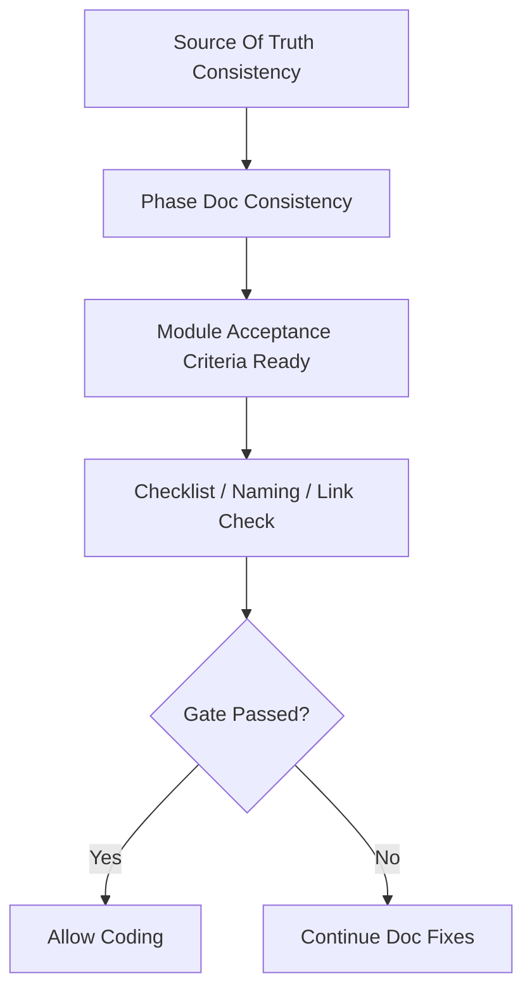

# Documentation Completion Gate

## 1. Goal

This document defines the formal sign-off threshold for "all documentation first complete, then enter coding".

It does not answer whether implementation is complete, but:

- Whether documentation factual source for current phase is closed.
- Whether there are still blocking documentation gaps, contradictions, or naming drift blocking coding.
- When to transition from "documentation ready" to "allowed to start implementation".

## 2. Scope

- Before any phase first starts coding, should pass this gate.
- `Phase 1a` is currently the first applicable phase.
- Later phases should also re-sign-off by same rules before entering implementation.
- If main architecture rewriting, phase boundary adjustment, module acceptance criteria change, or large-scale external reference absorption occurs during coding, should re-execute this gate.

## 3. Must All Be Satisfied

- `01` ~ `07` and related `contracts/`, `adr/`, `operations/`, `reviews/` have no factual source-level conflicts.
- Current phase's phase document, module acceptance criteria, and pre-coding checklist are aligned with each other.
- Current phase's required modules have clear acceptance criteria in [module_acceptance_criteria_matrix.md](./module_acceptance_criteria_matrix.md).
- Key contracts for current phase have been refined to granularity that can directly guide implementation.
- No residual todo markers or unclosed placeholder statements in `doc/`.
- No broken markdown links in `doc/`.
- `reference/research/archive` clearly marked as non-upper factual source, will not mislead current implementation.
- Canonical id, business alias, event naming, directory naming, and configuration naming rules are unified.
- If current phase still has "implement first, then backfill documentation" content, must explicitly register as implementation period item, not documentation gap.

## 4. When Not Passing

- If main document conflicts with contract: fix documentation factual source first, do not enter coding.
- If phase document conflicts with module acceptance criteria: fix phase document and matrix first.
- If industrial-grade or long-term platform documentation is missing: if not blocking current phase, register as subsequent platform gap; if blocking current phase, supplement documentation first.
- If only implementation artifacts missing, such as TypeScript type files, SQL migration, directory skeleton: classify as implementation task, do not mistakenly record as incomplete documentation.

## 5. Current Recommended Sign-off Sequence

## 6. Relationship with Other Documents

- Readiness judgment see `reviews/document_readiness_review.md`
- Phase status see `reviews/phase_readiness_matrix.md`
- Pre-work check see `pre_coding_checklist.md`
- Module acceptance see `module_acceptance_criteria_matrix.md`

## 7. Closure Conclusion

From now on, "documentation ready" and "allowed coding" are no longer directly equivalent.

Only when current phase simultaneously passes:

- Documentation readiness
- This completion gate
- Pre-coding checklist

Is implementation truly allowed.
