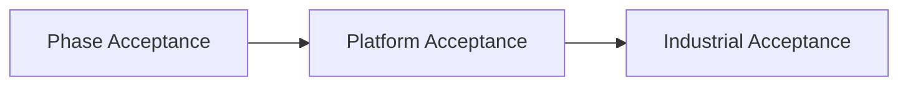

# Module Acceptance Criteria Matrix

## 1. Goal

This document uniformly writes acceptance criteria for each core module as a formal matrix, avoiding "documentation exists but don't know when it's considered complete".

It answers 4 questions:

- Under what circumstances is each module accepted at current phase.
- What hard thresholds does each module still lack for platform layer completion.
- When can a module be judged as industrial-grade producible.
- What evidence is minimum required for acceptance.

## 2. Usage Rules

- This document defines module-level acceptance criteria, does not replace phase-level exit thresholds.
- "Acceptance and Exit Thresholds" in phase documents should be consistent with this matrix.
- Module implementation is only accepted when simultaneously satisfying `contract alignment + test evidence + operational evidence`.
- If module enters industrial production, must additionally satisfy operations, audit, rollback, and alerting standards.
- If module needs to be elevated from "current phase acceptable" to "platform layer acceptable" or "industrial-grade acceptable", should also satisfy promote criteria and evidence package requirements.

## 3. Acceptance Dimensions

Each module accepts at minimum following dimensions:

- `contract_alignment`: Implementation does not conflict with main documents, contracts, ADRs.
- `functional_closure`: Main capability closed loop can run.
- `recovery_and_safety`: Failure, retry, recovery, permission, and risk boundaries are clear.
- `observability`: Logs, events, trace, metrics, or audit are sufficient for problem location.
- `test_evidence`: Has corresponding unit, integration, recovery, fixture, or evaluation evidence.
- `operational_readiness`: Has runbook, alerting, rollback, or human takeover capability before production.

## 4. Module Summary Table

| Module | Current Phase Acceptable | Platform Acceptable | Industrial Acceptable | Minimum Evidence |
| --- | --- | --- | --- | --- |
| Task and Workflow | Happy path, failure path, state migration, schema pre-check can run | Supports cross-division, partial result, static analysis, compensation plan | Supports long-task sharding, partial commit, complex compensation, stable replay | State tests, workflow integration, lint report, recovery drill |
| Runtime Execution | Single-machine execution, timeout, retry, dead-letter, context propagation can run | Lease, queue, worker reclaim, dispatch taxonomy complete | Multi-worker, fencing, failover, admission control, capacity guard complete | Execution tests, crash recovery, lease drills, perf baseline |
| Events and Streaming | Tier 1/2/3, ack, stream bridge, registry baseline available | Typed event bus, multi-consumer recovery, cross-process transport boundary clear | At-least-once delivery, cross-process replay, backpressure, ops thresholds executable | Event registry, consumer idempotency tests, replay drill |
| Storage Transaction Layer | task/workflow/execution/approval/event/file lock persistence complete | PG semantics priority, artifact/analytics/replay layering taking shape | PG authoritative, queue repair, backup/restore, retention closed loop | Schema migration tests, compat tests, restore drill |
| Artifact and Result Model | output, artifact, stepOutput, result envelope boundary clear | Artifact namespace, bundle/export, lineage association stable | Export, retention, audit, tenant scope in formal closed loop | Artifact integration tests, lineage checks |
| Supervisor and Recovery | Heartbeat, stale detection, startup consistency, recovery drill can run | Recovery manager, takeover action, repair flow clear | On-call takeover, automatic loss prevention, fleet-level recovery, oncall handoff executable | Startup checks, incident drill, takeover test |
| Agent/Division Organization Model | HQ/division/role boundary clear, single or few divisions can run | Division authoring, role contract, cross-division collaboration rules complete | Org/workspace/tenant layering, shared worker isolation, audit closed loop | Division samples, authoring lint, orchestration tests |
| Tool/Provider/Plugin | Tool metadata, provider fallback, permission whitelist, output purification available | Compatibility, capability registry, plugin review/revoke taking shape | Supply chain security, signature, SBOM, isolation level, third-party admission closed loop | Tool tests, provider fixtures, security scans |
| Security/Approval/Budget/Policy | Minimum permission, approval escalation, budget guard, sandbox boundary clear | Policy engine, deny taxonomy, risk classes, explainability complete | Dual approval, break-glass, secret manager, non-repudiation audit complete | Policy tests, approval tests, security drills |
| Observability/Test/Release/Operations | health/debug/inspect, fixture/VCR, basic release gate available | Trace/span, quality matrix, chaos smoke, gray rollout executable | SLO, alert, runbook, RCA, rollback, change governance complete | Dashboards, release gate reports, chaos results |
| Data Governance/Memory System | Data classification and minimum memory boundary clear | Decay, quality metrics, revocation, scope isolation taking shape | Retention, residency, memory permission coupling, compliance evidence complete | Classification checks, memory evals, retention proof |
| Execution Plane | Documentation modeling complete, not Phase 1a blocker | Queue/lease/worker/coordinator control plane taking shape | HA coordinator, regional failover, fleet ops complete | Distributed tests, failover drill |
| Data Plane | Transaction/artifact/analytics/replay boundary clear | Namespace, movement job, archive/replay formalized | Residency, tiered storage, cost governance, legal hold complete | Data movement tests, replay validation |
| Tenant/Org/Monetization | Minimum object model and entitlement baseline clear | Org/workspace/tenant hierarchy, quota, metering, cost attribution taking shape | Tenant isolation, settlement, billing audit, enterprise policy complete | Quota tests, billing ledger checks, isolation tests |
| Perception | MVP only proposes, does not directly modify main chain | Source trust, ranking, TTL, proposal governance taking shape | Multi-source governance, ROI monitoring, tenant-safe intelligence plane complete | Perception evals, proposal audit |
| Enterprise/Ecosystem | Documentation and contracts in place, not current phase blocker | Admin console, extension governance, ops plane taking shape | Marketplace, private deployment, SSO, SCIM, audit export, SLA closed loop | Enterprise drills, extension governance reports |

## 5. Tier Explanations

### 5.1 Current Phase Acceptable

Current phase acceptable does not mean platform layer completion, but indicates:

- Closed loop established within current phase goal scope.
- Obvious blockers eliminated.
- Corresponding contract requirements for current phase have test or operational evidence.

### 5.2 Platform Layer Acceptable

Platform layer acceptable indicates:

- Module is not just "runnable" but has reusable, extensible, governable boundaries.
- Interface, state, storage, policy, and recovery do not depend on single scenario.
- Can serve as common platform capability for subsequent multi-division, multi-tenant, or multi-worker.

### 5.3 Industrial Grade Acceptable

Industrial grade acceptable indicates:

- Module meets production foundation requirements.
- Has actionable runbook, alerting, rollback, and human takeover paths.
- Has audit, isolation, recovery, capacity, and configuration governance evidence.

## 6. Relationship with Phase Documents

- `Phase 1a` focus: Task and workflow, runtime, events, storage, security, basic observability.
- `Phase 1b` focus supplement: Workflow orchestration, streaming output, more recovery and explainability.
- `Phase 2a/2b/2c` focus supplement: Multi-division, memory, skills, HR, evolution, platform boundaries.
- `Phase 3/4` focus supplement: Tenant, monetization, perception, enterprise, ecosystem.

## 7. Stable Runtime Acceptance Subset

If current goal is not "expand functionality first" but "achieve stable operation first", must additionally accept at least following subset:

- Task and workflow: State consistent, duplicate advancement controlled, partial result semantics fixed.
- Runtime execution: Cancel propagation, timeout, retry, dead-letter, recovery drill verifiable.
- Events and streaming: Key events reliably delivered, ack, replay, backlog visible.
- Storage transaction layer: SQLite backup, recovery, corruption detection, migration interruption test passed.
- Tool/provider: High-risk commands controlled, output purification, child process cleanup verifiable.
- Observability/test/operations: Structured logs, key metrics, trace, stress test and soak test in place.
- Supervisor and recovery: Startup consistency, zombie lock/session/worker cleanup verifiable.

Corresponding baseline documents:

- `stable_runtime_blockers_checklist.md`
- `pre_stable_launch_blockers_checklist.md`
- `stable_core_scope.md`
- `stable_runtime_validation_plan.md`
- `module_remediation_backlog.md`
- `pre_launch_top20_hard_checklist.md`

## 8. Closure Conclusion

Module completion can no longer be judged by "feels roughly done".

From now on, each module must at least answer:

- Whether current phase has reached acceptable standard.
- What is missing for platform layer completion.
- What is missing for industrial production.
- What objective evidence supports this judgment.

Supplementary requirements:

- Any module claiming to enter `platform-ready` or `production-ready` should simultaneously satisfy `platform_promote_criteria_contract.md`.
- Environment-dependent modules should simultaneously satisfy `environment_readiness_registry_contract.md` readiness gate.
