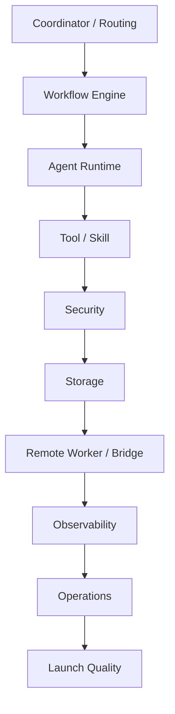

# Module Remediation Backlog

## 1. Purpose

This document organizes remediation items broken down by module into a formal backlog to serve subsequent stabilization and platformization implementation.

It answers 3 questions:

- What does each module most need to supplement right now?
- Which items are `P0 / P1 / P2`?
- Which remediation items should prioritize entering the stabilization execution plan?

## 2. Usage Rules

- This is an execution backlog; it does not replace contracts.
- All remediation items should link back to their corresponding contracts, reviews, or phase documents.
- `P0` represents a hard blocker before launch or stable operation.
- `P1` represents strongly recommended to complete before launch.
- `P2` represents to be filled in as soon as possible after launch.

## 3. Module Overview

## 4. Scheduling Layer (Coordinator / VP Operations / VP Orchestration)

| ID | Problem | Goal | Recommended Action | Priority |
|----|---------|------|-------------------|----------|
| `SCHED-01` | VP Operations classification and routing partially depends on LLM; results drift easily | Stable routing for the same input under the same configuration | Rule matching first, then LLM fallback; output structured reason; record route trace; establish replay tests | `P0` |
| `SCHED-02` | Scheduling decisions are not traceable | Every dispatch is explainable | Record affinity, load, constraint, fallback reasons; generate decision record for each dispatch | `P1` |
| `SCHED-03` | Affinity-first may cause hot-spot worker overload | Balance affinity with load balancing | Affinity weighting; limit max sticky share per worker; detect long-term load skew | `P1` |
| `SCHED-04` | Fallback rules are not rigorous when remote is unavailable | All degradation paths are clear and testable | Define `remote unavailable / degraded / partial available`; clarify local execution, queuing, fail-fast conditions | `P0` |
| `SCHED-05` | Missing admission control | Reject or degrade before overload | Check concurrency, cost, worker capacity, queue length before dispatch; task pooling; low-priority delayed enqueue | `P0` |
| `SCHED-06` | Ownership boundaries after dispatch are not rigorous | Task ownership is clear | Write lease owner after dispatch; support step-boundary handover; lease timeout recovery; worker disconnection auto-redispatch | `P0` |
| `SCHED-07` | Cross-division dependency graphs are error-prone | DAG configuration problems found before execution | Detect cycles, orphan nodes, missing references, cross-division output/input key mismatches | `P0` |
| `SCHED-08` | Urgent task preemption strategy is not defined | Important tasks can acquire resources without breaking consistency | Only preempt at step boundaries; preempted tasks auto-pause; record source and recovery point | `P1` |
| `P2-37` | Backpressure judgment is inconsistent across admission, runtime, and dispatch entry points | Overload strategy consistent across entry points | Unified health/backpressure snapshot consumption; judge starvation/stale by `occurredAt`; operator and CLI use the same backpressure criteria | `P1` |

## 5. Workflow Engine Layer

| ID | Problem | Goal | Recommended Action | Priority |
|----|---------|------|-------------------|----------|
| `WF-09` | YAML workflow errors only exposed at runtime | Found at startup or change | Step ID uniqueness, output key duplication, role existence, precondition registration checks | `P0` |
| `WF-10` | Step-level timeout governance is incomplete | Each step has a clear maximum execution time | Step-level timeout; timeout uniformly enters retry or fail; distinguish LLM, tool, queue, dependency timeouts | `P0` |
| `WF-11` | Uniform retry for all failures is unreasonable | Retry by failure type | Transient retry, semantic retry, permission fail not retried, destructive fail immediately escalated | `P0` |
| `WF-12` | Subsequent steps still execute when output is incomplete | Subsequent steps can only consume valid output | Step output schema validation after step completion; missing required fields immediately fail | `P0` |
| `WF-13` | Recovery relies too much on message/tool result | Each step has a stable snapshot when complete | Save step output, artifact ID, file diff summary, decision context | `P1` |
| `WF-14` | Recovery logic is hard to verify systematically | Recovery can be tested systematically | Support crash injection at `step started / tool completed / before commit` | `P1` |
| `WF-15` | Manual correction missing when intermediate state is wrong | Manual fix then continue running | Manually set `current_step_index`, manually write output, manually skip step | `P1` |
| `WF-16` | Workflow completed but task may not be done | State is eventually consistent | Reconcile workflow/task/session/division result at end; support auto-repair | `P0` |

## 6. Agent Runtime

| ID | Problem | Goal | Recommended Action | Priority |
|----|---------|------|-------------------|----------|
| `AGENT-17` | Agent lifecycle boundaries can still be tightened | Each Agent state is controllable | Define standard lifecycle diagram; terminated no longer accepts messages; paused can only resume or terminate | `P0` |
| `AGENT-18` | Heartbeat only checking "alive" is insufficient | Heartbeat reflects load and health | Add cpu, mem, tool backlog, current step, last progress time | `P1` |
| `AGENT-19` | Agent may be stuck but not dead | Detect stalled agent | Record `last_progress_at`; auto dump context + restart/upgrade on no progress | `P0` |
| `AGENT-20` | Single Agent can consume unlimited resources | Single Agent resources are controllable | Limit llm rounds, tool calls, memory footprint, elapsed time | `P0` |
| `AGENT-21` | Execution evidence scattered in logs and events | Single Agent has complete execution trace | Add agent execution record, recording plan, step, tool, error, retry, decision | `P1` |
| `AGENT-22` | Identity semantics unclear after restart | Recovery and audit are consistent | Preserve logical agent ID; restart generates new runtime instance ID and restart chain | `P1` |
| `AGENT-23` | Middleware chain design exists but not formally governed as runtime skeleton | Loop detection, compaction, tool repair, memory update truly enter the main chain | Treat `before_agent / before_model / after_model / wrap_model_call / wrap_tool_call / after_agent` as formal runtime seams; middleware exceptions default fail-open but with warning | `P0` |
| `AGENT-24` | No continuation recovery semantics after very long output truncation | Long-output tasks can stably continue writing | Detect `max_output_tokens` / equivalent stop reason; auto-increase output budget or enter continuation prompt; add diminishing returns stop condition | `P1` |
| `AGENT-25` | Loop detection is still coarse-grained | Precisely identify repeated tool calls and Doom Loop | Detect by `tool + normalized input hash`; 3 times warn/ask, 5 times escalate or terminate | `P1` |
| `AGENT-26` | Retry / breaker / limiter are still scattered | Form unified composable call governance | Add composable limiter, combine rate limiting by provider / model / tenant / task; share governance surface with retry-after, breaker, admission control | `P1` |
| `P2-26` | Message payload only stores plain text; tool results and summaries are hard to consume in layers | Messages can be stably persisted and compressed by part type | Introduce `parts_json` for messages; distinguish `summary / artifact_ref / tool_result`; context compaction prioritizes trimming large `tool_result` parts | `P1` |
| `P2-27` | Event publishing lacks type boundaries; schema compatibility policy is not explicit | Event bus has compile-time verification and clear compatibility policy | Add `payloadSchemaRef / compatibilityPolicy` to event registry; introduce typed publish wrapper to close event publishing | `P1` |

## 6.1 Memory Layer (Phase 2b)

| ID | Problem | Goal | Recommended Action | Priority |
|----|---------|------|-------------------|----------|
| `MEM-05` | `memories` table reserved but lacks repository / recall / lifecycle / quality baseline (current slice complete) | Memory is persistent, recallable, revocable, measurable | Extended memories schema, supplemented `MemoryService` / `memory` CLI, supported scope/trust/lifecycle recall filtering, hit counting/revocation/quality reporting, and automatic operational memory deposition in failure path; continue supplementing recall ranking / injection layer enhancement | `P1` |

## 7. Tool / Skill Layer

| ID | Problem | Goal | Recommended Action | Priority |
|----|---------|------|-------------------|----------|
| `TOOL-23` | Tool registration does not equal safe execution | Each tool passes baseline verification before launch | Parameter validation, timeout, cancellation, large output, secret redaction tests | `P0` |
| `TOOL-24` | Tool timeout and retry handling are not unified | Unified timeout and retry model | Each tool defines timeout and retryable error set, processed uniformly by executor | `P0` |
| `TOOL-25` | Inconsistent return value styles | Upper layer can consume stably | Standardize `success / output / data / error / duration / metadata` | `P0` |
| `TOOL-26` | Very large outputs pollute context | Minimize context | Write to ArtifactStore when exceeding threshold; message only contains reference and summary | `P0` |
| `TOOL-27` | Skill failure points are unclear | Skills are observable like mini workflows | Skill step-level events, retry, output recording | `P1` |
| `TOOL-28` | Cacheable skill may return stale results | Only hit cache under safe conditions | Cache key includes git HEAD / source hash; record cache source; can disable | `P1` |
| `TOOL-29` | Skill composition may expand permissions | Skills cannot bypass role permissions | Static check `requires_tools ⊆ role tools`; runtime re-check | `P0` |
| `TOOL-30` | MCP is a high-risk external surface | Do not trust MCP metadata and output | Namespace enforcement, allowlist, output sanitize, minimize environment variables, server sandbox | `P0` |
| `TOOL-31` | Tools execute serially by default; high read/write ratio scenarios have high latency | Concurrency-safe tools can truly execute in parallel | Add `isConcurrencySafe / interruptBehavior / isLongRunning / retryPolicy / maxResultSizeChars` to `ToolDefinition`; parallel for read tools, serial for write tools | `P0` |
| `TOOL-32` | Lacks native web scraping capability | Document / link tasks do not need external manual copy | Add `WebFetch`: URL fetching, HTML to Markdown, size limit, timeout, intranet blocked, domain allow/blocklist | `P1` |
| `TOOL-33` | Tool count growth will drag prompt when fully exposed | Tool surface can be discovered on demand | Add tool recommend / deferred loading / tool_search; expose all when few tools, use recall + promote mechanism when many | `P2` |
| `TOOL-34` | Large-scale code changes still lack formal patch path | Improve multi-file, multi-fragment modification success rate | Add patch DSL / apply patch path; support add/update/delete/move, fuzzy match, and failure fallback | `P1` |
| `TOOL-35` | Same-file multi-edit lacks atomic commit capability | Avoid half-success half-failure writes | Add multiedit / atomic batch replace; commit only when all succeed | `P1` |
| `TOOL-36` | Old tool result only trims, not progressive summarization | Preserve audit visibility while reducing prompt size | Completed tool result paired compression and summary part; original result `user_visible=true / agent_visible=false`, summary `agent_visible=true` | `P1` |
| `TOOL-37` | Lacks structured user question tool | More precise when must interrupt for user decision | Add `question` tool, supporting single-select / multi-select / batch questions / skipped semantics, integrated with approval / HITL rendering | `P2` |
| `TOOL-38` | Long tasks lack session-level todo view | Task progress more transparent to users and operators | Add `todo_write` tool, supporting `pending / in_progress / completed / cancelled`, integrated with timeline / diagnostics | `P2` |
| `P2-28` | Same skill lacks deterministic tool resolution under different model profiles | Tool selection can switch with model capabilities and be auditable | Skill step supports `modelOverrides`; resolve by profile / tier / capability; write requested/resolved tool to execution evidence; unknown override defaults fail-close | `P1` |
| `P2-29` | High-risk commands lack signature table and parameter arity constraints | Command execution surface more controllable | Build command signature table, arity validation, interpreter script-file mode and parameter-level sandbox validation for `command_exec` | `P0` |

## 8. Security Layer

| ID | Problem | Goal | Recommended Action | Priority |
|----|---------|------|-------------------|----------|
| `SEC-31` | Lacks actual prompt injection sample library | Continuous regression testing | Build malicious sample library, covering web, mcp, bash, memory, artifact | `P1` |
| `SEC-32` | Secrets scanning is more like log redaction | Full-chain scanning from input to output | Ingress, tool output, user-visible output, artifact scanning | `P0` |
| `SEC-33` | Insufficient conservative judgment for unknown commands | Unknown commands default conservative | unknown = ask or deny; classifier can only escalate not degrade; result cache has TTL | `P1` |
| `SEC-34` | High-risk configuration changes may lie dormant | Critical configuration integrity protection | division yaml, AGENT.md, features hash; diff audit and alerting | `P1` |
| `SEC-35` | Boundaries still partially in prompt layer | Code-level strong constraints | spawn_agent division check, tool permission runtime check, write path scope check | `P0` |
| `SEC-36` | Audit events can be tampered with risk | Secure audit is trustworthy | Key audit tables append-only; hash chain or checksum batch validation | `P2` |
| `SEC-37` | Network egress only relies on command blacklist; observability insufficient | Outbound behavior trackable | Extract URL / ssh / s3 / registry / publish targets from commands and tool calls; audit first, then gradually introduce policy blocking | `P1` |
| `SEC-38` | Invisible Unicode characters can bypass text safety detection | Reduce steganography and prompt injection risk | NFC normalize in sanitize main chain, filter Unicode Tags block and control characters, preserve risk markers | `P1` |
| `P2-30` | Multiple pending approvals in same session are independent; single rejection may still leave residual waiters | Approval rejection semantics consistent | One clear rejection auto-cascades to reject related pending requests in same session; preserve cascade audit event | `P1` |

## 9. Storage Layer

| ID | Problem | Goal | Recommended Action | Priority |
|----|---------|------|-------------------|----------|
| `DB-37` | High concurrent write conflicts | Write serialization, stable read/write | DatabaseWriter single-threaded write; batch commit; key write priority queue | `P1` |
| `DB-38` | Orphan data will accumulate after long-running | Data clean | Periodic orphan cleanup; reference check before cleanup | `P1` |
| `DB-39` | Having migration design does not equal reliable | Upgrades are repeatable and have PG portability baseline | Old version auto-migration test; migration failure rollback; recover then re-migrate test; supplement migration portability preflight and checksum compatibility strategy | `P0` |
| `DB-40` | artifact/log/debug/backup will bloat | Controllable disk usage | Per-type quota; auto-cleanup temp/debug; artifact pin allowlist | `P1` |
| `DB-41` | Reading immediately after writing may be inconsistent | Key path read consistency | Key paths unified through repository; clarify eventual consistency scope | `P1` |
| `DB-42` | PG not writable only has local rejection logic; lacks formal drill and release evidence | Authoritative-state admission must fail-close; operator can see read-only/fail-closed signal | Add stable DB writability rehearsal; cover health/doctor read-only fail-close, phase1b admission reject, dispatch pending ticket preserve; integrate evidence into gate/package | `P0` |
| `DB-43` | Events, UI, side effects, and state commits may still fork | Trigger side effects after state commits | Introduce Effect Buffer / post-transaction side effects; after DB / authoritative state succeeds, then send events, refresh UI, trigger external callbacks; uniformly rollback side-effect callbacks on failure | `P0` |
| `DB-44` | Insufficient external modification detection; may overwrite user new edits | Perceive file staleness before writing | Record mtime / digest on read; check freshness before write/edit; require re-read or manual confirmation when stale | `P1` |
| `DB-45` | Only SQLite authoritative store; lacks append-only session log layer | Balance queryable and replayable | Add session dual storage: SQLite as authoritative index, JSONL as append-only audit/replay; reconcile via session/event sequence | `P2` |
| `P2-33` | task output, step output, and artifact reference models are split | Unified result view projectable | Define unified result envelope; let inspect, diagnostics, and CLI directly consume task/step/artifact isomorphic results | `P1` |
| `QUEUE-01` | Queue replay and duplicate delivery lack formal drill | Queue can be rebuilt from authoritative DB truth and duplicate delivery will not cause duplicate execution | Add stable queue delivery rehearsal; cover replay rebuild, capacity/lease fencing, terminal reconciliation cleanup; integrate evidence into gate/package | `P1` |
| `DBQ-01` | Lacks DB/queue disconnect formal drill and repair drill | Queue disconnect explicit degradation, DB truth can rebuild queue, DB writeback failure fail-close | Add stable DB/queue disconnect rehearsal; supplement missing dispatch ticket repair job, queue unavailable block reason, authoritative store unavailable writeback reason; integrate evidence into gate/package | `P0` |

## 10. Remote Worker / Bridge

| ID | Problem | Goal | Recommended Action | Priority |
|----|---------|------|-------------------|----------|
| `REMOTE-42` | Worker registration info can be forged | Trusted worker registry | mTLS, token/OIDC, capability allowlist, challenge validation | `P0` |
| `REMOTE-43` | Worker status is too coarse | More fine-grained scheduling | `healthy / degraded / draining / quarantined / offline` | `P1` |
| `REMOTE-44` | Different workers have different sandbox strengths | Scheduling aware of security level | Add `isolation_level` to capability; high-risk tasks only sent to high-isolation workers | `P1` |
| `REMOTE-45` | Bridge disconnect/reconnect semantics not rigorous enough | No context loss, no duplicate execution | Stream offset, input ack, replay last N events, session consistency check | `P1` |
| `REMOTE-46` | Both ends of file sync changed will conflict | Clear conflict semantics | One-way sovereignty mode, hash comparison, conflict directly pauses waiting for human | `P1` |
| `REMOTE-47` | Graceful shutdown before maintenance needed | Lossless maintenance | Draining mode, not accepting new tasks, old tasks hand over at step boundaries | `P1` |
| `REMOTE-48` | Distributed mode logs are scattered | Single task full-chain viewable | taskId uniformly passed through; coordinator aggregates remote logs; CLI can view remote timeline | `P1` |

## 11. Observability

| ID | Problem | Goal | Recommended Action | Priority |
|----|---------|------|-------------------|----------|
| `OBS-49` | taskId not enough to cover cross-bridge/worker | Full-chain tracing | `traceId / spanId`, correlate LLM, tool, event, db write | `P1` |
| `OBS-50` | Lacks core metrics dashboard | Basic stable operation visualization | Task success rate, retry rate, recovery success, worker health, queue, event backlog, step duration, cost per task | `P0` |
| `OBS-51` | Many alerts will come later | Avoid alert storms | Aggregate by task, suppress similar events, define escalation path | `P1` |
| `OBS-52` | Assembling timeline after failure is difficult | Automatic incident timeline | Assemble timeline from events/logs/messages/step outputs; can export markdown/json | `P1` |
| `OBS-53` | Observability data grows infinitely | Keep key, clear noise | Events by tier by retention days; debug logs limited; historical summary retained | `P1` |
| `P2-34` | Inspect only suitable for drilling single records; lacks summary query layer | Filter first, then drill | Add task/workflow/decision summary query, filtering, and CLI query mode | `P1` |
| `P2-35` | debug dump, repro bundle, and diagnostics view are fragmented | Unified debugging chain | Close diagnostics CLI, debug dump, repro bundle payload, and unified result view | `P1` |
| `P2-36` | Health report signals too coarse | Health check can directly guide operations actions | Add queue governance, worker health, structured findings, and finer degradation / overload judgment | `P1` |

## 12. Memory and Learning Layer

| ID | Problem | Goal | Recommended Action | Priority |
|----|---------|------|-------------------|----------|
| `MEM-01` | Token estimation may still be coarse (current slice complete) | Compression, budget, overflow judgment more accurate | Prioritize consuming message parts / provider usage, and use more precise token estimator in local fallback; context compaction recalculates after trim based on rendered content; deprecated rough `chars/4` estimation; continue enhancing if provider native tokenizer connected later | `P1` |
| `MEM-02` | STM to long-term memory migration semantics incomplete (current slice complete) | Long conversation content can be deposited and retrieved | Supplemented memory consolidation: `layer_3` memories meeting threshold can be summarized into `layer_5` summary memories within explicit boundaries, and source memories can be auditably revoked; continue supplementing automatic trigger strategy, FTS5 / embedding retrieval, and stronger rerank | `P1` |
| `MEM-03` | Memory schema still weak | Form structured long-term memory | Unified `workContext / topOfMind / recentHistory / longTermBackground / facts[]` structure; with category / confidence / provenance | `P2` |
| `MEM-04` | Experience reuse still lacks formal cache layer | Similar tasks can reuse few-shot and strategy experience | Add experience cache, few-shot builder, similar task injection, and hit audit | `P2` |
| `MEM-06` | Memory retrieval still biased toward static injection | Experience and long-term memory must "inject when relevant" | Add memory/experience retrieval layer, FTS5 / keyword recall first, then supplement embedding / rerank; hit results enter few-shot and memory injection | `P2` |

## 13. Code Understanding and Modification Layer

| ID | Problem | Goal | Recommended Action | Priority |
|----|---------|------|-------------------|----------|
| `CODE-01` | Repo Map still biased toward file tree and shallow symbols | More semantic code understanding | Upgrade to tree-sitter / AST / definition reference graph / relevance-ranked semantic Repo Map | `P2` |
| `CODE-02` | Lacks formal patch path | Improve large-scale modification success rate | Introduce patch DSL / apply patch, coexist with edit | `P1` |
| `CODE-03` | Lacks LSP diagnostic closure | "Write wrong, see, fix" forms closed loop | Support at least TypeScript / Python diagnostics, pipe error summary back to model | `P1` |
| `CODE-04` | Lacks Git snapshot-level trial protection | Modifications can be undone and recovered | Add step-level Git snapshots, undo / redo, snapshot points linked with conversation history | `P1` |
| `CODE-05` | External file modification detection not in main modification chain | Avoid overwriting real user updates | Incorporate freshness / mtime / digest checks into edit / patch / write main chain; fail-close when stale | `P1` |

## 14. Operations Layer

| ID | Problem | Goal | Recommended Action | Priority |
|----|---------|------|-------------------|----------|
| `OPS-54` | Lacks unified self-check command | One-click diagnose current system | `agent doctor` checks DB, config, backup, locks, workers, event backlog, provider health | `P1` |
| `OPS-55` | Bad config/bad DB should not explode at runtime | Fail fast | Config validate, db integrity check, migration dry-run, provider ping | `P0` |
| `OPS-56` | Distributed upgrades need compatibility matrix | Upgrades do not interrupt business | Coordinator / worker upgrade order and protocol versioning | `P2` |
| `OPS-57` | Backup does not equal recoverable | Regularly verify recovery | Weekly restore test, DB+artifact joint recovery, post-recovery integrity verify | `P1` |
| `OPS-58` | Hard to know what version the system is running at any time | Version and configuration visible | Build info, config version, feature flags snapshot, schema version, prompt bundle version | `P1` |
| `OPS-59` | Configuration override chain lacks formal constraint governance | Overrides at different environments and stages are explainable and fail-close | Build dynamic configuration constraint override rules; limit override scope for env / tenant / rollout / break-glass; all overrides enter audit and readiness check | `P1` |
| `P2-31` | Config files do not support comments and trailing commas; governance readability poor | Config readable but still fail-close | Support JSONC parsing; allow `//`, `/* */`, and trailing commas; preserve malformed config rejection semantics | `P2` |
| `P2-32` | Provider / model profile metadata scattered | Model defaults and override sources unified | Build `models.json` registry; support local override; unknown profile and illegal metadata default fail-close | `P1` |

## 15. Launch Acceptance and Quality System

| ID | Problem | Goal | Recommended Action | Priority |
|----|---------|------|-------------------|----------|
| `QA-59` | Launch gate not formally systematized | Unified gate before release | Unit/integration, recovery regression, security red team, rate limiting and circuit breaker, gray soak test | `P0` |
| `QA-60` | No fixed standard task set | Comparable between versions | Programming, research, content, multi-division, remote coordination representative golden tasks | `P0` |
| `QA-61` | Lacks unified regression baseline | Version degradation quantifiable | Success rate, cost, latency, retry rate, manual escalation rate, recovery success rate | `P0` |
| `QA-62` | One-time upgrade is high risk | Gradual release | Feature flags, canary worker, canary user group, rollback switch | `P1` |
| `QA-63` | No rollback playbook | Can quickly degrade on failure | Rollback config, feature, worker version, prompt bundle | `P0` |
| `QA-64` | Lacks stable operation acceptance line | Has objective long-running threshold | 14 consecutive days running, no manual DB repair, no orphan queue, no zombie lock, 100% recovery success rate, P95 latency within budget | `P0` |
| `EXP-01` | Research layer recommendations lack formal absorption closure | Recommendations must have destination or rejection reason | Build `research_analysis_absorption_matrix`, record `adopted / deferred / rejected` item by item with corresponding scheme documents | `P0` |

## 16. Closure Conclusion

The purpose of this backlog is not to continue expanding features, but to break down issues in each module that truly affect launch and stable operation into executable items.

If entering the implementation phase subsequently, prioritize in order:

1. Clear `P0` hard blockers first
2. Then do `P1` stability and operations closure
3. Finally supplement `P2` industrial enhancements
